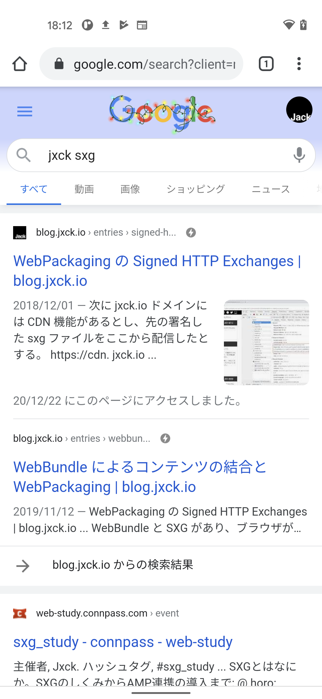

# [signed-http-exchage][amp][webpackaging] AMP SXG 対応


## Intro

本サイトを AMP SXG に対応した。その作業ログを記す。


## AMP SXG

AMP は、大きく AMP HTML と AMP CDN(AMP Cache) からなる。

AMP HTML 自体は、ルールに則って作った HTML でしかない。しかし、 Google のクローラが取得すると、 Google が管理する AMP CDN に保存される。

モバイルの Google 検索で、稲妻マークが出た検索結果をクリックすると、自分のサーバにリクエストが来るのではなく、 Google の AMP CDN にリクエストが行き、そこに保存された AMP HTML が返されている。



したがって、 AMP ページを表示すると、その URL バーが Google の URL になり、その仕組自体が色々と物議を呼んだりした。


Google は AMP に SXG を組み合わせることで、 Google の AMP CDN から提供するが URL バーを Origin のものにできる AMP SXG に対応している。

しかし、これは単に AMP HTML を SXG にすればよいかというとそうではない。

AMP CDN は取得した AMP HTML を、色々加工(Optimize)してから CDN に保存しているが、 SXG は署名がついてるため CDN で加工することができない。

そこで、 AMP SXG に対応するためには、クローラに渡す前に AMP CDN が行う加工を先にやってから SXG で署名して返す必要があるのだ。

この「AMP CDN が行う加工」を自分で行うためのツールが amppackager なので、これを入れる必要がある。


## 証明書

SXG はまだ過渡期の技術であるため、鍵や証明書が色々なプログラムや CLI から使われる可能性もあり、その過渡期のあいだは甘い権限で取り回される懸念もある。

そこで、サーバ用の HTTPS の鍵と証明書が SXG にも転用されることを防ぐためにも、別途取得させるようにいくつかの制限が課されている。具体的には。

- 鍵は prime256v1 の EC が必須
- 通常の HTTPS 用の証明書にはない CanSignedHTTPExchage 拡張が必須

openssl を使うと以下のように確認できる。


```sh
# key type が EC prim256v1
$ openssl x509 -in blog_jxck_io.crt -text | grep 'ASN1 OID: prime256v1'
# CanSignHttpExchanges 拡張がある
$ openssl x509 -in blog_jxck_io.crt -text | grep 1.3.6.1.4.1.11129.2.1.22:
```

(この拡張がないと SXG の署名はできないし、おそらく将来的には安全のためにこの拡張がついた証明書は HTTPS には使えなくなったりするのだろう)

鍵は openssl などで普通に作れるが、 CanSignedHTTPExchage 拡張のついた証明書は現状 Digicert しか発行していない。

発行した証明書は、今回は AMP SXG に使用するが、通常の SXG にも利用できるため、それはまた別途解説する。


## amppackager

AMP SXG は、前述の通り SXG にする前に変換が必要となる。これを行うのが amppackager だ。


```sh
$ go get -u github.com/ampproject/amppackager/cmd/amppkg
```

デフォルトだと `$HOME/go/bin` に入るのでパスを通す。


### amppkg.toml

amppackager の設定ファイルは toml で用意する。詳細は example を参照。

- https://raw.githubusercontent.com/ampproject/amppackager/releases/amppkg.example.toml

Port/Key/Cert など必要なものを埋める。

Port のデフォルトは 8080 だが管理上 10000 にしている。


### amppkg

起動してみたが、エラーが出たので残しておく。


```sh
$ amppkg
2020/12/23 20:04:15 Updating cert if necessary
2020/12/23 20:04:15 Certfetcher is not set, skipping cert updates. Checking cert on disk if updated.
2020/12/23 20:04:15 Updating OCSP; none cached yet.
2020/12/23 20:04:15 Updating OCSP; none cached yet.
2020/12/23 20:04:15 Updating OCSP; none cached yet.
2020/12/23 20:04:15 Updating OCSP; none cached yet.
2020/12/23 20:04:15 Cannot find issuer certificate in CertFile.
2020/12/23 20:04:15 Missing OCSP response.
github.com/ampproject/amppackager/packager/certcache.(*CertCache).readOCSPHelper
	/home/jxck/go/src/github.com/ampproject/amppackager/packager/certcache/certcache.go:374
github.com/ampproject/amppackager/packager/certcache.(*CertCache).readOCSP
	/home/jxck/go/src/github.com/ampproject/amppackager/packager/certcache/certcache.go:406
github.com/ampproject/amppackager/packager/certcache.(*CertCache).Init
	/home/jxck/go/src/github.com/ampproject/amppackager/packager/certcache/certcache.go:176
main.main
	/home/jxck/go/src/github.com/ampproject/amppackager/cmd/amppkg/main.go:103
runtime.main
	/home/jxck/dotfiles/pkg/go/current/src/runtime/proc.go:203
runtime.goexit
	/home/jxck/dotfiles/pkg/go/current/src/runtime/asm_amd64.s:1373
initializing CertCache
github.com/ampproject/amppackager/packager/certcache.(*CertCache).Init
	/home/jxck/go/src/github.com/ampproject/amppackager/packager/certcache/certcache.go:178
main.main
	/home/jxck/go/src/github.com/ampproject/amppackager/cmd/amppkg/main.go:103
runtime.main
	/home/jxck/dotfiles/pkg/go/current/src/runtime/proc.go:203
runtime.goexit
	/home/jxck/dotfiles/pkg/go/current/src/runtime/asm_amd64.s:1373
initializing cert cache
main.main
	/home/jxck/go/src/github.com/ampproject/amppackager/cmd/amppkg/main.go:107
runtime.main
	/home/jxck/dotfiles/pkg/go/current/src/runtime/proc.go:203
runtime.goexit
	/home/jxck/dotfiles/pkg/go/current/src/runtime/asm_amd64.s:1373
```

OCSP の情報が無いようだ。 Digicert で発行した証明書は自分のドメインのものと DigiCertCA.crt の 2 つがあったので連結したらいけた。


```sh
$ cat blog_jxck_io.crt DigiCertCA.crt > blog_jxck_io_full.crt
```

toml を更新して起動し直すと成功。


## routing

amppackager は HTTP サーバになっており、指定したポートで起動する。

直接 internet 側に公開するのではなく内部に起動し、外向けに立てた HTTP Server から、特定の条件のときのみ Proxy するように設定する。

(つまり、今回の場合 Port 10000 は閉じていることを確認する必要)

- リクエスト URL が `/amppkg/` の場合は、そのまま forward
- AMP ページへのリクエストで `AMP-Cache-Transform` ヘッダがあれば Path に `/priv/doc` をつけて forward
- それ以外は forward しない(直接の `/priv/doc` 含め)


### `/amppkg`

このパスは `/amppkg/cert/#{base64}` のように SXG の Certificate URL として使われている。

パスが固定なので h2o では以下のように転送すればよい。


```
"/amppkg":
  proxy.reverse.url: "http://127.0.0.1:10000/amppkg"
```

(reverse.url の最後に `/amppkg` 付け忘れて 404 になり少しハマった)


### `/priv/doc`

`AMP-Cache-Transform` が付いたリクエストは amppkger に転送する、この転送はパスベースではなく、通常の AMP ページへのリクエストでヘッダが付いたものだけということになる。

h2o は Path ベースでの Proxy は簡単だが、ヘッダをベースに分岐するには mruby handler 内で proxy する必要があり、その方法がよくわからず `http_request` でリクエストを再構築して書いていた。

後から、 [reproxy](https://h2o.examp1e.net/configure/reproxy_directives.html#reproxy) という機能がそのまま使えることを教えてもらい、一瞬で解決した。

(機能は知っていたが、 Example を見て同じドメインの別のパスに移譲すると勝手に思い込んでいたが、普通に別ポートにも移譲できた)


```ruby:amppkg.rb
```


### Vary header

同じ AMP の URL でも、リクエストによって HTML と SXG を出し分けることになる。

SXG のサポートは `Accept: application/signed-exchange;v=b3` などが追加されるため、それで判別することができる。

加えて AMP のクローラは `AMP-Cache-Transform` を追加するため、これも判断材料になる。

このため、 Response は `Vary` にこのヘッダを指定し、これら Request ヘッダに応じてキャッシュが別になるようにする必要がある。


```http
Vary: AMP-Cache-Transform, Accept
```

amppackager はこれを自動で付与しているようなので問題ないが、それは Response が SXG のときしかカバーしてない。

自分のサーバの AMP HTML を返す部分で、同じくこのヘッダを追加してやる必要がある。


## Debug

全てきちんと動いてるかを確認する最も確実な方法は Chrome で取得して Devtools で見ることだろう。

この場合 [mod header](https://chrome.google.com/webstore/detail/modheader/idgpnmonknjnojddfkpgkljpfnnfcklj?hl=ja) などで `AMP-Cache-Transform: google` のリクエストヘッダを追加する必要がある。

Devtools で見ると以下のように確認できる。


CLI の場合は `dump-signedexchage` で行うのが手軽だろう。


```sh
$ dump-signedexchange -uri $URL -requestHeader AMP-Cache-Transform:any -version=1b3 -headers=false -payload=false -verify
The exchage has a valid signature
```

これは cert-url から証明書チェインを取得してくれているらしいので、これが通れば一通り通ってると思われる。

個々のステップを細かく見たい場合は Curl で取得してから順番に解くなどすると良いかもしれない。


```sh
$ curl -s --output - -H 'amp-cache-transform: google;v="3"' -H 'accept: application/signed-exchange;v=b3,*/*;q=0.1' https://blog.jxck.io/entries/2020-12-03/masonry-layout.amp.html > dump.sxg
$ dump-signedexchange -i dump.sxg
format version: 1b3
...

$ curl -s --output - https://blog.jxck.io/amppkg/cert/KmG8nFDyIBqjUzFBg9YYDEcfu20CkBaNIl4m9sFJ9yM > cert.cbor
$ dump-certurl -i cert.cbor
```


## Bot Request

どうやらブラウザからアクセスしたりしていると、 Google に把握され Bot が来るようだ。

本ブログでは、躊躇なく Production でこういう作業をゴリゴリ行うので、作業してる途中から Bot が来てちょっと邪魔だった。

デバッグなどが終わらないうちは Internet Access 可能なドメインではやらないほうが良いだろう。

なお、ログから復元した Bot のヘッダは以下のようなものだった。 `AMP-Cache-Transform` と `Accept` 以外に変わったヘッダは無いようだ。


```http
GET /example.amp.html HTTP/1.1
Host: blog.jxck.io
From: googlebot(at)googlebot.com
Accept: */*;q=0.8,application/signed-exchange;v=b3
Connection: keep-alive
User-Agent: Mozilla/5.0 (Linux; Android 6.0.1; Nexus 5X Build/MMB29P) AppleWebKit/537.36 (KHTML, like Gecko) Chrome/87.0.42 80.90 Mobile Safari/537.36 (compatible; Googlebot/2.1; +http://www.google.com/bot.html)
If-None-Match: "5fd8a3e0-173f"
Accept-Encoding: gzip,deflate,br
If-Modified-Since: Tue, 15 Dec 2020 11:54:08 GMT
AMP-Cache-Transform: google;v="1..5"
```


## Search Result


## Outro

技術調査だけのために AMP に対応してきたが、 Google Search においても Mobile Experience を採用するアナウンスが出ているため、本サイトのように Origin が十分速い場合は AMP が必須というわけでもなくなる。

AMP SXG も、本当に AMP の URL を変えるというだけのためなので、ある程度試して満足したら AMP と一緒に捨てたいと思っている。

合わせて通常の HTML の SXG 対策も実施していきたい。


## DEMO

本サイトの AMP ページ全体に適用済みである。

Android Chrome で Google のモバイル検索から見れば挙動が確認できるだろう。

なお、各エントリの URL 末尾を `.html` から `.amp.html` にすれば AMP 版がリクエストでき、右上の稲妻アイコンから遷移できる。


## Resources

- Spec
- Explainer
- Requirements Doc
- Mozilla Standard Position
- Webkit Position
- TAG Design Review
- Intents
- Chrome Platform Status
- WPT (Web Platform Test)
- DEMO
- Blog
- Presentation
- Issues
- Other
  - ampproject/amppackager
    - https://github.com/ampproject/amppackager
  - webpackage/go/signedexchange
    - https://github.com/WICG/webpackage/tree/master/go/signedexchange
