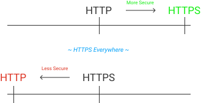

# URL バーの表示の変遷

## Intro

ついに URL バーから EV 証明書の組織表示が消されるアナウンスが、 Chrome から発表された。

思えば、 URL バーの見た目も、だいぶ変わってきたように思う。

URL バーの表示の変遷を一度まとめておく。

## URL バーの再現

本当なら古いブラウザのスクショを集めたいところだったが、これは非常に難しい。ネットで色々落ちてるものをかき集めても、ライセンスや解像度や表示されている URL などを考えると、使い勝手は決して良くない。

試しに古い Chromium をビルドしてみたが、一定より古いものはうまく開くことすらできなかった。開くことができたバージョンもあったが、どうやらそれだけでは当時の URL バーの UI までは再現されないようだ。

そこで、実物のスクショはあきらめ「一般的な URL バーのイメージ」を書いた図で、おおまかな変遷を辿る。あくまで架空の図であることに注意されたい。

## 原始の URL バー

最も基本的な URL バーは、表示している URL をそのまま表示するものだったと言えるだろう。

そして、 HTTPS が登場して以降ここに「安全である」という意味合いを追加する UI が付与される。一般的に鍵アイコンと呼ばれるものだ。

さらに、その証明書が EV であれば、発行先の組織名が表示された。

Netscape や IE5.5, 6 とかのレベルになると、もっと異なる UI だった。そこから徐々に変わってここに至るので、一般にいつこのイメージが定着したのかというと、断定は難しい。

推定すると、 Chrome は 2010 年にリリースされ、初期のころからこの UI だったように思う。ずっと空いて 2016 年に Let's Encrypt が始まるが、その時点では少なくとも日本の HTTPS の普及率は決して高くなく(2,3 割)、逆に銀行などが EV を入れており、「鍵が出てると安全」「組織名の表示を確認を」といった啓蒙が、リテラシーの高い一般ユーザに対して行われていたと思う。

したがって、このイメージが一般に定着していったのは 2012~15 年あたりかと思う。IE でいうと 9,10 くらいか。

## HTTPS Everywhere

HTTP が一般である上で、 Advanced なものとして HTTPS が提供されていたために、それを「Secure」とラベル付するのは一定の納得感があった。

その後、社会インフラとしての Web に人々の依存度が上がるかたわらで、 AT&T が無料 WiFi で広告を差し込んだり、 DigiNotor が不正発行をやらかしたり、エドワードスノーデンが告発したり etc etc etc と様々な社会の変化が起こり、 HTTPS の重要性が増した。

プラットフォーム側ではこれに呼応するように、ブラウザに HTTPS Only な機能が増え、 IETF プロトコル策定に暗号化が必須となり、極め付けに Let's Encrypt が登場して一気に HTTPS 化が広まった。

各位が  HTTPS Everywhere に向かって進んでいたのは、だいたい Let's Encrypt 登場の直前 2015 年から 2020 年あたりの話と言えるだろう。

結果 Web の前提が代わり、それに合わせて URL バーのデザインも変わっていくことになる。

## HTTP as Non Secure (2016~)

HTTPS のいう "Secure" はあくまで「_通信の安全_」であり、だれかが盗聴/改竄/なりすましをしてないことを保証するものだ。そのため、証明書の発行は基本的に「Issuer はそのドメインを本当に保持しているか」を基準に行われる。

重要なのは、「そのサイトのコンテンツは安全であるか」などという保証は、たとえ EV であっても HTTPS にはない点だ。 HTTPS 化が遅れた銀行を偽装したフィッシングサイトが、 Let's Encrypt で HTTPS 化されてたなどという、皮肉な話もあったりした。

ここに "**Secure**" と "**Trustworthy**" の差がある。

しかし、研究によって多くのユーザは鍵アイコンが示す "Secure" という表示の意味をそのようには理解しておらず、当然ページの中身が安全なだという "Trustworthy" を示すと誤解していたこともわかってきた。

- Rethinking Connection Security Indicators | usenix
  - https://www.usenix.org/system/files/conference/soups2016/soups2016-paper-porter-felt.pdf

そこで、 HTTPS が前提な世界においては「_HTTPS が Secure_」なのではなく「_HTTP が  Non Secure_」だという価値観にベースをシフトする必要があった。

結果 HTTPS を控えめに表示し、 HTTP の場合のみ Not Secure であることを示するように表示が変わっていくことになる。

この流れは 2016 年ごろはじまった。

- Google Online Security Blog: Moving towards a more secure web
  - https://security.googleblog.com/2016/09/moving-towards-more-secure-web.html
- Avoiding the not secure warning in chrome
  - https://developer.chrome.com/blog/avoid-not-secure-warn/
- Marking HTTP As Non-Secure
  - https://www.chromium.org/Home/chromium-security/marking-http-as-non-secure/
- Firefox 70 Address Bar Gets New Security Indicators, Shames Insecure Sites
  - https://www.bleepingcomputer.com/news/security/firefox-70-address-bar-gets-new-security-indicators-shames-insecure-sites/

最終的には、全ての HTTP を赤いエラー表示にするのが目指すところだが、現状はブラウザによってかなりばらけている(赤くするもの、赤くはしないもの、 Passowrd フォームがあるときだけ赤くなるものなど)。

- Chromium Blog: Evolving Chrome's security indicators
  - https://blog.chromium.org/2018/05/evolving-chromes-security-indicators.html

赤くなる前提でいうとだいたいこういう感じだ。

## Removing EV Badge

EV 証明書の発行は、 DV 同様のドメイン所持確認に加えて、組織の実在チェック(ペーパーカンパニーではないか)などを付加価値として追加している。逆を言えば、悪意をもったものでも要件を満たせば取得はできる。

PoC として有名なのは、 "Identity Verified" という会社を作って EV を取得することで、まるで安全であるかのように組織名を表示するという実証がある。

- First part of phishing with EV
  - https://web.archive.org/web/20170914040209/https://0.me.uk/ev-phishing/
  - https://web.archive.org/web/20191126204558/https://www.typewritten.net/writer/ev-phishing/
  - (オリジナルサイトは消えてるためアーカイブ)

また、アメリカでは州が別なら同じ社名の会社が作れる?とかで、実際に Stripe と同じ組織名が表示される EV 証明書が取得可能であること実証された。

- Extended Validation is Broken
  - https://web.archive.org/web/20171212011746/https://stripe.ian.sh/
  - (オリジナルサイトは消えてるためアーカイブ)

こうした研究から、 EV 証明書の組織名は、表示する方がむしろ良くないのではないかという論調が、特にセキュリティ研究者周りで強まった。 2017 年くらいのことだ。

- On the value of EV
  - https://groups.google.com/g/mozilla.dev.security.policy/c/szD2KBHfwl8/m/kWLDMfPhBgAJ

結果、 2018 年に Safari 12 から組織名の表示が消えた。

- Safari on iOS 12 changes the look of the URL/Search bar
  - https://twitter.com/BasileBailey/status/1041787756697899008
- Minutes of the F2F 44 Meeting in London, England, 6-7 June 2018 - CAB Forum
  - https://cabforum.org/2018/06/06/minutes-for-ca-browser-forum-f2f-meeting-44-london-6-7-june-2018/#Apple-Root-Program-Update
- Apple
  - https://cabforum.org/2018/06/06/minutes-for-ca-browser-forum-f2f-meeting-44-london-6-7-june-2018/#Apple-Root-Program-Update

2019 年には Chrome と Firefox が EV の組織名表示を消すと発表した。

- Upcoming Change to Chrome's Identity Indicators
  - https://groups.google.com/a/chromium.org/g/security-dev/c/h1bTcoTpfeI
- Chromium Docs - EV UI Moving to Page Info
  - https://chromium.googlesource.com/chromium/src/+/HEAD/docs/security/ev-to-page-info.md
- Intent to Ship: Move Extended Validation Information out of the URL bar
  - https://groups.google.com/g/mozilla.dev.platform/c/o18n0SZRyUE/m/bsbGzuO6AQAJ

結果 HTTPS であるかどうかが重要になり、アイコンをクリックしたりしない限り EV の特別扱いはなくなった。

## eTLD+1 のみの表示

フィッシング攻撃の典型的な方式の一つが、よく似たサイトを偽装して、そこにクレデンシャルを入力させるといったものがある。

理想としては Password Manager などで機械的に検出することだが、それにしてもやはり URL の中で特にドメイン(eTLD+1)を確認するのは、防衛手段の基本となる。

一方、ユーザは URL の仕様を正しく認識しているわけではなく、サブドメインが知ってるサイトだったり、長いパスやクエリで特にモバイルでの視認性が下がっている場合などに、攻撃にひっかってしまうという研究結果がでた。

- Measuring Identity Confusion with Uniform Resource Locators - Google Research
  - https://research.google/pubs/pub49166/

そこで、 URL の中でとりわけ重要な、そのサイトのアイデンティティとも言える eTLD+1 のみを表示することで、ユーザにサイトをより明確に認識させるという方式が、特にモバイルで採用されるようになった。 Chrome では 2020 年に発表されている。

- Chromium Blog: Helping people spot the spoofs: a URL experiment(2020/08: M86)
  - https://blog.chromium.org/2020/08/helping-people-spot-spoofs-url.html

## ロックアイコン

HTTPS は、緑ではないにせよロックアイコン自体は表示されていた。

しかし、 HTTP as Non Secure というベースシフトが起こたことに合わせ、 HTTPS を Secure とする UI からより Normal なものとしていくことになる。

結果、 Chrome は HTTPS からロックアイコンの削除をすると発表した。

当初の計画では、単純にロックアイコンがなくなるような絵がかかれていたが、実際には今ロックアイコンは Permission や Cookie など、この間にブラウザに実装されたさまざまな設定へのエントリポイントを兼ねていた。

そこで、ロックアイコンを単純に消すのではなく、代わりに「このサイトが安全かどうかを示してそうに見えない」何か、ハンバーガーメニューや三点メニューのようなメニューアイコンに置き換える必要が出た。 2021 年の段階では下三角のよくあるアコーディオンのアイコンのデモがあった。

- Chromium Blog: Increasing HTTPS adoption(2021/07: M94)
  - https://blog.chromium.org/2021/07/increasing-https-adoption.html

しかし、新しいデザインである Tune アイコンが紹介された。

- Chromium Blog: An Update on the Lock Icon
  - https://blog.chromium.org/2023/05/an-update-on-lock-icon.html

他のブラウザがどうするのかは、発表を見てないように思う。 Chrome と同じ Tune アイコンではないだろうということで、擬似的に中立的なハンバーガーメニューで図を作っておく。

## Outro

少なくとも HTTPS に関する部分では、 URL Bar の表示は HTTP をいつどう赤くするか/しないかあたりを残し、おおよそ落ち着いたんだじゃないかと思う。

数年後は、「昔 URL が緑だった時代がある」と懐古する時に、このエントリが引っ張り出せると思う。

## Outro

## DEMO

## Resources

- Spec
- Explainer
- Requirements Doc
  - Chromium Docs - Guidelines for URL Display
    - https://chromium.googlesource.com/chromium/src/+/HEAD/docs/security/url_display_guidelines/url_display_guidelines.md
- Mozilla Standard Position
- Webkit Position
- TAG Design Review
- Intents
- Chrome Platform Status
- WPT (Web Platform Test)
- DEMO
- Blog
  - TLS: browser UI - Anne's Blog
    - https://annevankesteren.nl/2014/10/tls-browser-ui
  - Troy Hunt: Extended Validation Certificates are Dead (2018/9)
    - https://www.troyhunt.com/extended-validation-certificates-are-dead/
  - Troy Hunt: PayPal's Beautiful Demonstration of Extended Validation FUD (2019/5)
    - https://www.troyhunt.com/paypals-beautiful-demonstration-of-extended-validation-fud/
  - Troy Hunt: Extended Validation Certificates are (Really, Really) Dead (2019/8)
    - https://www.troyhunt.com/extended-validation-certificates-are-really-really-dead/
  - Are EV certificates worth the paper they're written on? (2017/12)
    - https://scotthelme.co.uk/are-ev-certificates-worth-the-paper-theyre-written-on/
  - Sites that used to have EV (2018/8)
    - https://scotthelme.co.uk/sites-that-used-to-have-ev/
  - Gone forEVer! (2019/8)
    - https://scotthelme.co.uk/gone-for-ever/
  - Extended Validation not so... extended? How I revoked $1,000,000 worth of EV certificates! (2019/9)
    - https://scotthelme.co.uk/extended-validation-not-so-extended/
  - If it looks like a duck, swims like a duck, and QWACs like a duck, then it's probably an EV Certificate (2022/1)
    - https://scotthelme.co.uk/looks-like-a-duck-swims-like-a-duck-qwacs-like-a-duck-probably-an-ev-certifiacate/
- Presentation
- Issues
  - On the value of EV
    - https://groups.google.com/g/mozilla.dev.security.policy/c/szD2KBHfwl8/m/kWLDMfPhBgAJ
- Other