# [dialog][popover] Dialog と Popover #7

## Intro

ここまで解説した仕様を踏まえ、いくつかのユースケースの実装について考えてみる。

あくまで仕様の組み合わせ方についての解説であり、実装そのものの推奨ではない。

**なお、ここで紹介する仕様はまだ変更の可能性があり、かつ実装も揃ってないものがある点に注意**


## 規約への同意

まずは、「規約への同意」の UI について考えてみる。想定するのは以下のようなものだ。



見ての通り、この規約に同意しないと先に進むことができない、ブロックを伴う UI であるため Modal Dialog として実装するのが妥当だろう。

どのようなきっかけで表示されるかはわからないため、 JS から `showModal()` する前提で実装を考えていこう。


### HTML

まず、基本的な HTML 要素を並べてみよう。(`<dialog>` と関係ない部分は簡略化)

```html
<dialog>
  <section>
    <h1>利用規約への同意</h1>
    <section>
      <p>長い長い</p>
      <p>利用規約</p>
      <p>スクロールあり</p>
    </section>
    <a>規約のダウンロード(PDF)</a>
    <p>同意する</p>
    <button>確認</button>
  </section>
</dialog>
```

全体が `<dialog>` であることで `role=dialog` な要素自体は定義できている。`role=dialog` には `aria-description` による説明があることが求められているため、ここでは `<h1>` をそのまま適用できるだろう。

```html
<dialog aria-labelledby="dialog-label">
  <section>
    <h1 id="dialog-label">利用規約への同意</h1>
  </section>
</dialog>
```

次に利用規約本文だが、基本的には非常に長くなるため、このままでは `<dialog>` 全体が縦長になり、スクロールが出ることになる。

しかし、 `<dialog>` そのものがスクロールするのは推奨されておらず、この場合は `<section>` の高さを固定し、スクロールさせるような CSS を定義する。

そして、 `<dialog>` が開いた際に、デフォルトでフォーカスするべき要素は、 `autofocus` で明示的に指定するべきという仕様になっている。最初に出てくるコントローラは `<input checkbox>` だが、「利用規約を確認してから同意」という前提であれば、規約自体の `<section>` にフォーカスが当たるのが良さそうだ。

```html
<section autofocus>
  <p>長い長い</p>
  <p>利用規約</p>
  <p>スクロールあり</p>
</section>
```


もし、より手前に `autofocus` すべきコントローラがある場合は、 `<section>` には `autofocus` をつけないだろう。しかし、ただの `<section>` はフォーカスができないため、キーボードでの操作などが不便になる。この実装を修正し、スクロールする要素をフォーカス可能にする流れがあるが、全ブラウザは対応してないため、 `tabindex=0` を指定しておくのが良いだろう。

```html
<section tabindex="0">
</section>
```


最後に、この Dialog を閉じるには、単なる `<button>` のリンクをフックして JS で `close()` するのではなく、明示的に `<form method="dialog">` を Submit することで閉じる。

```html
<form method="dialog">
  <input type="checkbox" id="agree">
  <label for="agree">同意する</label>
  <button type="submit">確認</button>
</form>
```

まとめると以下だ。

```html
<dialog aria-labelledby="dialog-label">
  <h1 id="dialog-label">利用規約への同意</h1>
  <section autofocus>
    <p>長い長い</p>
    <p>利用規約</p>
    <p>スクロールあり</p>
  </section>
  <a>規約のダウンロード(PDF)</a>
  <form method="dialog">
    <input type="checkbox" id="agree">
    <label for="agree">同意する</label>
    <button type="submit">確認</button>
  </form>
</dialog>
```

### CSS

次に CSS を考える。(`<dialog>` と関係ない部分は省略)

`<dialog>` 自体の CSS で考えるべきは、大きく以下の 2 つのセレクタだろう。

```css
dialog {
  /* dialog 自体のスタイル */
}

::backdrop {
  /* 背面部分のスタイル */
}
```

`<dialog>` 内で注意が必要なのは、前述のとおり規約の高さを指定し、スクロールさせることだ。

```css
dialog {
  section {
    height: 10em;
    overflow: scroll;
  }
}
```

`::backdrop` は Modal Dialog が開いていることによって「背面は操作ができない(inert)」ということを伝える目的がある。基本的には Opacity をかけることで、背面を見せながらも暗くするというのが基本だ(ブラウザデフォルトに任せても良い)。

```css
::background {
  background: rgba(0, 0, 0, 0.4);
}
```

位置に関しては、このユースケースでは画面の真ん中に表示が基本だろう。その場合、 Top Layer の真ん中に表示されるのがデフォルトであるため、デフォルトで良さそうだ。

表示に関しては、デフォルトでは「パッ」と開いて「パッ」と閉じるだけだ。ここにアニメーションを加えてフェードさせたい場合を考える。


TODO: 開く

```css


```

TODO: 閉じる


あとは、 `<dialog>` 内部をいつも通りスタイルすればいい。

まとめると以下だ。

```css
dialog {
  section {
    height: 10em;
    overflow: scroll;
  }
}

::background {
  background: rgba(0, 0, 0, 0.4);
}
```


### JS

最後は JS だ。

この `<dialog>` は Modal であるため、必要なタイミングで `showModal()` する必要がある。 `showModal()` さえ呼べば、従来自前の実装が必要だった面倒なことはほとんど実装してくれるため、気にすべきは閉じる部分くらいだろう。

現状は `<form method="dialog">` を `<button type="submit">` で閉じているため、それだけで結果は取得できる。しかし、「同意するボタン」があり、この明示的なチェックが求められているため、まずはチェックするまではボタンを無効にしておこう。


```js
document.querySelector("#agree").addEventListener("checked", (e) => {
  // チェックされたらボタンを有効にする
  document.querySelector("button[type=submit]").disabled = false
})
```

確認ボタンによって `<form>` が submit されれば、そのまま `<dialog>` は閉じる。その結果は `returnValue` で取得できる。

```js
$("form").on("submit", (e) => {
  e.target.retunValue
})
```

もし、何かしら値として渡したいものがある場合は、 submit をフックして自分で `close()` を呼ぶことで、実装が可能だ。結果は文字列でしか渡せないため、 JSON などのシリアライズが必要だろう。

```js
$("form").on("submit", (e) => {
  e.preventDafault()
  const returnValue = JSON.stringify({
    agree: true
  })
  $("dialog").close(returnValue)
})
```

## Cookie への同意

利用規約とほぼ同じだが、 Cookie への同意ダイアログは、 Dialog でありながら Modal としては表示せず、画面の端に表示し続け明示的な操作を伴って消える実装が多いだろう。かつ、他を操作することで自動で消えるわけでもないため、 Light Dismiss も要求されない。

この場合は `show()` で non-Modal な `<dialog>` として実装する方法が考えられそうだ。


基本的な実装は、前述の利用規約とそこまで変わらない。

画面の右下に固定で出す場合は、 `position: absolute` で配置することになる。 `<dialog>` には UA のスタイルが当たっているため、4方向全てする方が良いだろう。

```css
dialog {
  position: absolute;
  top: auto;
  right: 1%;
  bottom: 1%;
  left: auto;
}
```