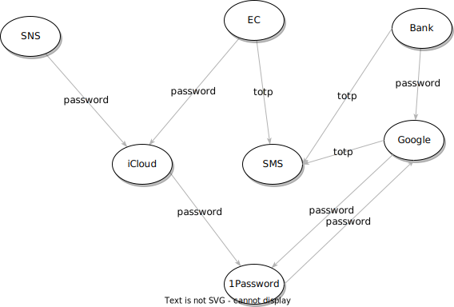
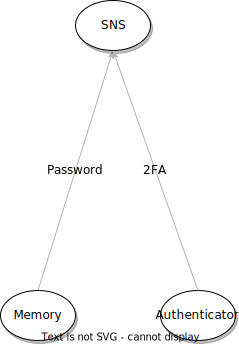
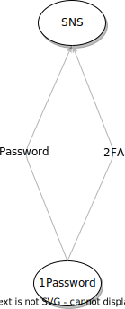

# [passkey][password] アカウント防災訓練のススメ または "Password Less" と "Less Password"

## Intro

震災の直後、復興のさなかに水害が起こり、再び全てが流される。能登の人々にとっては大変な 2024 年だったと思う。首都直下型や南海トラフはいつ起こってもおかしくないと言われ、戦火すら他人事ではなくなっている。

家に災害用の備蓄を用意するのと同様、定期的に「アカウント防災訓練」を個人的に実施するようになって数年経つ。

観点は「 **今、持っているものを全て失っても、リカバリできるだろうか?** 」だ。

現代のアカウントの管理は、リテラシがある程度高い人間にとっても、十分に複雑になってきている。

"*Password Less*" が叫ばれているが、現状 Password は無くなっているというより集約されている。つまり "*Less Password*" で残る「最後の Password」を起点に、どう全体を復元するかが災害時リカバリの課題だ。これに失敗して全てが詰むと、仮に無事避難できたとしても、相当な喪失を味わうだろう。

現状の選択肢と設計方針を振り返りつつ、災害時にデジタルアカウントをどう守るかについて考えたい。

## 注意

このアカウント防災訓練は、特に答えを出しているつもりはなく、見直してみること自体はお勧めするが、ここに書くやり方を人に勧めたいわけでは無い。その時の状況や選択肢、個々の事情や主義/理想によって、結果は変わるだろう。

どちらかというと趣味の延長で、「こういうのを考えるのが楽しい」からやっているのが、正直なところだ。

それを踏まえ、少しでも「あ、そういえば自分はどうなるだろう?」と思うきっかけになればと思い、今年初めて公開してみることにした。

## 前提

アカウント管理は、結局「どうリカバリするか」に行き着く。これはサービスを提供する側も、使うユーザ側も同じだ。

Password を忘れたら、メールでリカバリできるかもしれない。では、そのメールのリカバリはどうなっているか?

Passkey で Password を無くせるかもしれない。でも Passkey を保存した Password Manager にはどう入るのか?

「アレが残っていれば大丈夫」「コレがあればなんとかなる」という前提は、それが手に入る場面でしか成立しない。

災害で家や職場をすべて失い、普段使っているデバイス(PC, スマホ, Authenticator etc)をすべて失った状態でも、普段使っているサービスに再び入れるだろうか?

アカウント防災訓練を、「**ある日持っているものをすべて失ったら**」という前提で行うと、いろいろなものが見えてくる。

もちろん、「そんな状況ならまあ、諦めるかな」と思う人もいるだろう。しかし、もし無事に避難できた場合に、そこから続く生活を前に、同じことを言えるかは考えてみてほしい。

## リカバリチェーン

Password を忘れてリカバリする場合、メールを受信するのが一般的だろう。

そのメールが Gmail だった場合、Google にログインできないといけない。

では、Google へのログインはどうやってリカバリするだろう?

覚えられるような Password だとまずいので、複雑な Password を iPhone で作った?

それを保存した iCloud にはどうやって入る?

Password は覚えていても、 2FA が設定されていたら、、、それって SMS だっけ? それとも YubiKey?

デバイスが失われた時のための、バックアップコードは? 印刷したものは燃え、USB は流され、机に入れたらまずいだろと Dropbox に入れてあるけど Dropbox には入れる?

こうした依存関係を把握すると、リカバリの連鎖は割と複雑になっていることが多い。

特に、二段階/要素認証の普及で、覚えておいた Password だけで入れるサービスは減った。一方、二段階/要素の選択肢が多く、フローもサービスによって異なるので、全体を把握するのはエンジニアでも難しくなってきている。

あまり意識せず、場当たり的に色々な場所に保存し、知らぬ間に複雑にしてしまっている場合もあるだろう。

最初にこのチェーンを把握し、どういう依存関係になっているかを把握すると良いだろう。

## リカバリルートの特定とチェーンの整理

このチェーンを辿ったときに、最後に行き着く場所を、便宜的に「リカバリルート」と呼ぶことにしよう。

多くの場合、Google、Apple、Microsoft、1Password などに行き着くことが多いと思う。意識せず 2 つのサービスで相互に認証情報を保存しあっていると、どちらかに入っているうちは良いが、同時に入り直そうととすると、デッドロックする可能性もある。

その上で、SMS による TOTP や、Passkey、会社で配られた YubiKey や、銀行から送られてきた乱数表など、付随する何かを用いている場合も多い。

登録時のバックアップコードまでちゃんと保存しているか、保存していたとしても、それが最新のものになっているかなど、普段使わないものは確認しておかないと、いざというとき使えないだろう。

基本的には、チェーンはシンプルな方が良い。筆者の場合は基本的に全て 1Password に保存し、1Password にさえログインできれば、ほぼ全て復旧できる状態だ。そのうえで、利便性のために中間(iCloud Keychain etc)にいくつかのコピーが挟まっているような状態にしている。

もちろん、1Password が SPoF で、コンプロマイズされれば終わる。 LastPass のようなことが 1Password で起こらない保証は難しい。しかし、疑い出せばデバイスだって OS だって多角形の重箱にしか見えなくなる。素人が独自で考えたオリジナルの管理方法のように、自分だけが安全だと過信した泥船に乗ることを選ばない限りは、何かしらのリカバリルートを信用するしかない。

セキュリティと可用性はトレードオフだが、多くの一般ユーザにとっては「*攻撃されるリスク*」よりも「*ミスって詰む*」リスクのほうがよっぽど高いと個人的には思っている。

また、Google や Apple は、災害など関係なく突然アカウントが Ban されるという事例が、探すと色々出てくるだろう。仮に Google 八部に会い、Google のサービスを使えなくなるのはしょうがないとしても、それによって他のすべてのサービスに入れなくなるのは避けたい。

米国大統領が変わった今、こうした米国ビッグテックは、それこそ隣の島で何かあったとき、どうなるんだろう?と思ったりもする。そういう心配をするなら OSS の Password Manager などを入れるのが筋だろうが、それにしても 1Password が便利すぎるし、一応カナダの会社だし、中の人(今は違うが)にも知り合いがいて個人的な安心感もあるので、ここにルートを預けている。

## 2FA

二要素認証は、構図としては以下のようになる。

「記憶」に頼る Password と独立させるために、YubiKey や Titan のような Authenticator の「所持」要素を入れるのは、2FA としては理想かもしれない。しかし、壊れたり流されれば終わりだ。

実際、WebAuthn (not Passkey) が出てきた頃は、「2 つの Authenticator を買い、1 つは普段遣い、1 つは緒に貸金庫に保存」などという話もあった。しかし、物理 Authenticator を何個か使ってきたが、割とすぐ壊れ、何度か買い直したので、バックアップとしての心もとなさを感じている。

一方、Google Authenticator などの同期のないアプリは、端末移行などでミスって詰む人を何人も見てきた。そこで、同期ができる Authy などを使っていた時期もあるが、結局これも全て 1Password に集約した。

最近では 2FA 適用時に、バックアップコードを提供することが多い。このバックアップコードも「災害」を前提に考えると、意外と保管が難しい。紙で印刷したり、USB に入れて貸金庫に入れても、何かのはずみでサービス側のコードを更新してしまうと、保管したものは無効になるという同期の問題もある。

結局、筆者は 2FA だろうがバックアップコードだろうが、全て 1Password のログインアイテムに、Password と一緒に保存している。二要素ではなく、俗に言う一要素二段階の状態だが、可用性を重視しているのでそれ自体は気にしていない。

代わりに、Passkey だろうと乱数表だろうと、全て 1Password に保存し、1Password の管理にだけ集中すれば良くすることで、運用と認知の負荷をかなり下げることができている。

2FA は、簡単な Password が使い回されていた時代に、後付けで「それだけでは入れなくする」目的で追加された側面が大きいと考えている。すでに Password Manager で複雑な Password を登録し、さらに追加の要素を足しているのであれば、その時点でほとんどの攻撃に対策はできている。

それでも漏れる少しの隙を防ぎたいなら、それは個々の認知の負荷と運用練度の範囲でやればいいと思う。自分がやらかして詰むリスクよりも、コンプロマイズされるリスクの方が高いと思うのであれば。

## 最後の Password

Password Less の終着点は、Password Manager の普及で、 Passkey はその中継地点と捉えている。今の Passkey は Apple の最初のコンセプトとは代わり、 FIDO の Discoverable Credentials という位置づけになっているが、「Device Bound Secret は端末を変えたときに困る」というコンセプトには納得感があり、秘密鍵を同期で共有するなら何かしらの Password Manager が必要だ。そして、 Password Manager を使っているなら、認証方法が Passkey であるかどうか自体はあまり大きな問題では無いと感じる。

結局災害関係なく、 Password Manager は入れておくのが現代の前提となる。そして、災害宅の観点で最後に考えないといけないのは、その Password Manager のリカバリだ。これは、Google でも Apple でも 1Password でも、最後には Password が出てくる。

Passkey を保存する Manager のリカバリに Passkey を使うと、鶏が卵を背負ってやってくるので、他に頼りにくい「ルート」であるサービスがリカバリ手段として提供できる手段は実は少ない。結局そこは Password を消せなのだ。

必然的にこの「最後の Password」をどう守るかがリカバリの要になる。

これを失えば全部失い、これさえあれば他の Password は無くせる。そういう意味で "Password Less" の実態は、今のところこの「最後の Password」に集約する "Less Password" なのが現状だ。

1Password の場合、リカバリには 3 つの情報が必要となる。

1. Email
2. Secret Key
3. Password

1 と 3 は、記憶に頼ることになるだろう。特に 3 は、1Password を使っていれば、高頻度で入力することになるため、普段使いしている筆者は記憶に頼れる。

問題は 2 だ。これは登録時に付与される 34 桁のランダム文字列であり、最初くらいしか入力しないので、記憶に頼るのは難しい。これが 1Password における「最後の Password」相当になる。

1Password は、この値の書かれた PDF を「Recovery Kit」として配布し、「印刷して金庫にしまっておけ」と啓蒙してくる。

これをどう守るか。これが最大の課題だ。

## Recovery Kit

最初に思いつくのは、先程も出た「貸金庫」だろう。

ところで貸金庫は、震災があっても無事なものなのだろうか? 3.11 後の新聞などを探すと、一応残っていたという話もあるようだが、場所にもよる気がするので、信頼性はよくわからない。そもそも、ペライチの紙や USB メモリを保存しておくには、サブスクとしてちょっと高い。

ちなみに、最近だと行員の方の信頼性の話もあるが、換金できないモノなんかに興味はないだろうから、そこはどうでもいい。というか、そう考えると Secret Key だけが盗めてもなんにもならないので、機密性自体は重要ではなく、どちらかというとディザスタリカバリとして、「家ではない場所」に価値があるようにも思う。

関東大震災のような想定だと、もう少し遠隔地であれば良さそうだ。例えば北海道とか、海外とか。会社に支社でもあるなら、出張がてらそこにちょっと置かせてもらえれば、その方が良いかもしれない。というか、無事なオフィスがあるなら、機種変前に使ってた iPhone でも置いておきたいものだ。

そもそも、預けるにしても紙は心もとない。USB に入れたり CD といったメディアも結構簡単に壊れるからなぁ。一番安全なのは、金属か。ドッグタグに刻印しておけば、簡単には破損しなさそうだ。

まあ、被災した直後に、そんな遠くにモノを取りに行く余裕があるか怪しいし、有事でも起これば海外なんかしばらく行けない可能性もある。

物理バックアップは、ちゃんと考えると家の地下にシェルターでも欲しくなる。形あるものの儚さと扱いにくさを感じる。

腕に入れ墨、、、

ということで、とりあえずドッグタグを採用して、Secret Key (を導出できるもの)を刻み込んだものを作り、それを災害時に持ち出す防災カバンに取り付けて、物理バックアップについては終わることにした。

これは、「全て失ったら」の制約からは外れるが、持ち出せた場合にすぐリカバリできる用だ。そっちは別の方法に切り替えることにする。

## KYC によるリカバリ

物理はこのくらいで諦めて、視点を変えてみる。

世の中には「自分が自分であること」を証明できればなんとかなる場面が少なからずある。例えば被災時には、銀行や保険は、ある程度の本人確認でサービスを受けられるようになるといった仕組みになっている。

そして、同様に一定の認証を経て公共サービスはリカバリできる、つまりマイナンバーや運転免許は、どこかのタイミングで戻ってくることになるはずだ。(災害時に実際どういう運用になるのかは知らないのだが)

ここまで来ると、KYC を経て登録する系のサービスは、リカバリできる可能性が高い。一般的に、登録時に免許の撮影を求めるようなサービスだ。

そして、筆者が使っている Line Mobile は、KYC が通れば同じ番号の SIM を再発行してくれる。これは、実際に問い合わせて確認した。他の SIM でも同じかは知らない。

SIM が戻ってくるなら、端末さえ手に入れば SMS 認証が通るということになる。

つまり、SMS は「自分が自分であること」を証明できれば、どこかのタイミングで戻ってくるリカバリ手段として使えそうだ。

一般的に、SMS はその脆弱性がよく指摘され、使わない方が良いものとされてはいる。今後は使えなくなるかもしれない。

しかし、筆者はこの性質をバックアップとして使い、記憶ベースの Password と SMS で認証できるサービスに、1Password の Secret Key やいくつかのバックアップコードをバックアップしている。(もちろん、それとはわからない形で)

Passkey 普及などを、リテラシを差し置いて推し進めると、自爆で入れなくなる人も少なくないだろう。そういう人のカバーのためにも、KYC でリカバリできるサービスは増えていくような気が個人的にはしている。しかし、個別にはよくても 1Password 自体が KYC ではリカバリできないため、1Hop 置いたバックアップをそのどこかに置いておくのは重要だ。もちろん、一緒に Password まで置いてはいけないのは、言うまでもない。

## その他

マイナンバーカード自体が使えないかとは思っている。今は、マイナンバーでログインできるサービスは非常に限られているが、そのどこかに任意の情報が保存できる領域があれば、市役所でマイナンバーカードを発行してもらえた時点でリカバリができる状態を作れるかもしれない。

もっと言えば、一般サービスがマイナンバーカードでログインできるようになれば楽そうに見えてくる。しかし、中にある秘密鍵自体は再発行で変わるため、リカバリに使う場合は券面情報(つまりマイナンバーそのもの)を求めることになり、ハードルが非常に高いはずなので難しいという認識だ。公開はされていないが、IDP の機能自体もあるようなので、それが公開されれば良いのかもしれないが、おそらく公共サービスだけなのだろう。

また、今回は「全てを失ったが、無事ではあった」という暗黙の前提だったので、いわゆる「本当の生体認証」なら通るかもしれない。しかし、Touch ID や Windows Hello のように、生体情報を Authenticator Unlock に使うものは多いが、本当に生体情報を登録し直接認証に使うサービスを筆者はまだ見たことがない。個人情報の問題もあって難しいのだろうが、こういう用途で使えるサービスがあったら1箇所くらいいいかという気もするので、あるならぜひ知りたい。

## Outro

防災訓練としてはいるが、思考実験の側面も強い。

今回は自分のアカウントだけの話をしたが、家庭内 SE の役目を担っている場合、家族(特に高齢の両親など)のように、ネットリテラシが高くない人をカバーする必要もあるかもしれない。

筆者はこの訓練を定期的に行い、そのたびに色々と更新してきた。つまり、今後もその時々のインターネットや社会状況に応じて、更新し続ける必要があるだろう。

そういうものだと思って、年に一回くらいはなんとなく気にかけてみる機会になると良いと思う。

ちなみに、筆者の最近のテーマはどちらかというと「自分が死んだときに残された家族にアカウントをどう移譲/処分してもらうか」というデジタル終活の方だ。プライバシーを守りつつ、必要なアカウントは家族が継続して使え、不要なものは処分し、誰かに継いでもらう必要があるものを移譲してもらう、などを考えると、こちらはもっと難しく、考え甲斐があって楽しい。

その話も、いずれ書いてみたい。
