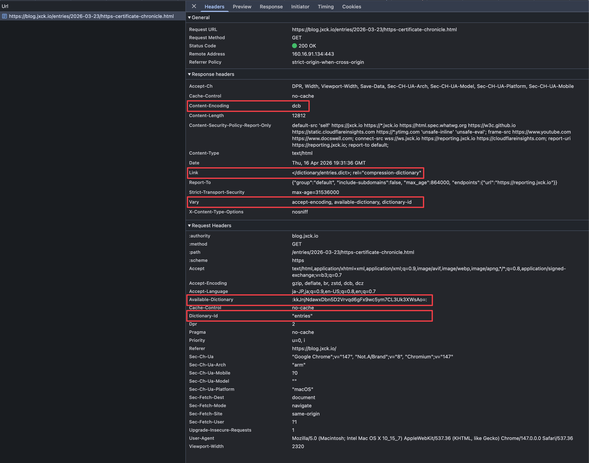

# [cdt][zstd][brotli][compression] Compression Dictionary Transport によるコンテンツ圧縮の最適化

## Intro

Compression Dictionary Transport は、圧縮に用いる辞書を HTTP 上で共有するプロトコルであり、2025 年 9 月に RFC 9842 として標準化された。

本サイトの対応を行ったので、方式の概要とデプロイ方法について解説する。


## 圧縮

圧縮は、基本的に「同じ値が出てきたら、前の値への参照に置き換える」という方式が中心となる。

例えば以下のような HTML を考えよう。

```html
<link rel="author" href="https://jxck.io">
<link rel="canonical" href="https://blog.jxck.io">
```

参照する位置とその長さを `[n:m]` と表すと以下のように置き換えられる。

```html
<link rel="author" href="https://jxck.io">
[0:11]canonical[18:16]blog.[34:9]
```

文字列表現では少ししか短くなっていないが、参照をバイナリで表現すればかなり小さくなる。これが LZ77 などの基本的な考え方だ。

この方式は、対象としたデータの中で、いかに効率よく「同じ値」を見つけるかが肝となる。圧縮ツールでは、この「同じ値」をどこまでの範囲で探すかを指定している場合が多い。丁寧に探せば圧縮率は向上するが、メモリ消費と実行時間が増え、速度を重視すると圧縮率が下がる。

ところが、対象データだけで探索を行う場合、最初の方に出てくるデータは圧縮が難しいことがわかる。そこより前に、コピーできるデータがないからだ。

同じ理由で、小さいファイルの圧縮率は相対的に下がる。そこが、アルゴリズムだけを用いた圧縮の限界になる。


## 辞書

例えば HTML の場合、`<!doctype html>` で始まる可能性が非常に高い。画像などのバイナリデータも、ヘッダ部分には共通するパターンが多くなる。それらは、 1 回しか出てこないことも多い。

そこで、あらかじめ `<!doctype html>` やバイナリヘッダなどのデータを参照用に用意しておき、それを圧縮対象の手前にくっつけてから圧縮を始めると、こうしたパターンも圧縮できることになる。

このとき、圧縮で参照するために頻出パターンをあつめたファイルを、LZ77 では辞書(Dictionary)と呼ぶ。汎用アルゴリズムを超えた圧縮を実現するには、いかに「精度の良い辞書」を用意するかが、圧縮性能を大きく左右することになる。


## Brotli の静的辞書

Brotli は最初から「Web 上でやり取りするデータ」にフォーカスしている。そこで、実際に Web 上でやり取りされている情報を大量に集め、そこから頻出パターンを抜き出した辞書を生成し、*仕様の中に直書き* している。

RFC にある、長い Hex がそれに当たる。

- RFC 7932 - Brotli Compressed Data Format
  - https://datatracker.ietf.org/doc/html/rfc7932#appendix-A

実際にバイナリを覗いてみると、テキストとして認識可能な箇所が多々ある。

最初の部分は、頻出英単語だろう。

```
timedownlifeleftbackcodedatashowonlysitecityopenjustlikefreeworktextyearoverbodyloveformbookplaylivelinehelphomesidemorewordlongthemviewfindpagedaysfullheadtermeachareafromtruemarkableuponhighdatelandnewsevennextcasebothpostusedmadehandherewhatnameLinkblogsizebaseheldmakemainuser')
```

途中はなんとなく JS 感がある(改行も含めて圧縮できるよう、辞書内に改行がそのまま入っている)。

```
exit:35Zvarsbeat'});diet999;anne}}</[i].LangkmĀ²wiretoysaddssealalex;
  }echonine.org005)tonyjewssandlegsroof000) 200winegeardogsbootgarycutstyletemption.xmlcockgang$('.50pxPh.Dmiscalanloandeskmileryanunixdisc);}
dustclip).

70px-200DVDs7]><tapedemoi++)wageeurophiloptsholeFAQsasin-26TlabspetsURL bulkcook;}
HEAD[0])abbrjuan(198leshtwin</i>sonyguysfuckpipe|-
!002)ndow[1];[];
Log salt
    bangtrimbath){
00px
});ko:ģfeesad>
s:// [];tollplug(){
{
 .js'200pdualboat.JPG);
}quot);

');
```

後半の方は明らかに頻出 HTML だ。

```
<html <meta charset="utf-8">:url" content="http://.css" rel="stylesheet"style type="text/css">type="text/css" href="w3.org/1999/xhtml" xmltype="text/javascript" method="get" action="link rel="stylesheet"  = document.getElementtype="image/x-icon" />cellpadding="0" cellsp.css" type="text/css" </a></li><li><a href="" width="1" height="1""><a href="http://www.style="display:none;">alternate" type="appli-//W3C//DTD XHTML 1.0 ellspacing="0" cellpad type="hidden" value="/a>&nbsp;<span role="s
```

これが Brotli の仕様そのものに含まれている。つまり、辞書を別途共有する必要はなく、サーバとクライアント両方が Brotli に対応しているだけで、この辞書を使った圧縮/伸長が可能になるのだ。

Web の静的ファイルを Brotli 圧縮すると、gzip よりかなり小さく圧縮できるのは、この辞書によるところも大きい。


## 自作の辞書

Brotli が RFC になったのは 2016 年だ。すでに 10 年経ち、その間にも Web には様々な変化がある。新しく増えた API や、頻度が増えた構文パターンなどは、既存の辞書には含まれていない。その変化を辞書に反映するには RFC を更新する必要があるのだ。また、あくまで世界中のトラフィックを集計して作った汎用辞書であるため、自分が配布するコンテンツに特化したチューニングなどもできない。

もしここで、自分の配布しているコンテンツの特性を踏まえて最適化された *自作の辞書* を作り、それを用いて圧縮できれば、より小さくできるだろう。

例えば、テンプレートエンジンにコンテンツを流し込んでいるサイトの場合、テンプレートはどの記事にも現れる共通部分ととらえることができる。そのテンプレートを連結したものは、HTML を圧縮する際の辞書として使えるだろう。雑に言うとこうだ。

```console
# 辞書生成
$ cat ./src/template/*.hbs > template.dict
# 辞書を用いて圧縮
$ brotli --dictionary=template.dict index.html -o index.html.br
```

他にも、JS をビルドした bundle.v1.0.0.js があった場合、それは更新した bundle.v1.0.1.js の辞書になる。なぜなら、多くの場合ファイル全体に対して、更新部分自体は数 % しかないからだ。

非常に単純化し、 v1.0.0.js と v1.0.1.js の間で、 100 ~ 110 byte 目だけが変わっていたとしよう。すると、その行より前と後は、全て v1.0.0 を参照して圧縮できる。イメージは以下だ。

TODO: イメージ


つまり、両者の Diff だけを送っているような状態にかなり近いといえる。

この辞書を用いた差分の圧縮は、 **Web における差分更新** を近似していると言えるのだ。

## WebBundle の失敗

実は Web における差分更新を実現するための取り組みは、以前にもあった。

ページに必要な複数のリソースを 1 つにまとめ、 1 回の Fetch で取得できるようにする WebBundle という仕様がかつて提案された。

- Webbundle によるサブリソース取得の最適化 | blog.jxck.io
  - https://blog.jxck.io/entries/2020-07-26/bundle-subresources.html

このメリットは、現代ではスタンダードな JS の Bundling でも効果が期待された。

我々は ESM を手に入れてからも、 Native な `import` はほとんど使ってない。 `import` 段階で、多くの依存を取得すると、オーバーヘッドがデカいため WebPack などで 1 ファイルにまとめて配布している。その中では Native な `import` は使ってない。 `import` は Bundler が見るための構文としてしか使われてない現状があるのだ。

従って、 bundle された一箇所 `main.js` だけが修正されただけでも、更新されてない依存を含めた bundle.js 全体を再取得する必要があるのだ。これは非常に無駄が多い。

そこで複数の JS を Bundle して bundle.js を作るのではなく、バラバラのまま WebBundle で一括配布する。クライアントは、ばらばらに Fetch されたかのように import できる。そうすれば、 JS の `import` 時に Fetch するのと異なり、ネットワークオーバーヘッドを減らして、生の `import` が使える。個別のキャッシュもできる。これが WebBundle に期待されたメリットだ。

問題は、 WebBundle した中で `main.js` だけが更新された場合、それだけを取得できるようにするにはどうするか？という差分更新の API 設計だった。

単純に「これらのファイルを持っている」などのリストを素直に提示するのは、クライアントのキャッシュ状況を開示していることになる。そこまでエントロピーが高いと、 Fingerprint や Tracking のベクターとなってしまう。また、この設計はどうしても IPC を挟み、パフォーマンスが出にくいという問題もあるようだった。

差分更新ができなければ、結局最新の WebBundle ファイルを毎回取得する必要があり、 bundle.js と差がないことになる。そして、徐々にこのコンセプトは作業がなくなり、実質死んだ提案と言って良い状態になった。

その後始まった Shared Brotli は、この「差分更新」のコンセプトを、辞書を用いて再始動するモチベーションがあったのだ。

## Web Font 問題

これが最も効くユースケースは WebFont だろう。

Noto Sans JP の woff2 を配布したいが、全部は重い。かといって、そのページに必要な文字だけを送ったら、次のページでは足りない。全ページで必要な文字を事前に把握するのも難しい。

ページごとに毎回異なる woff2 を取得するのも重いし、ページ間の woff2 はほとんどが共通していることになる。これこそが、差分更新が求められる場面だ。

例えば、全てのページで「そのページに必要な文字だけ」の woff2 を用意し、ページごとに送る。しかし、転送は既に送っている woff2 を辞書として圧縮することで、「足りない文字だけを送る」に近い転送量に下げることができる。

全ページで、そのページ用の woff2 を作っておく事前作業や、それを「クライアントにすでにある woff2」を辞書として圧縮するオーバーヘッドは残る。そもそも、 1 ファイルの転送は残るため、ネットワークが遅ければフォント置換による FO(I/U)T は避けられないだろう。それでも、 CJK で Web Font をどうしても使いたい開発者にとっては、縋れる藁ではあるだろう。

残る問題は、「その辞書をどう共有するか」というプロトコルだ。

## Web における辞書共有

実は過去にも、まさしく「サーバとクライアントで辞書を共有し圧縮率を上げる」という目的のために作られた SDCH (Shared Dictionary Compression for HTTP) という仕様が存在し、Chrome にも実装されていた。

- A Proposal for Shared Dictionary Compression over HTTP
  - https://lists.w3.org/Archives/Public/ietf-http-wg/2008JulSep/att-0441/js.dictionary_Compression_over_HTTP.pdf

しかし、この仕様は提案時期が 2008 年頃とかなり古く、仕様も複雑だった。当時はまだ CORS なども普及する前であるため、安全性の問題もあり、全くと言ってよいほど普及せず、2016 年には Chrome からも削除された。

一方、後発の Brotli がブラウザに実装され、`Content-Encoding: br` として静的辞書を使った圧縮転送を実現した。つまり、ブラウザには Brotli の実装が既に入っていたのだ。

この Brotli には、仕様に定義された静的辞書以外に、独自に作った辞書を使うこともできるため、その辞書を共有するためのプロトコルを作る取り組みが始まった。

SDCH や WebBundle の失敗を踏まえて、仕様をシンプルに絞った。CORS を前提とする昨今のセキュリティマナー、過剰なエントロピーを露出しないプライバシーマナーに則りモダンな仕様にした。

そうして、差分更新の近似になる「Web における辞書共有」を再定義したのが "*Shared Brotli*" と呼ばれる提案だった。

後から「zstd など他の圧縮方式でも使える」ということで、名前をより汎用的な "Compression Dictionary Transport (CDT)" にリネームし、標準化作業が進められた。


## RFC 9842: Compression Dictionary Transport

2025 年 9 月に RFC 9842 として発行された。

- RFC 9842: Compression Dictionary Transport
  - https://www.rfc-editor.org/rfc/rfc9842

CDT は、任意のコンテンツから辞書を作成し、それをサーバ/クライアント間で共有する 2 つの方式が提案されている。

- Delta Compression
  - クライアントが取得したコンテンツを、次の取得の辞書にする
- Separate Dictionary
  - 事前にサーバが用意した辞書を、クライアントがバックグラウンドで取得する

どちらも、共有した辞書を Brotli/Zstd で使用することができる。


## Delta Compression

すでに取得したリソースを、次の送信するリソースの辞書として使う方式だ。

例えば `index.html` を返す際に、「他の HTML の辞書に使える」ということを`Use-As-Dictionary` で指定する。

```http
Use-As-Dictionary: match="/*", match-dest=("document"), id="entries", type="raw"
```

`index.html` を取得済みのクライアントは、そこから `about.html` に遷移する際に、以下のように「辞書に使える `index.html` を持っている、とリクエストに付与する。

```http
Accept-Encoding: dcb, dcz
Available-Dictionary: :<base64-SHA256 of index.html>:
Dictionary-ID: "entries"
```

提示されたハッシュから、クライアントが `index.html` を辞書として持っていることを知ったサーバは、次に返す `about.html` を `index.html` を辞書として圧縮して返すことができる。Brotli で圧縮する場合は Dictionary-Compressed Brotli (`dcb`)、Zstd なら Dictionary-Compressed Zstd (`dcz`) としてレスポンスする。

```http
Content-Encoding: dcb
Vary: Accept-Encoding, Available-Dictionary, Dictionary-ID
Use-As-Dictionary: match="/*", match-dest=("document"), id="entries", type="raw"
```

このレスポンスは、圧縮に使う辞書によって結果が変わってしまうため、`Vary` に依存するヘッダを入れるのを忘れてはならない。また、ここに `Use-As-Dictionary` を付与すれば、他のコンテンツの圧縮にも使うことができる。

この場合サーバは、受け取った `Available-Dictionary` のハッシュ値から、対応する辞書(ここでは HTML)を引き、それを使って次のレスポンスを圧縮することになる。現在、Brotli や Zstd のオンザフライ圧縮をしているのであれば、そこに辞書を追加するだけなので、パフォーマンスの問題もそこまで大きくはならないだろう。

しかし、動的に HTML を生成し、レスポンスしたら捨ててしまうタイプの実装では、ハッシュから辞書となる HTML を引けないため、CDN などに HTML をキャッシュしているような構成の方が相性がいい。辞書にするためメモリに持つ場合は、その管理の戦略も必要だろう。

また、オンザフライで圧縮するため、圧縮率よりは圧縮速度を重視した実装をすることになる。速度を重視する場合は、Brotli よりは Zstd の方が有利そうだ。

現状、このような高度な差分圧縮配信に対応したサーバは、ざっと探したところ見つかっていない。


## Separate Dictionary

Separate Dictionary は、その名の通り共有辞書を事前生成しておく方法だ。

例えば、配信する全ての JS から辞書を作成する。

```sh
$ ./dictionary_generator ./js.dict ./assets/js/*.js
```

この `js.dict` をサーバにデプロイし、HTML の `<link>` または HTTP `Link:` ヘッダで指定する。

```html
<link href="js.dict" rel="compression-dictionary">
```

```http
Link: <js.dict>; rel="compression-dictionary"
```

このレスポンスを取得した際に、ブラウザは辞書の存在に気づき、それをダウンロードすることで、以降のコンテンツの伸長に利用できる。

つまり、投機的な取得であるため、例えばメインページのための辞書をログインページでダウンロードしておくといった設計になるだろう。代わりに、それなりに大きな辞書を配布しやすい。

`js.dict` のレスポンスヘッダには、辞書が対象とするパスを以下のように指定する。

```http
Content-Type: application/octet-stream
Use-As-Dictionary: match="/assets/js/*", match-dest=("script"), id="js", type="raw"
```

この仕様の特徴として、`js.dict` のための `Content-Type` は定義されていない。かなり初期の段階で「あったほうが良いのでは?」というフィードバックもしたが、無いまま仕様になってしまった。

どのような辞書なのかは `Use-As-Dictionary` の `type` で指定することになっているが、現状デフォルトの `raw` のみしかない。`raw` はいわゆる "unformatted blob of bytes" として仕様に定義されているため、`application/octet-stream` を指定するのが妥当そうだ。

あとの流れは同じだ。以降の JS の取得に対して、ブラウザは `Available-Dictionary` を送ってくる。

```http
Accept-Encoding: dcb, dcz
Available-Dictionary: :<base64-SHA256 of js.dict>:
Dictionary-ID: "js"
```

サーバは、クライアントが指定してきた辞書を使用し、コンテンツを圧縮して返すことができる。

この方式の場合は、辞書が事前に生成済みだ。したがって、bundle.js のように JS も生成済みであれば、事前に時間をかけて丁寧に圧縮した bundle.js.dcb を用意しておき、辞書が一致したらそれを返すという方法が使える。

```console
$ brotli -q 11 -w 24 -f --dictionary=js.dict bundle.js -o bundle.js.dcb
```

JS のビルドに追加して実行すれば良いため、静的サイトジェネレータなどとも相性が良いと言えるだろう。


## プライバシーと制限

WebBundle の失敗を踏まえ、CDT では制限を課している。

- 辞書は Partitioning される
  - Cookie や Cache と同じ
  - 辞書をサイト間共有するといったことはできない
- `Available-Dictionary` は常に 1 つしか送らない
  - 複数辞書の候補があっても、それをリストで送りサーバが選ぶようなことはしない
  - どれが送られるかはクライアントが選ぶので、トラッキングベクタになりにくい
- 辞書と圧縮対象は Same-Origin
  - `Use-As-Dictionary` の `match` は辞書と同じ origin のみ
  - Cross-Origin になるレスポンスに CDT を使うなら CORS チェックを通る必要がある
  - 別 origin に対して無条件に `Available-Dictionary` を送れるわけではない

これにより、Web のセキュリティ基盤である Same Origin Policy に則った仕様となり、Cross Origin Info Leak のリスクを減らすことができる。


## 本サイトへの適用

### 構成

本サイトは、テンプレートエンジンに Markdown を流し込んだ静的な HTML でできており、動的なレスポンスは検索くらいしかない。ビルドした静的ファイルは、全て Brotli の一番強いオプションで、時間をかけてじっくり事前圧縮し、`Content-Encoding: br` で配布している。

Delta Compression の場合、取得済みの記事を次の記事の辞書にすれば、記事の差分だけを送っている状態にできる。ただしこれは、どのハッシュがどの HTML を指すかを把握し、動的に圧縮する必要がある。

Separate dictionary の場合、記事ページ(`/entries/*`)から辞書を生成し、全ての記事を事前に圧縮しておくことができるだろう。

h2o はどちらの方式にも対応していないため、パッチを当てるか mruby で実装する必要がある。まずは PoC として mruby で実装したいため、比較的対応が楽な後者の Separate dictionary 方式を採用することにした。


## 辞書の作成

まず、サンプルとなるファイルから辞書を作成する。

今回は単純に `/entries/**/*.html` を全てサンプルとし、辞書を生成した。テンプレート由来の共通部分も最終的には HTML に展開されて含まれるため、入力は全記事 HTML のみとしている。

作成した辞書は `/dictionary/entries/<sha256>.dict` として配布している。build 時は `blog.jxck.io/dictionary/entries/active.dict` という symlink から参照し、配信時の `Link` ヘッダは `h2o.dict.conf` に書き出している。

辞書は大きくすることもできるが、大きければ効率が良いわけでもない。色々テストをした結果、256KB を採用した。

辞書もほとんどただのテキストなので、Brotli で強めに圧縮したところ、60KB ほどになった。

辞書の作り方は、それだけで 1 つのエントリになるため、次回に詳細を解説する。


## 事前圧縮

HTML のビルドプロセスの最後に、その HTML を全て集めた辞書を作り、その辞書で各 HTML を圧縮する処理を加えた。

事前処理なので、最も強いオプションで強く圧縮している。

実験したところ、同じ辞書を使っていても、`zstd` と `brotli` で圧縮率が変わる。

本サイトでは、`brotli` を用いた圧縮の方が小さくなったため、そちらを採用することにした。

提供している辞書に加えて、Brotli 自体が静的な辞書を持っていることも効いているのかもしれない。

辞書を使って圧縮した `.dcb` / `.dcz` には固定のヘッダをつける必要がある。

Dictionary-Compressed Brotli (`dcb`) は以下の 36 byte

```
0xff, 0x44, 0x43, 0x42 (magic)
(SHA256 32 bytes)
```

Dictionary-Compressed Zstd (`dcz`) は以下の 40 byte

```
0x5e, 0x2a, 0x4d, 0x18 (magic)
0x20, 0x00, 0x00, 0x00 (magic)
(SHA256 32 bytes)
```

全ての `.html` の隣には、従来の `.html.br` と `.html.dcb` ファイルがある状態だ。

全 269 ファイルで圧縮を行ったところ、`.html` に対して `.dcb` は以下のような結果になった。

Caption: `.html` と `.dcb` の比較
| 指標           | 値     |
|:--------------:|:------:|
| 対象ファイル数 | 269    |
| 平均圧縮後比率 | 10.79% |
| 平均削減率     | 89.21% |

`.html` を配信するより 1/10 程度になる。

Caption: `.br` と `.dcb` の比較
| 指標                               | 値     |
|:----------------------------------:|:------:|
| 対象ファイル数                     | 269    |
| `.br` に対する `.dcb` の平均削減率 | 46.70% |

また、CDT をネゴシエーションできなかった場合は、従来通り `.html.br` を返す。

`.html.br` と `.html.dcb` を比べると以下だ。

つまり辞書のおかげで、ただ brotli 圧縮するより、半分くらい小さくなっていると言える。


## 辞書の配布

作成した辞書は、`blog.jxck.io` 以下のすべてのパスで、`Link` ヘッダでアドバタイズしている。

```http
Link: </dictionary/entries/<sha256>.dict>; rel="compression-dictionary"
```

どこかしらにアクセスすれば辞書をバックグラウンドで取得できるので、次にアクセスする記事から圧縮に使える。

辞書の有効期限は、単純に辞書の `Cache-Control` で行う。以前は `ttl=3600` のように、キャッシュと独立した辞書の期限を指定できる提案もあった。これは特に、先の Delta Compression のパターンで HTML レスポンスの期限と、辞書としての期限を変えたいという要望だった。しかし、`max-age` と `stale-while-revalidate` の併用などによってカバーできる可能性があり、必要になったら再度議論する方向で一旦削除されている。

辞書のレスポンスはこのようにした。

```http
Content-Type: application/octet-stream
Use-As-Dictionary: match="/entries/*", match-dest=("document"), id="entries"
Cache-Control: max-age=172800
```

配信 URL 自体は content-addressed にしておき、build や mruby からは `active.dict` という固定名 symlink を参照する形にしている。これにより、配信パスは hash 名のまま、build 側は glob や固定名 `.dict` に依存せずに済む。


## `.dcb` ファイルの提供

最後は辞書利用のネゴシエーションだ。これは、h2o の mruby handler で実装している。

- jxck.io/.mruby.handler/dcb.rb
  - https://github.com/Jxck/jxck.io/blob/main/.mruby.handler/dcb.rb

要点はこうだ。

- 起動時に `active.dict` を取得し、SHA256 のハッシュを事前に計算しておく
- リクエストごとに以下をチェック
  - `Accept-Encoding: dcb` がある
  - `Available-Dictionary` が `active.dict` の実体辞書のハッシュと一致
  - `Dictionary-ID` が `"entries"` と一致
  - リクエストされた Path が `match` / `match-dest` と一致
  - リクエストコンテキストが正しい

最後のリクエストコンテキストは、要するに CORS チェックだ。

RFC の以下にアルゴリズムがあるため、それをそのまま実装すれば良い。

```
If there is no "Sec-Fetch-Site" request header, return TRUE.
If the value of the "Sec-Fetch-Site" request header is "same-origin", return TRUE.
If there is no "Sec-Fetch-Mode" request header, return TRUE.
If the value of the "Sec-Fetch-Mode" request header is "navigate" or "same-origin", return TRUE.
If the value of the "Sec-Fetch-Mode" request header is "cors":
If the response does not include an "Access-Control-Allow-Origin" response header, return FALSE.
If the request does not include an "Origin" request header, return FALSE.
If the value of the "Access-Control-Allow-Origin" response header is "*", return TRUE.
If the value of the "Access-Control-Allow-Origin" response header matches the value of the "Origin" request header, return TRUE.
Return FALSE.
```

ただし、本サイトでは CORS などに対応するつもりがないため、最小限に絞って実装した。CDT に対応しないでも、普通に `.html` や `.html.br` を返せば良い。


## Debug

正直デバッグはしづらい。

一応 Chrome は `chrome://net-internals#sharedDictionary` で、取得済み辞書の情報を見ることができ、そこからキャッシュを消すことができる(名前の通り過去の遺物感がある)。


正しい辞書が使えていない場合などは結構ハマる。

次回解説するが、`zstd --train` がそのまま辞書に使えると思ってかなりの時間を溶かした。

もう少し使われるようになれば、このあたりも改善されることを期待したい。


## DEMO

本サイトの記事 HTML に限定し、Compression Dictionary Transport の Separate Dictionary 対応を行った。




## Outro

Shared Compression Dictionary の検証のため、本サイトの HTML を事前辞書で圧縮し、検証を行った。

本ブログでは 2023 年 7 月に、まだ策定段階の Compression Dictionary Transport について解説した。

- Compression Dictionary Transport (Shared Brotli) によるコンテンツ圧縮の最適化 | blog.jxck.io
  - https://blog.jxck.io/entries/2023-07-29/compression-dictionary-transport.html

本ブログは、その更新版にあたる。


## Resources

- Spec
  - RFC 9842 - Compression Dictionary Transport
    - https://www.rfc-editor.org/rfc/rfc9842.html
- Explainer
  - WICG/compression-dictionary-transport
    - https://github.com/WICG/compression-dictionary-transport
- Requirements Doc
  - Compression dictionary transport with Shared Brotli
    - https://docs.google.com/document/d/1IcRHLv-e9boECgPA5J4t8NDv9FPHDGgn0C12kfBgANg/edit
- Mozilla Standard Position
  - Request for Mozilla Position on Compression dictionary transport · Issue #771 · mozilla/standards-positions
    - https://github.com/mozilla/standards-positions/issues/771
- WebKit Position
  - Compression Dictionary Transport · Issue #160 · WebKit/standards-positions
    - https://github.com/WebKit/standards-positions/issues/160
- TAG Design Review
  - Tag review for Compression Dictionary Transport · Issue #877 · w3ctag/design-reviews
    - https://github.com/w3ctag/design-reviews/issues/877
- Intents
  - Intent to Experiment: Compression dictionary transport with Shared Brotli
    - https://groups.google.com/a/chromium.org/g/blink-dev/c/NgH-BeYO72E
  - Intent to Ship: Compression dictionary transport with Shared Brotli and Shared Zstandard
    - https://groups.google.com/a/chromium.org/g/blink-dev/c/MuaRf28nExk
- Chrome Platform Status
  - Compression dictionary transport with Shared Brotli and Shared Zstandard - Chrome Platform Status
    - https://chromestatus.com/feature/5124977788977152?gate=5186705503551488
- WPT (Web Platform Test)
  - web-platform-tests dashboard
    - https://wpt.fyi/results/fetch/compression-dictionary?label=experimental&label=master&aligned
- DEMO
  - horo-t/compression-dictionary-transport-shop-demo
    - https://github.com/horo-t/compression-dictionary-transport-shop-demo
  - horo-t/compression-dictionary-transport-threejs-demo
    - https://github.com/horo-t/compression-dictionary-transport-threejs-demo
- Blog
  - Supercharge compression efficiency with shared dictionaries
    - https://developer.chrome.com/blog/shared-dictionary-compression
  - Compression Dictionary Transport (Shared Brotli) によるコンテンツ圧縮の最適化 | blog.jxck.io
    - https://blog.jxck.io/entries/2023-07-29/compression-dictionary-transport.html
  - All the way up to 11: Serve Brotli from origin and Introducing Compression Rules
    - https://blog.cloudflare.com/this-is-brotli-from-origin/#the-future-of-web-compression
- MDN
  - Compression Dictionary Transport - HTTP | MDN
    - https://developer.mozilla.org/en-US/docs/Web/HTTP/Guides/Compression_dictionary_transport
- Presentation
- Issues
  - Compression dictionary transport with Shared Brotli [40255884] - Chromium
    - https://issues.chromium.org/issues/40255884
  - 1882979 - [meta] Compression Dictionary Transport
    - https://bugzilla.mozilla.org/show_bug.cgi?id=1882979
- Other
