# [css][color] CSS Color Module v6 ベースの色設計

## Intro

Web における「色」を扱う API は、気づいたら色々増えている。

デザインシステムの中で、デザイントークンとして色を一元管理するといった構成は増えているが、その先の定義が RGB Hex なことはまだ多いだろう。

今の Web の API を用いると、どういった色の設計や管理が可能なのか、Web における色の指定を棚卸しする。

中心は CSS Color Module Level 4 ~ 6 だ。

- https://drafts.csswg.org/css-color-4/
- https://drafts.csswg.org/css-color-5/
- https://drafts.csswg.org/css-color-6/


## Named Color

CSS のキーワードとして登録されている 148 色は、Named Color と呼ばれる。

```css
background-color: red;
```

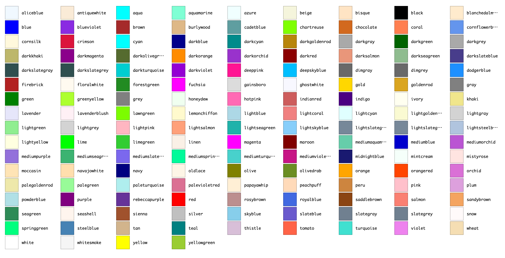

DEMO: https://labs.jxck.io/color/#named-colors

仕様に書かれている通り、これらは初期のブラウザが動作環境としていた X11 の実装する色名を、そのままブラウザに移植したところから始まる。

> For historical reasons, this is also referred to as the X11 color set.

X11 以外にもいくつかの経路で集約されたため、`gray` (米国綴り)と `grey` (英国綴り)が両方あったり、`aqua` と `cyan` が同じだったりするため、色自体は 139 色だ。

そして、この "Named Color" が "Web Safe Color" だと誤解されることがある。

Web Safe Color は、モニターが 256 色しか再現できなかった時代に、その範囲を超えないように指定し、再現性を保つための色とされる。

要するに RGB をそれぞれ 16 進数にしたとき、`00`, `33`, `66`, `99`, `CC`, `FF` の 6 つを組み合わせた 6^3 = 216 色を指す。ちなみに、連続する数字はまとめられるので `#FFCC33` は `#FC3` と書ける。

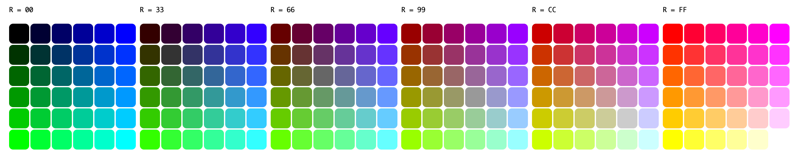

DEMO: https://labs.jxck.io/color/#web-safe-colors

例えば Named Color の `skyblue` は `#87CEEB` と半端な値が含まれるため、Web Safe Color ではなく、最も近いのは `#99CCFF` になる。

現在 Named Color を、プロダクションの色設計で用いる積極的な理由はない。

また、一般的な閲覧環境に "Web Safe Color" の再現性を求める必要もない。

- CSS Color Module Level 4 - 6.1. Named Colors
  - https://drafts.csswg.org/css-color-4/#named-colors


## RGB

色の指定として最初に思いつき、もっとも使われているのが RGB だろう。三原色である Red / Green / Blue の割合を指定する手法だ。

指定方法は、それぞれを 16 進数にして並べた方法が一般的だ。Alpha を加えて 8 桁にすることもできる。

```css
background-color: #aabbcc;   /* rgb */
background-color: #aabbccdd; /* rgba */
```

`rgb()` を用いると、それぞれを 10 進数や、割合(%)で表現することができる。

```css
background-color: rgb(30 40 50 / 60%);
background-color: rgb(10% 20% 70% / 60%);
```

DOM API で色情報を取得する際、`[30, 40, 50]` のように RGB 形式を用いるものがあるため、そこと連携する際は `rgb()` が使いやすい。また、昔は `rgb(30, 40, 50)` のようにカンマ区切りだったが、今は区切る必要はない。

また Alpha を指定するために `rgba()` も定義されたが、`rgb()` が拡張されて Alpha が取れるようになったため、`rgba()` は `rgb()` のエイリアスとなっている。

- CSS Color Module Level 4 - 5.1. The RGB functions: rgb() and rgba()
  - https://drafts.csswg.org/css-color-4/#rgb-functions


## HSL

RGB は、ディスプレイが赤・緑・青を発光し、その混ぜ合わせで色を作るモデルを、そのまま数値に落とし込んだものだ。つまり、ディスプレイに対する、低レイヤーな命令と言える。

このモデルは、機械にとって都合が良くても、人間にとって都合が良いとは言えない。

例えば、以下の 2 つでどちらの方が「鮮やか」か、ぱっと分かるだろうか?

```css
background-color: #f53d65;
background-color: #ff335f;
```

こうした問題を解決するために、「人間の知覚」に近い表現ができるモデルが、複数作られた。

その 1 つが HSL だ。HSL は Hue(色相) / Saturation(彩度) / Lightness(明度) の 3 つで色を表す方式だ。

先程の 2 つの色を HSL で表すとこうなる。

```css
background-color: hsl(347 90% 60%);
background-color: hsl(347 100% 60%);
```

こう比較すると、両者は色相/明度は全く同じで、彩度だけが変わっていることが一目瞭然となる。

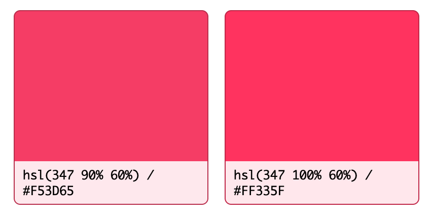

DEMO: https://labs.jxck.io/color/#hsl-comparison

この特徴を用いれば、例えば L, S を固定して H を変えれば、「明るさ」「鮮やかさ」を統一した異なる色を選ぶことができるため、統一したカラーパレットを作ることができる。アルゴリズミックな色定義が可能ということだ。

```css
background-color: hsl(220 90% 50%);
background-color: hsl(250 90% 50%);
background-color: hsl(280 90% 50%);
background-color: hsl(310 90% 50%);
background-color: hsl(340 90% 50%);
background-color: hsl( 10 90% 50%);
```

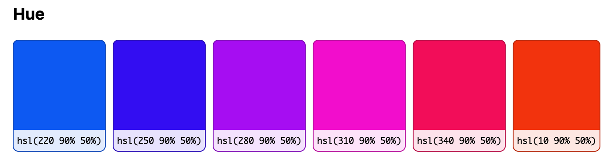

DEMO: https://labs.jxck.io/color/#hsl-components

Web においても、HSL を採用する事例は決して少なくはなく、shadcn/ui などでは、HSL の成分を定義して、そこから色を生成する方式を取っていた。

- "I recommend using HSL colors for theming but you can also use other color formats if you prefer."
  - https://github.com/shadcn-ui/ui/blob/eeb17545a16824e11d09149a5ecab9fca570c448/apps/www/content/docs/theming.mdx#other-color-formats

d3.js も色の操作に `d3.hsl()` API を提供している。

- d3-color | D3 by Observable
  - https://d3js.org/d3-color#hsl

ところが、H を変えていく場合、L が同じでも「黄色が眩しく、青が暗い」と感じる問題が知られていた。

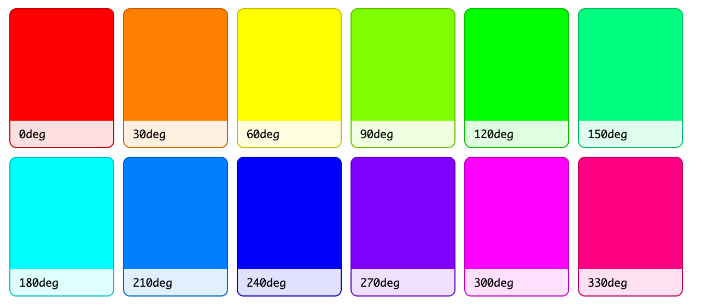

DEMO: https://labs.jxck.io/color/#hsl-uniformity

したがって現在は、「人間の知覚特性に合わせた変化」をさせやすい性質(Perceptual Uniformity:知覚均等性)をもつよう、改善された方式が使われるようになっている。

つまり、Web において今から新規に HSL を用いる積極的な理由はない。

- CSS Color Module Level 4 - 7. HSL Colors: hsl() and hsla() functions
  - https://drafts.csswg.org/css-color-4/#the-hsl-notation


## HWB

HWB は Hue(色相) / Whiteness(白の混合率) / Blackness(黒の混合率)で色を指定する方式だ。

「選択した純色に対し、白と黒をどれだけ混ぜるか」という、絵の具の混色に近いメンタルモデルで、色を設計することができる。

先程の 2 色の場合は以下のようになる。1 つめの方が、白と黒が多く混ざっているため、2 つめの方が純色に近いことがわかる。

```css
background-color: hwb(347 24% 4%);
background-color: hwb(347 20% 0%);
```

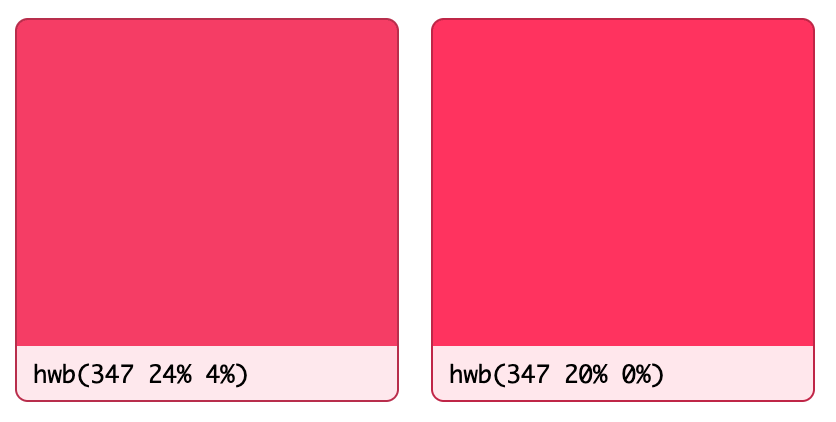

DEMO: https://labs.jxck.io/color/#hwb-comparison

HSL は、明度・彩度のパラメータがそれぞれ独立していることにメリットがあった。

しかし、人間が色を作る上では、対象となる色を「淡くする」「くすませる」といった操作の方が直感的であり、カラーピッカーの UI とも相性が良い。そのため、デザインツールではこの HWB と近いモデルの HSV/HSB が使われており、そことの親和性も高いとされた(全く一緒ではない)。

考案者がペイントツールを作っていた Alvy Ray Smith (後に Pixar を共同創業)であることを考えても、その特徴に納得がいく。

ところが、HSL と同様に知覚均等性はなく、アルゴリズミックな色定義がしやすいわけでもなかったため、Web の世界ではあまり使われている話を聞かない。今後も、積極的に採用する理由はないだろう。

- CSS Color Module Level 4 - 8. HWB Colors: hwb() function
  - https://drafts.csswg.org/css-color-4/#the-hwb-notation


## LAB

LAB は、色の見た目を数値化し、感覚的な違いを共有するような場面で広く使われ、CIE (国際照明委員会)によって策定された色空間であり、CIELAB とも呼ばれる。

Lightness, a, b の 3 次元で指定され、a が赤~緑、b が青~黄の間の値を指定する。

```css
background-color: lab(50% 40 20 / 80%);
```

例えば L を 10 から 20 にしたときも、50 から 60 にしたときも、「同じくらい明るくなった」と感じやすいという、知覚均等性を持つため、グラデーションやシェードの設計がしやすいとされる。

しかし、a と b の調整は難しく、「彩度だけ変えたい」といった場合の計算が複雑になる。

例えば、先程の 2 色は HSL では彩度だけ変わっていたが、LAB だと以下のようになる。

```css
background-color: lab(56.5% 70.8 22.8);
background-color: lab(57.4% 75.8 27.9);
```

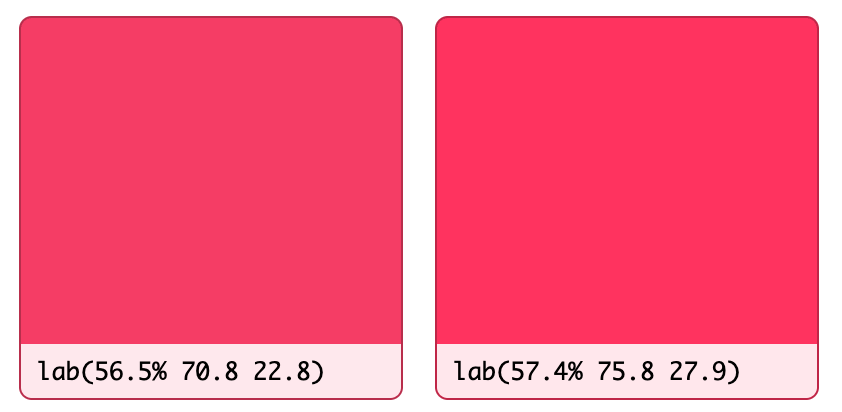

DEMO: https://labs.jxck.io/color/#lab-comparison

明度が近いことはわかるが、彩度の差はここからだと読み取るのは難しい。

L はよくても、a, b をアルゴリズミックに設計するのが難しいため、LAB もそのまま Web で採用されることは少ない。

したがって、LAB も新規で積極的に入れる理由はないだろう。

- CSS Color Module Level 4 - 9.3. Specifying Lab and LCH: the lab() and lch() functional notations
  - https://drafts.csswg.org/css-color-4/#specifying-lab-lch


## LCH

人間の視覚は「明度(Lightness)」「彩度(Chroma)」「色相(Hue)」という 3 つの要素で、色を認識している。

これをそのまま落とし込んだのが LCH だ。

```css
background-color: lch(60% 50 250 / 80%);
```

色相(H)だけを変えていけば、同じ明るさ・鮮やかさのカラーパレットを作ることができる。

明度だけを変えて Hover 時の色を出したり、彩度だけ変えて Disable 時の色を出したりと、状態に応じたバリエーションも作りやすい。

ただし、青の色相においては、明度や彩度だけを変えても明らかに赤みを帯びて紫っぽくなり、色相が変わって見える現象が知られている。

```css
background-color: lch(30% 130 300); /* 起点 */
background-color: lch(50% 130 300); /* 赤紫が入る */
```

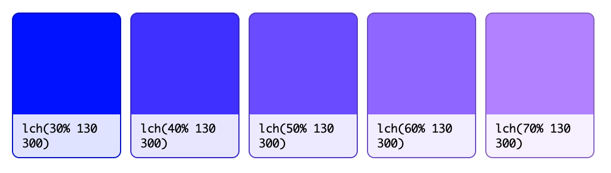

DEMO: https://labs.jxck.io/color/#lch-hue-shift

これは実は LAB でも起こっており、LCH は LAB を直交座標から極座標に変換しただけ(つまり表し方を変えただけ)なので、LAB の問題を引き継いだ形になる。

したがって、LCH も新規で積極的に入れる理由はないだろう。

- CSS Color Module Level 4 - 9.3. Specifying Lab and LCH: the lab() and lch() functional notations
  - https://drafts.csswg.org/css-color-4/#specifying-lab-lch


## OKLAB/OKLCH

LAB/LCH の持っていた「青が紫にシフトする」問題を数学的に解決したのが OKLAB/OKLCH だ。

- A perceptual color space for image processing
  - https://bottosson.github.io/posts/oklab/

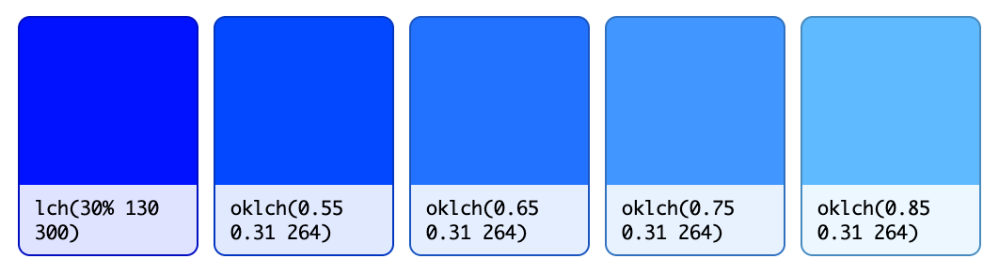

DEMO: https://labs.jxck.io/color/#oklch-hue-stability

ブログによると、OK とは良いという意味そのままの OK のようだ。

> It is called the Oklab color space, because it is an OK Lab color space.

これにより、色相・明度・彩度の独立性が高く、ある要素の調整が他の要素に影響しづらい色空間を手に入れたことになる。

つまり、LCH かつ OK な OKLCH を使って、カラーパレットやグラデーション、状態ごとのバリエーションなどを定義するのが、現代の Web における色の設計手法の理想と言って良い。

例えば、L, C を固定し H を変えていけば、明るさ/鮮やかさが揃ったカラーパレットが作れる。

```css
:root {
  /* 明度(L) と 彩度(C) の共通設定 */
  --brand-l: 0.74;
  --brand-c: 0.125;

  /* Hue を変えることで、トーンが揃ったカラーパレットが定義できる */
  --brand-blue:   oklch(var(--brand-l) var(--brand-c) 263); /* 青 */
  --brand-green:  oklch(var(--brand-l) var(--brand-c) 148); /* 緑 */
  --brand-purple: oklch(var(--brand-l) var(--brand-c) 314); /* 紫 */
  --brand-red:    oklch(var(--brand-l) var(--brand-c)  32); /* 赤 */
}
```

HSL では「黄色だけ眩しすぎる」「青だけ暗すぎる」という問題が起きるが、OKLCH であれば知覚的に揃ったパレットを作ることができる。

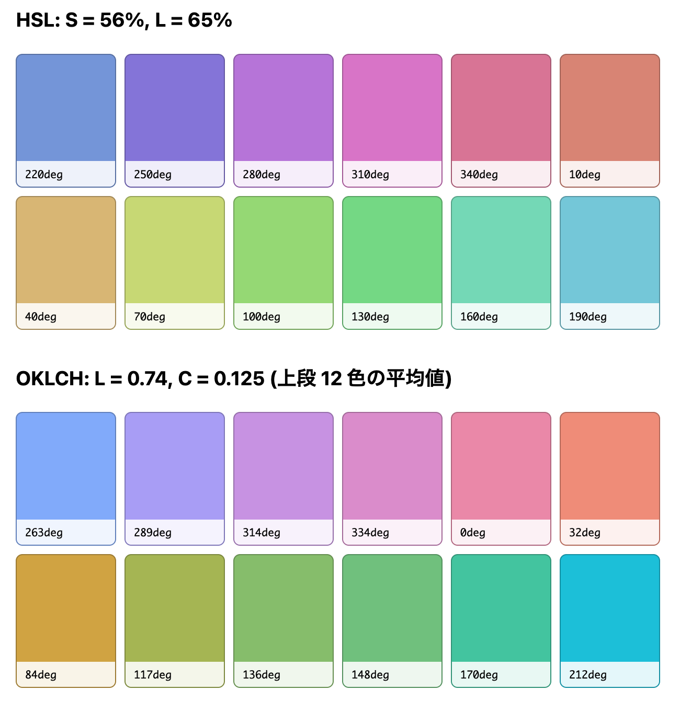

知覚均等性の差は、パレットをグレースケールするとよくわかる。

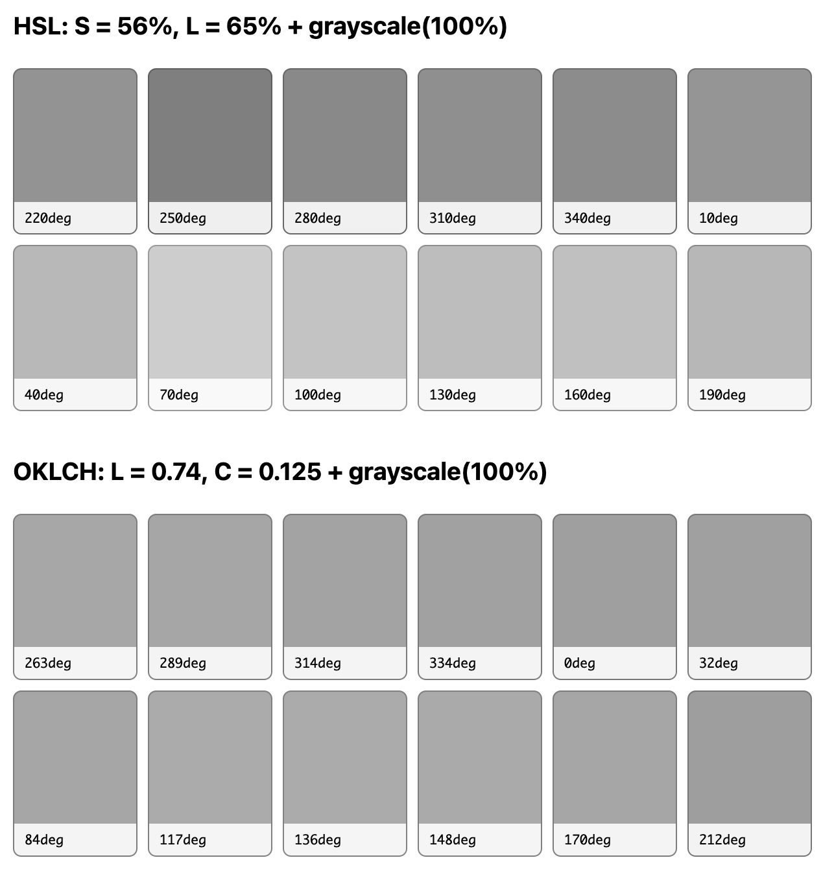

DEMO: https://labs.jxck.io/color/#palette-comparison

- CSS Color Module Level 4 - 9.4. Specifying Oklab and Oklch: the oklab() and oklch() functional notations
  - https://drafts.csswg.org/css-color-4/#specifying-oklab-oklch


## Relative Color Syntax

Relative Color Syntax は、すでに定義された色を元に、別の色を作ることができる。

たとえば、既存の色の Alpha だけを変えたいといった場合に、以下のように書くことができる。

```css
background-color: rgb(from var(--primary) r g b / 20%);
```

これを `oklch()` と組み合わせれば、さらにバリエーションが作りやすい。

例えば、Hover 時に少し暗い色にしたい場合は、L を `calc()` で落とせば良い。

```css
background-color: oklch(from var(--primary) calc(l - 0.1) c h);
```

また、`calc(1 - l)` にすると L を反転することができるため、ダークモード用の色を算出するといった使い方もできる。

```css
background-color: oklch(from var(--primary) calc(1 - l) c h);
```

カラーパレットも、適当に H を決めるのではなく、ある基準の色を決め、そこから色角度を加算(Hue Shifting)することで、調和の取れたカラーパレットを出すこともできる。

よく使われるのは、色相環を分割する角度の採用だ。つまり 2 分割する 180 度を追加した補色。3 分割する 120, 240 度を追加したトライアド。30,60 度などを追加した類似色などを、必要に応じて増やしていく設計だ。

```css
:root {
  /* 統一感のあるバリエーション */
  --primary-shift-120: oklch(from var(--primary) l c calc(h + 120));
  --primary-shift-240: oklch(from var(--primary) l c calc(h + 240));

  /* 同系色の追加 */
  --primary-shift-30: oklch(from var(--primary) l c calc(h + 30));
  --primary-shift-60: oklch(from var(--primary) l c calc(h + 60));

  /* 補色 */
  --primary-shift-180: oklch(from var(--primary) l c calc(h + 180));
}
```

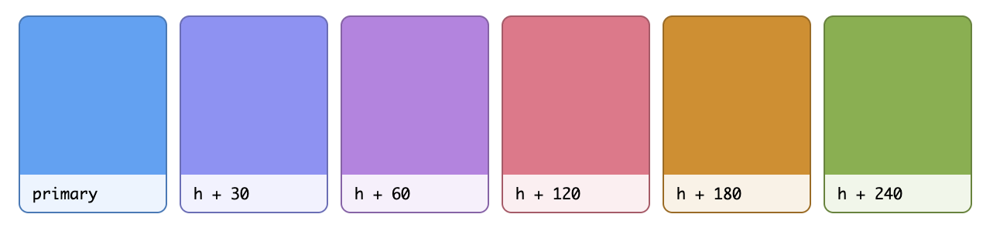

DEMO: https://labs.jxck.io/color/#relative-colors

ここまで来ると、`--primary` 一色だけを決めたら、あとは全て自動で算出することができる。

テーマ変更を可能にする UI などでは、`--primary` のバリエーションさえ提供すれば、大きく破綻のない UI を提供できる、といった設計も可能だろう。

もちろん、このシステマチックな方式だけでは満たせない表現は多々あり、連動した他のパラメータの細かな調整ノウハウはある。

それでも、現代の Web の色設計の基本は OKLCH をベースとしたこの設計が中心と考えて良さそうだ。

- CSS Color Module Level 5 - 4.2. Relative Color Syntax
  - https://drafts.csswg.org/css-color-5/#relative-colors


## Color Mix

`color-mix()` を用いると 2 つの色を混ぜて、新しい色を宣言的に作ることができる。

例えば Hover 時のように、状態に応じた色変化を作る場合、OKLCH で L を変えれば、Light Mode は減少、Dark Mode は増加の方向に切り替える必要が出る。

```css
background-color:
  light-dark(
    oklch(from var(--primary) calc(l - 0.1) c h),
    oklch(from var(--primary) calc(l + 0.1) c h)
  );
```

`light-dark()` は色を取るが、色以外のパラメータなどを取らないため、色を全部書く必要がある(本当は `light-dark(-0.1, +0.1)` などと書けると嬉しいができないという話)。

そこで視点を変えて、「背景色と前景色を混ぜる」ことで Hover の色を設計することを考えよう。たとえば、背景に前景を 20% 混ぜるとこうなる。

```css
background-color: color-mix(in oklab, var(--fg) 20%, var(--bg));
```

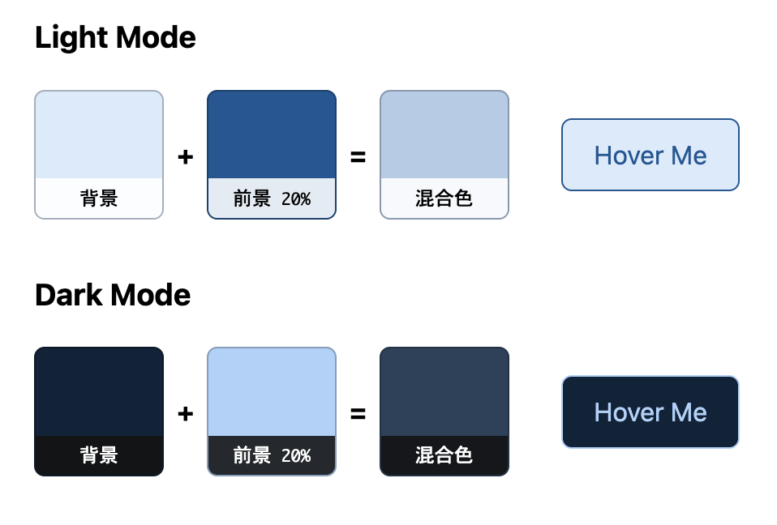

DEMO: https://labs.jxck.io/color/#color-mix

Light Mode では、淡い青の背景に濃い青の前景が混ざり、少し濃い青になる。Dark Mode ではその逆。つまり、どちらでも「背景色を少し前景色に近づけた」値になる。

また、`currentColor` を用いれば、今どういう色が表示されているかを知らなくても、アルゴリズミックに色を算出することも可能だ。

例えば以下のようにすれば「親から継承した文字色を、背景方向に 20% 沈めた色」を作ることができるため、例えば脚注用に「薄い色」を作るといったことも可能になる。

```css
color: color-mix(in oklab, currentColor, var(--bg) 20%);
```

Web Components のように、どういう色で表示されるかは利用側に委ねるが、そこからの彩色ルールだけ提供したいといった設計も可能になる(実際は非常に難しいため、変数を提供して指定できるようにした方が楽だろうが)。

ちなみに、Relative Color Syntax より少し前に `color-mix()` の実装があったため、透明度のバリエーションは `color-mix()` で transparent を混ぜる方式が使われている場面がある。

```css
background-color: color-mix(in srgb, var(--primary) 20%, transparent);
```

しかし、透明度だけを変えるなら、RCS でいいだろう。

- CSS Color Module Level 5 - 3. Mixing Colors: the color-mix() Function
  - https://drafts.csswg.org/css-color-5/#color-mix


## Contrast-Color

色の設計で最も注意したいのは、組み合わせによってコントラストが担保されず、読みにくくなってしまうことだ。

アルゴリズミックに算出するのであれば、「最終的に算出された背景に対して、文字色がコントラストを満たしているのか」を確信する方法が欲しくなる。

そこで、最初に提案されたのが `color-contrast()` だ。

複数の色を渡すと、対象色に対して最もコントラストの高いものを採用してくれる。

```css
color: color-contrast(var(--bg) vs #eee, #333, #111);
```

非常に便利そうだ。

ところが、この「コントラストの算出」に対して、業界が非常に揺れている。

広く採用される WCAG2 のコントラスト計算は、知覚特性を考慮しきれていないと指摘されることも多く、その対案として提案された APCA は、WCAG3 で採用されるという触れ込みだったが、すでにドラフトからは落とされている。

その議論のさなかの提案だったため、Safari は実装に着手しつつも、標準化は難航し、現在仕様は取り下げられている。

代わりに提案されたのが `contrast-color()` だ。これは単純に、「指定した色と白・黒を比べ、コントラストの高い方を返す」というものだ。

```css
color: contrast-color(var(--bg)); /* white / black */
```

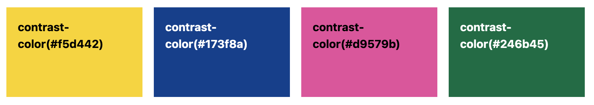

DEMO: https://labs.jxck.io/color/#contrast-color

もし `color-contrast()` を使ったとしても、フォールバックに白/黒相当を渡すだろうという想定もあるので、そこだけを切り抜いたイメージだ。

出てくる色は、`#000000` か `#ffffff` と極端なので、これをさらに RCS で調和する色味に調整する必要がありそうだ。しかし、調整したらコントラストが達成される保証はない。これを使っていれば安心とも限らない。

非常に便利そうでありながら、同時に使うのはかなり難しいというイメージが筆者にはある。

- CSS Color Module Level 6 - 2. Computing a Contrasting Color: the contrast-color() function
  - https://drafts.csswg.org/css-color-6/#colorcontrast


## Wide Gamut (広色域)

近年のディスプレイは表現能力がかなり向上しており、それとともに表現できる色の範囲が増えた。

従来のディスプレイで表現できた色の領域を sRGB (Standard RGB)と言うのに対して、これらを Wide Gamut と総称する。

Web では、CSS Color Module Level 4 で、Wide Gamut 系の色空間を CSS で指定できるようになっている。

- srgb: 従来の RGB 領域
- display-p3: Apple が策定したプロファイル。赤や緑方向に拡張し、iPhone / Mac などで表現できる。
- a98-rgb: Adobe が策定した Adobe RGB というプロファイル。緑~青緑方向に拡張し、CMYK への変換向き。
- prophoto-rgb: Kodak が策定したプロファイル。自然界にあるほとんどの色をカバーできるが、人間には知覚できない領域を含む。
- rec2020: 4K/8K テレビ放送などに対応するプロファイル。一般的なディスプレイでは再現できない領域を、将来のために確保している。

したがって、Web 開発では意識するとしても `display-p3` だ。ただし、Display P3 にしかない色は、基本的に彩度の強い色なので、それを使わない範囲であれば意識する必要はない。

Wide Gamut を指定する場合は、`color()` を使い、その色域の中での割合を RGBA で指定する。

例えば、以下のようにすると sRGB よりも外にある Display P3 領域において、もっとも鮮やかな緑を出すことができる。

その色を発色できないディスプレイでは、表現できる色域に丸め込まれる(gamut mapping)。

```css
background-color: color(display-p3 0% 100% 0%);
```

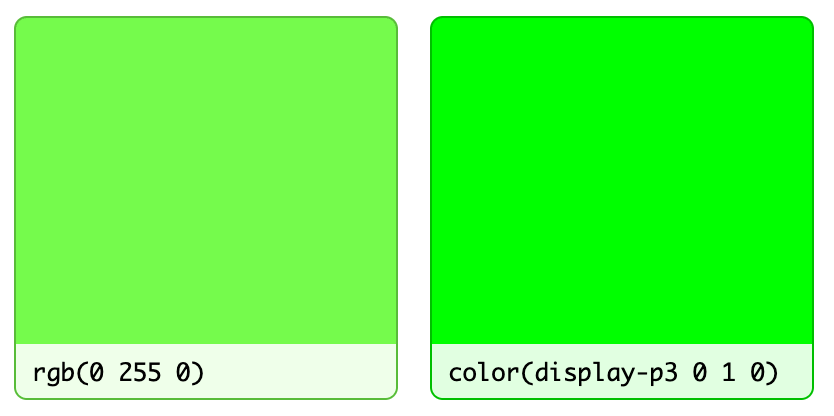

DEMO: https://labs.jxck.io/color/#wide-gamut

`rgb()` が表現する色空間は sRGB であるため、`display-p3` などの広い色域は表現できない。

しかし、`oklch()` は C(彩度)の指定が段階や割合ではないため、理論上は上限がない。

そのため、以下のようにこの明るい緑を、Wide Gamut を意識せずに再現できる。

```css
background-color: oklch(0.86 0.3 142);
```

したがって、やはり `oklch` を使って実装をしておけば、仮に何らかの UI でネオンカラーのような彩度の強い色が必要になっても、シームレスに取り入れることができる。

もし丸め込みによる色の差し替えが許容できない場合は、Media Query を用いて分岐もできる。

```css
:root {
  --accent: oklch(0.86 0.2 142);
}

@media (color-gamut: display-p3) {
  :root {
    --accent: oklch(0.86 0.3 142);
  }
}
```

- CSS Color Module Level 4 - 10. Predefined Color Spaces
  - https://drafts.csswg.org/css-color-4/#predefined


## その他

Color Module v6 では他にも、2 色の補間を出す `color-mix()` に対して、合成(Alpha Blending)を行う `color-layers()` が提案されている。

また `contrast-color()` も、白/黒だけではなく候補リストを渡してそこから選択し、その選択のためのコントラストアルゴリズムを指定できるよう拡張されるなど、`color-contrast()` 時代のモチベーションに戻す方向の議論もある。

もちろん、それらは全て提案段階で、また白紙に戻る可能性が大いにあるが、今後も色の指定に関する API は増えていきそうだ。

- CSS Color Module Level 6 - 3. Layering Multiple Colors: the color-layers() function
  - https://drafts.csswg.org/css-color-6/#color-layers


## Outro

もちろん、基本となるデザインが LAB や HWB などで行われており、それをそのまま Web に移植するといった場面はあるだろう。その場合は、用意された関数をそのまま使えば良い。

しかし、Web を前提にデザインし、Web で実装し、Web のもつポテンシャルを引き出すのであれば、OKLCH を基本にし、その他機能を踏まえながら実装するのが素直だろう。

単に `oklch()` 関数で色を出すだけではなく、そこで使われるパラメータを整理して、アルゴリズミックに色を算出することができれば、色の管理はかなり容易になり、テーマや状態が増えても破綻しにくい土台を作ることができるだろう。

デザインシステムや、そこで定義されるデザイントークンが、デザイナーが感覚で決めた Hex の集約になっているのであれば、こうした知見を活かして設計を見直してみると良いかもしれない。