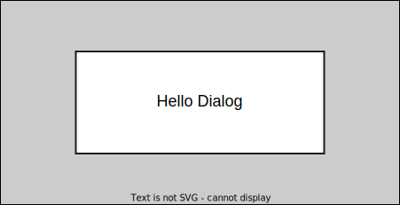
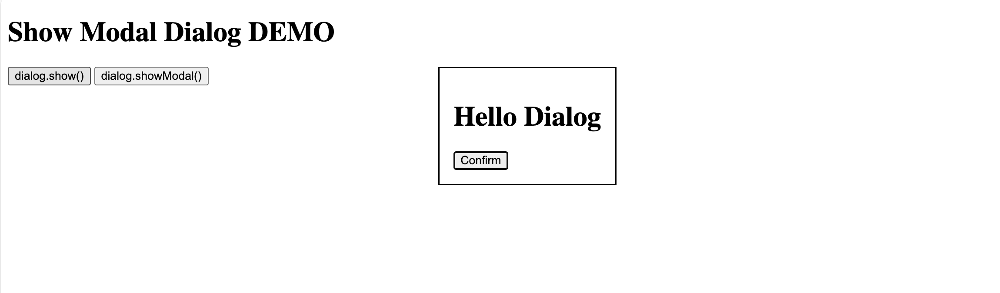
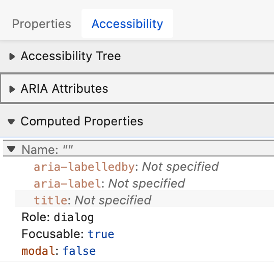
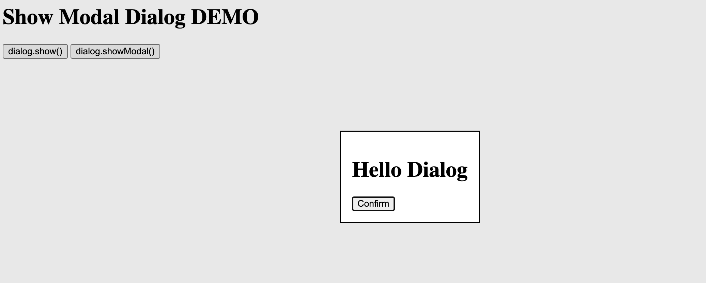
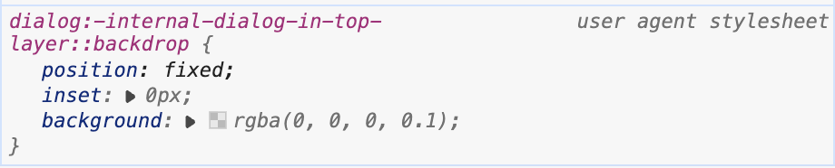
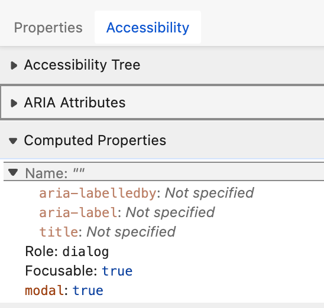

# [dialog][popover] Dialog と Popover #3

## Intro

前回までは `<dialog>` が標準化されるまでの経緯と、 API の概要や関連仕様を解説した。

今回は `<dialog>` の API としての使い方について、具体的に解説していく。


## 各要素の使用

### `open` 属性

`<dialog>` は、デフォルトでは不可視(`display: none`)な要素となっている。 `open` 属性が付くと表示される。

```html
<dialog open>
  <div>
    <h1>Hello Dialog</h1>
  </div>
</dialog>
```




### `show()`/`showModal()`

しかし、基本的に `<dialog>` は動的に出てくるため JS で開くことになるだろう。しかし、 `open` 属性を動的に付けるのではなく、 `show()`/`showModal()` を用いるのが基本だ。

```js
$("button.show").on("click", (e) => {
  $("dialog").show()
})

$("button.showModal").on("click", (e) => {
  $("dialog").showModal()
})
```

まず `show()` を呼ぶと、先ほどで言う `<dialog open>` した状態になり Dialog が開く。



これは単に non-Modal な Dialog が open してるだけなので、後にあるテキストの選択や、ボタンクリックといった操作は引き続き可能だ。また、この時別の `<dialog>` を `show()` しても同時に表示できる。これは、全く排他的な操作がされてないことを意味する。

Accessibility Tree を確認すると Role が `dialog` になっていることが確認できるだろう。



これを、 `showModal()` で開くとこうなる。



背景が薄くグレーになるのは、 `::backdrop` のデフォルト CSS があたってるからだ。



non-Modal と異なり Modal は同時に一つしか開けない。

Accessibility Tree もこうなる。




### Submit

閉じる UI は、 JS を書かなくても HTML だけで実装可能だ。

```html
<dialog open>
  <div>
    <h1>Hello Dialog</h1>
    <form method="dialog">
      <button type="submit">Accept</button>
      <button type="cancel">Deny</button>
    </form>
  </div>
</dialog>
```

このように `<form method=dialog>` を `<dialog>` の中に書くと、その submit/cancel は Dialog を完了したことになり、 Dialog を閉じる。これにより、ユーザに何かを確認させ、インタラクションを求めるユースケースを実装できる。

この時、 `<button name>` の値は、 JS から `returnValue` で取れるため、ボタンによる分岐が可能になる。

```html
<dialog open>
  <div>
    <h1>Hello Dialog</h1>
    <form method="dialog">
      <button type="submit" value="accept">Accept</button>
      <button type="cancel" value="deny">Deny</button>
    </form>
  </div>
</dialog>
<script>
$("dialog").on("close", (e) => {
  console.log(e.target.returnValue) // "accept" / "deny"
})

$("dialog").on("cancel", (e) => {
  console.log(e.target.returnValue) // こちらではない
})
</script>
```

注意点は、 `type=cancel` をクリックしても、発生するのは `"close"` イベントである点だ。`"cancel"` イベントは、 Modal Dialog を ESC で閉じると言った操作で、 `"cancel"` -> `"close"` の順で発火する。


### `close()` と `returnValue`

この `<form>` に `<input>` を置いても、その `value` は `returnValue` には渡らない。任意の値を渡す場合は、 `close()` の引数に明示的に渡す必要がある。

```html
<dialog>
  <div>
    <h1>Hello Dialog</h1>
    <form method="dialog">
      <input type="text" name="text" value="text" autofocus>
      <input type="hidden" name="hidden" value="hidden">
      <button type="submit" value="accept">Accept</button>
      <button type="close" value="deny">Deny</button>
    </form>
  </div>
</dialog>
<script>
$("form").on("submit", (e) => {
  e.preventDefault()
  const data = new FormData(e.target)
  // 文字列しか渡せないのでシリアライズ
  const params = new URLSearchParams(formdata)
  $("dialog").close(params)
})

$("dialog").on("close", (e) => {
  console.log(e.type, e.target.returnValue) // text=text&hidden=hidden
})
</script>
```

閉じるだけではなく、開く方も JS 無しでできるが、それについては話がかなり広がるので別の回で解説する。


### aria-label / aria-labelledby

WAI-ARIA では `role=modal` に対して、 `aria-label` / `aria-labelledby` を使ってアクセシブルな名前を割り当てることが推奨されている。

- Accessible Rich Internet Applications (WAI-ARIA) 1.3
  - https://w3c.github.io/aria/#dialog

Dialog の `<h1>` がラベルに相当する情報を持っている場合は、以下のような実装が考えられる。

```html
<dialog aria-labelledby="dialog_name">
  <div>
    <h1 id="dialog_name">Hello Dialog</h1>
    <form method="dialog">
      <button type="submit">Confirm</button>
    </form>
  </div>
</dialog>
```


### フォーカスの確認

次は、それぞれのフォーカスの挙動を確認しよう。non-Modal では、フォーカストラップされないので、 Modal に注目する。

開くボタンにフォーカスを移し、キーボードで Modal を開くと違いがわかりやすい。

共通してるのは以下だ。

- 開くための `<button>` にフォーカスし Enter で開いたら、フォーカスが `<dialog>` 内の要素に移る。
- `<dialog>` の `<button>` で閉じたら、開いた時の `<button>` にフォーカスが戻る。

これにより、 `<dialog>` を開いてもフォーカスが移らなかったり、閉じたらフォーカスが迷子になるといった事態を避けられる。

また、 Modal の場合は Modal 以外の DOM にフォーカスが移動することはない。これにより、 Modal を開いた状態で、想定してない別操作を行えてしまうといったことはなくなる。

しかし、ブラウザ UI 側には出ていくことができる(できないと、行き詰まる可能性がある)ため、その点は慣れが必要かもしれない。

なお、 `<dialog>` 内に `autofocus` な要素があればそこにフォーカスが移るが、これがない場合、デフォルトでどこにフォーカスを移すのかは非常に重要で、前回解説したように仕様でどうするかも結構揉めた。

そして、仕様ではデフォルトの挙動を整理しつつも、前提として「どこにフォーカスすべきかを `autofocus` で指定するのが推奨」となった。

```html
<dialog>
  <div>
    <h1>Hello Dialog</h1>
    <form method="dialog">
      <button autofocus type="submit">Confirm</button>
    </form>
  </div>
</dialog>
```

現状では、 `<dialog>` 自身がフォーカスを得るかどうかなどについて実装に差異があるので、明示的な指定を忘れると、フォーカスの回数などによって操作を覚えているユーザにとっては不便となり得る。

ただし、最初のコントローラに `autofocus` を置くと、その手前のテキストがスキップされるため、必ず最初のコントローラに `autofocus` すれば良いとは限らない点には注意したい。


### スクロールとフォーカス

Dialog のユースケースの 1 つとして、「規約への同意」を求める UI がある。

規約は基本的に長文になるため、そのまま `<dialog>` にレンダリングすると、 `<dialog>` 自体がスクロール可能になってしまう。

```html
<dialog style="height: 100px;">
  <div>
    <p>めっちゃ</p>
    <p>長い</p>
    <p>規約</p>
    <p>...</p>
    <p>...</p>
    <p>...</p>
  </div>
  <form method="dialog">
    <button type="submit" value="agree">Agree</button>
    <button type="submit" value="disagree">Disagree</button>
  </form>
</dialog>
```

しかし、 `<dialog>` 自体がスクロール可能になることは、下部にあるコントローラーまでの到達を困難にするなど、様々な不便があるため、仕様では「`<dialog>` 自体を Scrollable にするのは避けるべき」と明示されている。

代わりに、規約を別ページにしリンクを貼る、 PDF でダウンロードさせるなども考えられるが、最も簡単なのは規約のみを Scrollable なコンテナに入れる方法だ。以下の場合は、最初の `<div>` が Scrollable になっている。

```html
<dialog style="height: 100px;">
  <div style="overflow: auto; height: 60px;" autofocus>
    <p>めっちゃ</p>
    <p>長い</p>
    <p>規約</p>
  </div>
  <form method="dialog">
    <button type="submit" value="agree">Agree</button>
    <button type="submit" value="disagree">Disagree</button>
  </form>
</dialog>
```

注意点として、もしこのスクロールする `<div>` の手前に別のコントローラーがあった場合を考えよう。

```html
<dialog style="height: 80vh;">
  <!-- snip -->
  <button autofocus>Controller 1</button>

  <div style="overflow: auto; height: 60vh;">
    <p>めっちゃ</p>
    <p>長い</p>
    <p>規約</p>
  </div>

  <button>Controller 2</button>
  <!-- snip -->
</dialog>
```

この場合、従来は "Controller 1" で Tab 移動すると "Controller 2" にフォーカスが移り、キーボードだけで規約を読むことができなっかったため、明示的に `tabindex=0` を付与する必要があった。

しかし、このような場面での不便を解消するために、「スクロール可能な要素は、デフォルトでフォーカス可能にする」という仕様が標準化され、実装が進められていた。

- Keyboard focusable scrollers  |  Blog  |  Chrome for Developers
  - https://developer.chrome.com/blog/keyboard-focusable-scrollers

既に Chrome は M130 から、 Firefox は実装済みだが、 Safari は実装上の困難さとパフォーマンスを理由にネガティブな態度を表明している。

- 190870 - Make scrollable element focusable
  - https://bugs.webkit.org/show_bug.cgi?id=190870

したがって、しばらくは `tabindex=0` を明示的に付与した実装をすべきだろう。

```html
<dialog style="height: 80vh;">
  <!-- snip -->
  <button autofocus>Controller 1</button>

  <div style="overflow: auto; height: 60vh;" tabindex="0">
    <p>めっちゃ</p>
    <p>長い</p>
    <p>規約</p>
  </div>

  <button>Controller 2</button>
  <!-- snip -->
</dialog>
```

より詳細なガイダンスは、以下が参考になるだろう。

- dialog initial focus, a proposal · whatwg/html Wiki
  - https://github.com/whatwg/html/wiki/dialog--initial-focus,-a-proposal


### Close と returnValue

Dialog を閉じる場合、先のように `<form>` を使わず JS で `close()` を呼んで閉じることもできる。なお「`open` 属性を消す」では、 Modal は「消える(hidden)」が「閉じる(close)」の意味にはならない(`close` イベントも発火しない)ので、 JS の場合必ず `close()` を使って閉じるべきだ。

Dialog を閉じるとき、ユーザは何かしらのインタラクションを行った結果(同意結果や選択結果)は、 `dialog.close()` に渡した文字列がそのまま取得できる。

```js
$dialog.close("accept")
$dialog.returnValue // "accept"
```

`<form>` を使った場合に submit された結果もここから取得できる。


### backdrop をクリックしたら閉じる

Dialog の要件としてよくある「背景(backdrop)をクリックしたら閉じる(キャンセル)」というユースケースの実装を考える。

まず前提として、 Modal の場合は「backdrop 含め、どこをクリックしても `<dialog>` がクリックされたことになる」という性質がある。

```js
dialog.on('click', (e) => {
  // 画面のどこクリックしても発火
  console.log(e.target) // dialog
})
```



そこで、 `<dialog>` を `padding: 0` にし、直下の `<div>` が `<dialog>` の内側いっぱいに表示されている状態にする。以下では、赤い `<div>` が `<dialog>` いっぱいに被さっている形だ。

```html
<style>
  dialog {
    padding: 0;
    div {
      padding: 1rem;
      background-color: red;
    }
  }
</style>
<dialog>
  <div>
    <h1>Hello Dialog</h1>
    <form method="dialog">
      <button autofocus type="submit" value="confirm">Confirm</button>
      <button type="cancel" value="cancel">Cancel</button>
    </form>
  </div>
</dialog>
```

この状態で `showModal()` した場合、 Dialog の領域をクリックしても `<dialog>` より先に `<div>` で Click Event が発火する。

TODO: dialog 領域のクリックが div で発生する

これを利用すると、 backdrop 領域をクリックしたら `target`/`currentTarget` が `<dialog>` だが、 Dialog の中をクリックした場合は `target` が `<div>` になるため、これで分岐が可能になる。

```js
$('dialog').on('click', (e) => {
  // dialog 背景含めて全体がフック対象
  const { target, currentTarget } = e
  console.log({ target, currentTarget })
  if (e.target === e.currentTarget) {
      // 両方 dialog 自身なのは backdrop のみになる
    $('dialog').close()
  }
})
```

これは実装の頻出パターンになるだろう。


### キーボード操作

`<button>` を置く以外に、キーボード操作の対応もネイティブで行われている。これは、そういう Cancel や Close を意味する操作を自動でフックする Close Watcher を内部で使うことで実現している。

non-Modal Dialog の場合は、他の要素が操作できるためキーボードには反応しないが、 Modal Dialog は Close Watcher が効いてるため、 ESC で閉じたりができる。

Android の場合はこれを背面タップで閉じる(持ってないため未検証)といった、デバイス固有の操作とも紐づける役割を果たしている。

なお Modal Dialog を ESC で閉じると、 `cancel` -> `close` の順でイベントが発火する。


## `<dialog>` の使い所

さて、一通り確認したところで使い方を確認していこう。

例えば、規約を表示してそこへの同意を取得するなどだ。閉じる際にその結果を `returnValue` で取得して処理を分岐することになるだろう。

使い分けは以下のようになる。

- ユーザをブロックして、処理が終わらない限り先には進めない => Modal Dialog
- ユーザをブロックはしない、しかし、どこかで処理は求めたい => non-Modal Dialog

例えば、ログインしないと先に進めないなら、 Modal Dialog にログインフォームが入るかもしれない。

でも Cookie への同意バナーを画面の右下に出すのであれば、 non-Modal になるだろう。

このように、インタラクションを求めるのが `role=dialog` である `<dialog>` の用途だ。「ユーザに対して何かインタラクションを求めている」そして、「そのインタラクションが終わったら閉じる」のが基本だ。

逆に「ユーザにインタラクションを求める Modal Dialog UI」を `<dialog>` を使わずに実装するのも、今後は望ましくないと言えるだろう。フォーカス管理も、 `inert` も、CloseWatcher も、ユーザランドで完璧に実装するのが難しい機能で、わかりやすく言えばアクセシビリティ面での問題などにつながる。

特に、支援技術の利用者を想定するならば以下のようなものだ。

- そもそも Dialog が開いてることに気づけない
- Modal が開いて、他の操作ができなくなったが、何が起こったのかわからない
- 操作できないはずのところにフォーカスが飛んで想定外の操作をしてしまう
- ESC が奪われて、意図していた操作ができなくなる
- 開いて閉じたらフォーカスが迷子になる

これらは `<dialog>` を適切に使えば、支援技術には `role=dialog` や `aria-modal=true` なものが開いたことが適切に伝わり、プラットフォームの支援を受けた快適な操作が実現できる。

多くのサイトがライブラリなどを用いて自前で実装しており、そうしたライブラリを剥がすのには時間がかかることを考えると、移行を視野に入れた計画を立てる良いタイミングだと言えそうだ。


## `<dialog>` ではないケース

もし単に「変更が保存されました」や、「わからなかったら下のヘルプへ」といった通知を目的とするのであれば、それは `<dialog>` で実装するべきものではないだろう。 Top Layer に表示できるからといって、「浮かび上がる系の UI」 全てに `<dialog>` を使うのは適切ではない。その点で `<dialog>` の用途は限られていると言えるだろう。

とはいえ、せっかく Top Layer, CloseWatcher, inert, backdrop などのプリミティブを整備したのに、これを狭い用途のみに限定するのは勿体無い。

そこで、こうしたインフラを共有し、より汎用的な UI を実現するために並行して策定されたのが、 Popover だ。