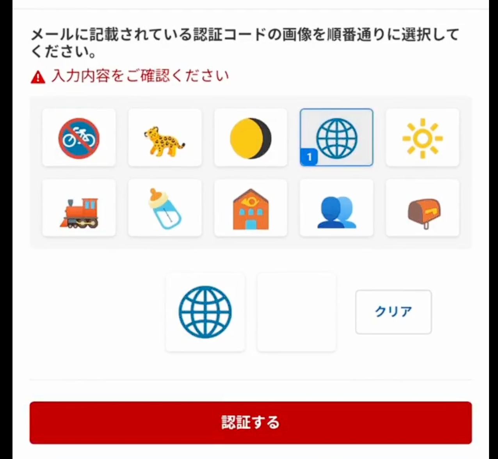

# [passkey][security] 大フィッシング攻撃時代における攻撃手法と自衛手段の考察

## Intro

GW のさなか、有名投資家のテスタ氏を中心に、大規模な乗っ取り攻撃の存在が報告された。

当初 900 億円程度と試算された被害額は、数日のうちに 3000 億円を超えると修正され、富裕層のみならず一般市民も無視できない状況となっている。

今、一体何が起こっているのか。金融資産を預かるサービスはどのようにユーザを守るべきか。我々ユーザはどのように自衛するべきか。

判明している情報をもとに考察する。

## 注意

タイトルでは「フィッシング攻撃」としたが、実際のところ攻撃手段が明確になっている件ばかりではないようだ。

個別の案件は表面化しないため、今回は本人によって公開されている個人投資家テスタ氏のケースを引き合いに、何が起こっているのかを調査する。

これはあくまで、テスタ氏自身が体験を公表されているからであり、テスタ氏自身を批判する意図を持ってのものではない。

また、先にはっきりさせておくが、テスタ氏は攻撃を受けつつも、金融被害自体は未然に防いでいる。これは、一般の人間では難しかっただろうと思う。

## 楽天証券での事例

2025/05/01 の朝に、テスタ氏が楽天証券のアカウントを何者かに乗っ取られたことを報告した。

https://x.com/tesuta001/status/1917736001101001180

以降、状況を更新するツイートが続き、いくつかのメディアでも詳細を語っている。

https://www.youtube.com/watch?v=gGPbvzG6yS4

- 投資家テスタさん、口座乗っ取り「個人・証券会社とも防犯意識向上を」 - 日本経済新聞
  - https://www.nikkei.com/article/DGXZQOFL031XUTT00C25A5000000/

これは単発的にテスタ氏を狙ったというより、無差別的に多くのユーザが攻撃を受け、その中でテスタ氏が早期の発覚と対応を行えただけのようだ。

金融庁は、2025 年に入ってからの被害統計を発表している。

- インターネット取引サービスへの不正アクセス・不正取引による被害が急増しています:金融庁
  - https://www.fsa.go.jp/ordinary/chuui/chuui_phishing.html

筆者が調査を始めた 5/7 の時点では 1000 億程度とされ、以下のようなデータが公開されていた。

Caption: 2025/5/7 時点での金融庁の発表
|                                  | 2025 年 2 月 | 2025 年 3 月 | 2025 年 4 月 (16 日現在) | 3 か月合計  |
|:--------------------------------:|:------------:|:------------:|:------------------------:|:-----------:|
| 不正取引が発生した証券会社数(社) | 2            | 4            | 6                        | ー          |
| 不正アクセス件数                 | 43           | 1,422        | 1,847                    | 3,312       |
| 不正取引件数                     | 33           | 685          | 736                      | 1,454       |
| 売却金額                         | 約 1 億円    | 約 131 億円  | 約 374 億円              | 約 506 億円 |
| 買付金額                         | 約 0.3 億円  | 約 128 億円  | 約 320 億円              | 約 448 億円 |

ところが、5/8 に情報は更新され、執筆時点(5/9)では以下のように上方修正されている。

Caption: 2025/5/9 時点での金融庁の発表
|                                  | 2025 年 1 月 | 2025 年 2 月 | 2025 年 3 月 | 2025 年 4 月  | 合計          |
|:--------------------------------:|:------------:|:------------:|:------------:|:-------------:|:-------------:|
| 不正取引が発生した証券会社数(社) | 2            | 2            | 5            | 9             | ー            |
| 不正アクセス件数                 | 65           | 43           | 1,420        | 4,852         | 6,380         |
| 不正取引件数                     | 39           | 33           | 687          | 2,746         | 3,505         |
| 売却金額                         | 約 0.8 億円  | 約 1 億円    | 約 129 億円  | 約 1,481 億円 | 約 1,612 億円 |
| 買付金額                         | 約 0.7 億円  | 約 0.6 億円  | 約 128 億円  | 約 1,308 億円 | 約 1,437 億円 |

1 月分の被害が追加されているが、これは全体としては誤差程度だ。後から 4 月の被害が多数発覚したことが大きく影響している。

テスタ氏が被害を公表し話題になったことで、被害に気づいた人もいたかもしれない。非常に有益な公表だったと感じている。

## テスタ氏の場合

テスタ氏の過去の発言を振り返っても、非セキュリティエンジニアという意味での一般人としては、非常にセキュリティ意識が高く、なんなら同業者に対する啓蒙も行っていたようだ。

- フィッシング対策について意識しており、偽サイトへの対策をしていた。
- 2 段階認証をきちんと設定し、周囲にも推奨していた。
- ウイルス対策ソフトを二重に入れて、毎日スキャンを実施していた。

そんな中、どのように攻撃を受けたか。氏の動画などを元にまとめると以下のような流れのようだ。

- 株式市場が開く前、朝 8:30 ごろから、楽天マーケットスピード(投資ツール)にログインしていた。
- ツールにログイン済みの状態で、楽天証券側のデバイス認証メールが来た。
- 身に覚えがないが、二段階認証でブロックされるだろうという認識だった。
- しかし、念のためログインしたら、前日夜に身に覚えのない注文履歴があった。
- ここで攻撃に気づき、パスワードを変更した。
- その後、すぐにアカウントをロックし、他もロックした。
- 楽天の調査の結果、この日以前の怪しいログインや注文の痕跡はなかった。
- 市場が開く前に注文を取り消せたため、金融被害は防げた(これがすごい)。

デバイス確認メールとは「このデバイスでのログインは初めてだ」と確認を求めるものだ。本職の投資家であれば、複数の口座を使い、デバイス確認などのメールを受け取る機会は少なくないだろう。多くのユーザは、通知が増えるほど無視するようになるのが常だ。

そんな中、通知を見逃さずにチェックし、「デバイス確認メールってことは、ログインできてるってことでは?」と気付けたのが命運を分けた。

市場が開く前に攻撃に気づいてすぐにロックできたからよかったが、それは市場が開く前から PC に張り付いてる本職だからこそできたことで、普通の人なら知らないところで出された注文なんて、気付けなかった可能性が高い。

他の口座も含めて迅速にロックをかけるといった対策を実施し、今のところ金融被害は出ないとのこと。判明しているのは、全然使ってない口座にログインされて、何故かメアドが変更されていたと。

さぁ、何が起こっていたんだろうか。

## 二段階認証の不備

後に色々発覚するが、楽天証券の二段階認証は以下のようなものだったようだ。

2 枚の画像が入ったメールが送られ、それと同じものを選ぶ方式だ。

問題は、これは 10 枚から 2 枚を順に選ぶ 10P2 = 90 通りしかないにもかかわらず、リトライ制限がなかったことだった。

総当たり可能なため、パスワードさえ突破していれば実質意味のない二段階認証だった。

他にも、SBI 証券は本体サイトが障害などを起こした場合に、代替で取引できる「バックアップサイト」が公開されていたが、こちらはパスワードだけで入れた。つまり迂回路があったということだ。

現在では、楽天の二段階認証には制限がかかり、SBI 証券のバックアップサイトは閉鎖されたようだ。

他にも、類似する脆弱な認証機構を持つサービスは対応に追われている。「二要素/段階認証を有効にしていれば安心」という状況を提供できていなかったことが露見した形になる。

## パスワードの漏洩経路

二段階認証に不備があったこと自体は確かに問題だ、ところがそれらは「パスワードが入手されている」からこそ成立する攻撃でもある。

ではパスワードはどう漏れたのだろうか?

一般的にパスワードの漏洩ルートは、大きく 3 つ考えられる。

1. フィッシングサイトにパスワードを入力してしまった
2. 他サイト、もしくは本サイト自体からすでに漏洩していた
3. インフォスティーラ(マルウェア)に感染し窃取された

各経路について見てみよう。

### フィッシングサイト

今最もメジャーな経路は、フィッシングサイトを用いた攻撃だ。

本家と全く同じサイトを用意し、それをデプロイした URL を SMS やメールなどで拡散する。文面には「今すぐ確認を」といった、対応を焦らせるものが多い。

その URL を開き、表示された偽のログイン画面にパスワードを入力させることで、パスワードを窃取する。

最近はパスワードだけを窃取しても、二要素認証で塞がれるため、偽サイトが本物のサイトに入力を中継し、2FA の OTP もユーザに入力させたものを転送することで、両方を突破するのが一般的だ。

その方式を使うなら、楽天証券の二段階認証の画像選択も、本サイトから提示された選択肢をそのまま攻撃対象に選ばせれば良いため、この攻撃が成立している状況では、選択回数を制限したところで実はあまり効果はない。

それくらい、このタイプの攻撃は非常に強力なのだ。

効果的な対策は、パスワードマネージャを用いてオートフィルで入力することで、URL の異なる偽サイトでは入力されないよう機械的なチェックを入れることが理想的だ。パスワードマネージャを用いていないユーザには、「ブックマークした URL からしかログインしない」といった自衛手段が啓蒙されているだろう。

今回のテスタ氏の発言を照らし合わせると、まず 1 について、本人はかなり気を使っているようで、こう述べている。

> パスワード等がどう流出したかは、今も全く不明です。
> フィッシング詐欺のようなのにログインするとかパスワードを打つというようなことは絶対していません。
>
> --- https://x.com/tesuta001/status/1917882864907227457

「絶対にしていない」と言い切る根拠が、「自分で気をつけている」なのか「パスワードマネージャなどを使っている」なのかはここからはわからない。しかし、テスタ氏の他の発言からも「パスワードマネージャ」という話は出ていないので、一般的な対策である「ブックマークからのログイン」を徹底しているといった対策が予想される。

### 漏洩済みパスワード

パスワードの漏洩は、多くのサイトで継続的に発生している。自身のパスワードが一度も漏れたことがない人など、おおよそいないだろう。

自分のパスワードが漏洩したことがあるかどうかは、普段使っているメールアドレスを以下のサイトに入力すればわかる。

- Have I Been Pwned: Check if your email has been compromised in a data breach
  - https://haveibeenpwned.com/

もちろん、ここにリストされているのは「判明している漏洩」だけであり、漏洩していることにすら気づいていないサービスは数多くあると予想される。

漏洩したパスワードはダークネット経由で取引され、また別の攻撃者によって利用される。パスワードを記憶に頼って管理している多くのユーザは、同じパスワードを別のサイトでも用いるため、脆弱なサイトで漏洩したパスワードを用いて、より堅牢なサービスの攻撃に転用するために、売買されているのだ。

これが、「パスワードを使い回してはならない」理由だ。この攻撃の前では、パスワードの長さや複雑さは関係ない。

対策は、「パスワードをサービスごとに全て変える」しかない。それを記憶に頼る運用は難しいため、やはりパスワードマネージャによる自動生成と記録が理想的な対策になる。パスワードマネージャを使わないユーザには、サービスの名前やドメイン名を絡めたルールベースのパスワード生成などが啓蒙されていた。

テスタ氏は、今回最低でも 2 つの証券サイトにログインされたようなので、「この 2 つで使い回されていなかったのか」が重要になるが、そこはわからない。もし「使い回しているパスワードが、他のサイトで漏れた」か「使い回していないが、本サイトから漏れていた」という可能性があると、二段階認証が脆弱だった時点で防ぎようのない状況に陥っていることになる。

### マルウェアによる漏洩

最後は、最近流行りのインフォスティーラ、つまりインストールしたらローカルにある情報をかき集めて窃取するマルウェアの可能性だ。

インフォスティーラの実態は様々なものがあるが、例えばブラウザが保存しているパスワードや Cookie を抜くものが、ダークネットの市場で取引されていることが知られている。

ブラウザはこうしたクレデンシャルを、OS が提供する安全な領域(Mac でいう KeyChain)に保存するようになっているため、簡単には盗まれないように実装されてはいる。

しかし、実際のところインストールされ権限を得た場合、完全に窃取を防ぐのは難しいのが現状だ。どんなに暗号化を徹底しても、実際にログイン画面に入力するには平文にせざるを得ないため、そこで暴露する値を完全に防ぐのは簡単ではない。拡張のように、より強い権限があればなおさらだ。パスワードをブラウザに保存させたりしない場合も、キーロガーが仕込まれれば入力時に値が窃取される可能性もある。

自衛手段は、単純にそうしたソフトをインストールしないことに尽きる。しかし、攻撃者はあの手この手でインストールを誘発する。

なお、テスタ氏は「ウイルス対策ソフトを二重に入れて毎日スキャンしている」と述べているが、それによって確実に見つかるとは限らない。スキャンにも色々あるが、基本は「既知のパターンと類似するファイル」か「不審な動作をするプロセス」を発見する行為を指す。入れた瞬間に情報を抜き、抜いたあと自分で消滅/無害なファイルになるタイプの実装がされていれば、どちらのスキャンもすり抜ける可能性もあるため、必ず発見できるとは限らないのだ。

問題は感染方法だ。最近は CAPTCHA、つまり「私はロボットではありません」の画面に偽装し、Windows にマルウェアに感染させようとする手口が判明している。

- その「私はロボットではありません」は本物? マルウェア感染狙う"偽 CAPTCHA"出現 米 Microsoft が注意喚起
  - https://www.itmedia.co.jp/news/articles/2503/26/news063.html

といっても、クリックしたり、表示しただけで感染するようなものではない。Windows でソフトをダウンロード/インストールするショートカットキーである `Win+R -> Ctrl+V -> Enter` というコマンドを押すように指示され、疑わずに実行すると感染するという攻撃だ。

慣れている人は「なんだそれ? そんなの押すわけないだろ?」と思うかもしれないが、一般ユーザにとっては普段強いられる「信号機を選ばされる」のと同じくらい謎な行為であるため、そういうものなんだろうと言われるがままに実行してしまう。よくできた攻撃だ。逆を言えば、こうした一定の能動的操作もなく感染するタイプのウイルスなど、そう簡単には作れない。ある程度のリテラシがあって、そうした能動的な操作をしなければ、感染はそう簡単には起こらない。(それほど、多くのユーザは能動的に感染してしまっているとも言える)。

テスタ氏が YouTube で配信しているラジオ内で、「自分はあまりパソコンには詳しくない」という発言をしていたことからも、「スキャンの実施」だけで感染の可能性を否定するのは難しい。

対策としては、「感染を防ぐ」の一手になり、それは「怪しいサイトの言いなりになって余計な操作をしない」という話になり、「気をつける」以上のことを言っていないことになる。実は啓蒙が難しい分野でもあると言える(それゆえに、攻撃が流行っている)。

感染している以上、パスワードマネージャの導入も、決定的な対策にはなるとは限らない。強いて言えば、オートフィルで入れていれば、キーロガーで抜かれないといった可能性はあるくらいだろう。

「ウイルス対策ソフト」が対策になるかは不明だ。そもそも非常に名前がズルく、入れたところで具体的に何がどう対策されるかは不明だし、対策になる根拠もない。OS のベンダも日夜様々な攻撃を収集し、アップデートの形で対策を配布しているため、その更新を怠らない状態で、それを上回る何かを本当に提供しているのかは筆者にはわからない。反対に、ウイルス対策が強い権限で入っていることで、そちらが狙われている可能性も否定できず、そうした問題が発覚したこともあるため、筆者は「ウイルス対策ソフト」を積極的に推奨する立場ではない。

もしそれでも不安であれば、iPhone を使うというのはあるかもしれない。Android や PC と異なり、iPhone は現状ソフトのインストールが App Store に限定されており、全てのアプリは審査を通っている。仮に問題のあるものがあれば、Apple 側で対策が可能なため、この手の攻撃にはかなり強い。もちろん、何も問題がないとは言わないが、一般ユーザが安心して使う Walled Garden なプラットフォームとしては、ウイルス対策ソフトを入れた Windows PC よりは、安全が確保しやすいと考えている。

しかし、それも囲い込みとみなされ、独占禁止の観点から緩和され、今後は Android のようにサイドローディング可能になるため、今だけの話になるかもしれない。iPhone にもウイルス対策ソフトが推奨されるような世界になれば、この話はなかったことになる。

---

インフォスティーラについては、前にここでも話したダークネットとか調査してる「マクニカ」って会社も記事を出してた。

証券各社で判明している口座の乗っ取りによる不正操作被害。口座乗っ取りの発端となるのは、ID やパスワードといった口座情報の盗難だ。盗難の手口が、フィッシング詐欺による被害と、そうでない場合の可能性があるという。フィッシング詐欺の手口でない場合、考えられるのが「インフォスティーラ」と呼ばれるコンピューターウイルスの感染だ。どのようなウイルスなのか。サイバーセキュリティー事業を手掛けるマクニカ(横

マクニカが調べたところ、闇サイト「ダークウェブ」などで、証券口座に関する認証情報がのべ 10 万 5 千件確認できました。2024 年から急増しています。

インフォスティーラは、完全に秘密裏に短時間で動くのが特徴です。情報を盗んだ後、証拠隠滅のために、自分自身の姿を消してしまいます。このため、いつ、どんな情報が取られたのか、後から調べてもわかりません。

 特にグーグルの「クローム」など、ウェブ閲覧ソフト(ブラウザー)の情報が狙われます。閲覧履歴が盗まれ、オンラインショッピングのサイトでブラウザーに保存している ID やパスワード、クレジットカードの情報などが簡単に抜き取られてしまいます。

まあもちろん、パスワードなんかは簡単には抜けないようになってきつつあるけど、実際に売られてるからなんとでもなってしまっている可能性は高い。特に、パスワードマネージャに頼らず手入力してるなら、キーロガー系で抜ける可能性もあるしね。

---

## サービスが取り得る対策

今回発覚した金融サービスの認証機構の脆弱性は、実装不備によるものが多かったと言える。単に二段階認証を提供したというだけでなく、その二段階目が安全であることはユーザの資産を守るうえでの責任と言えるだろう。

最近では、金融機関が「FIDO 認証用アプリ」として、専用のアプリを入れさせることが多くなった。実装方法は多々あるが、ログイン時にアプリ側に通知が送られタップするものや、表示されたコードを入力するものなど、バリエーションは多い。

実はバリエーションが多いため、一概にそれを入れていれば安全かどうかは、判断が難しいところもある。例えばコードを入力する方式は、前述の Proxy 型のフィッシングサイトでは対応できない可能性もある。90 通りの画像のように、エントロピーが低くリトライ制限がなければ意味がない。

2 要素の理想は、「秘密鍵」を生成し対応する公開鍵をサービスに登録して、公開鍵方式の認証を追加することだ。「記憶」によるパスワードに追加して、秘密鍵の「所有」を要素として追加できる。

ただし、それを自前で実装すると、鍵の保管場所が問題になる。そこで FIDO に準拠した API をプラットフォームが提供し、それを用いて OS 内の安全な場所に鍵を管理するのが基本だ。

そして、鍵へのアクセスをアンロックするために Touch/Face ID や Windows Hello のような API を用いることで、間接的に「生体認証」を 3 つ目の要素として追加することができる。

「間接的」としているのは、「生体情報」そのものをサービスに登録して、認証に用いているわけではないからだ。簡単に捨てたり再生成できない「生体認証」そのものをサービスに登録するのは、プライバシーの問題が大きいため、一般的にそうした認証は行われない。あくまで、スマホや PC など、デバイスに閉じて登録され、Authenticator のアンロックのみに使われるのが一般的だ。

以上のことを実装する上で、問題となるのが導入の敷居とリカバリになる。アプリによっては、端末を無くしたり壊した場合に、そのバックアップ手段がきちんと整備されていないためにユーザがログインできなくなる。そうした事態を防ごうと、例えばアプリが入った iPhone を無くしたら、パスワードだけのログインで簡単にリカバリできるようにする、といった実装をすれば、やはりそこが穴として攻撃者の餌食になってしまうからだ。

ただし、金融系は別途 KYC(本人確認)をするのが普通のため、再度本人確認を行うことでリカバリできる場合が多い。そういう意味では、二要素目をロストしても回避手段がある点で、リカバリを甘めに設定する必要性は、KYC をしない一般サービスよりは減る。今は、マイナンバーは「よみがな」が無いために金融 KYC に使いにくいという問題があるが、それも今後解決していくらしいので期待したい。同時に「マイナンバー KYC の強度」がボトルネックにならない運用を、是非期待したいところだ。

そして、これらを独自アプリではなく、統一規格として実装できるのが Passkey だ。二要素どころか、これ自体をパスワードの代わりに単一の要素として使うことも可能な程度に、強力な手段として注目されている。

したがって、ユーザが Passkey を登録することに慣れてくれば、サービスは独自実装のアプリを都度作るより、Passkey の対応を行う方が良いだろう。

問題は、まだまだ一般ユーザに Passkey が普及しきっているとは言えない点だ。スマホは iPhone も Android も、Google/Apple のマネージャが Passkey に対応しており、クラウド共有による同期が可能なため、端末の移行に対する敷居は下がった。これが今後普及すれば、金融サービスでも Passkey を提供していく流れになっていくのが良いと思われる。

また、仮に Passkey を実装しなかったとしても

- ログイン通知
- 重要操作回数制限
- 異常アクセス検知(IP アドレス, User-Agent etc)

などといった実装は、攻撃が集中することが容易に想定できる金融サービスでは必須の実装と考えていいだろう。特に、認証が強固になれば次に狙われるのは Cookie だ。その際にもこうした防衛戦は役に立つ。今だと WAF などのソリューションで容易に解決できる部分も多いだろう。

詳細は、筆者が OWASP のガイドラインに Cookie Theft 対策として提出した以下が参考になるだろう。

- OWASP に Cookie Theft 対策 Cheat Sheet を執筆した | blog.jxck.io
  - https://blog.jxck.io/entries/2025-03-03/owasp-cheat-sheet.html

「入られないようにする」と「入られても大丈夫なようにする」の両方の視点が重要となる。

## ユーザが取り得る対策

第一歩として、やはりパスワードマネージャは認証管理のベースとして、導入したいところだ。

LastPass の問題もあり「パスワードマネージャが漏洩をやらかしたら」というリスクに対する懸念が必要以上に広まった気もしている。

確かに、完璧なシステムは無いため、Google/Apple/1Password も、完全に漏洩を防げるという確信は誰にもないとしか言えないだろう。

問題は、その上で素人が片手間に工夫した認証管理が、パスワードマネージャ以上に安全になることは、まず無いと言って良い。

そして、今「パスワードマネージャ」と呼ばれるものがやっているのは、「パスワードを代わりに覚えておく」だけではない。

例として筆者が使っている 1Password は、ざっと挙げても以下のような機能がある。

- 推測攻撃対策
  - 複雑さ/長さを指定して、安全なパスワードを生成できる
  - 安全でないパスワードが保存されていれば警告を出す
- 漏洩対策
  - 使い回しているパスワードがあれば、警告を出す
  - サービスで漏洩発覚が報告されたら、変更すべきパスワードを教えてくれる
- 多要素認証
  - 画面上の QR を読み込んで TOTP を登録してくれる
  - Passkey も登録してくれる
  - Passkey がまだ登録されていないサービスを教えてくれる
  - 1Password のアンロックを TouchID などにできる
- フィッシング攻撃対策
  - パスワードを生成したサイトにだけオートフィルできる
  - TOTP も生成したサイトにだけオートフィルできる
  - Passkey を使って自動でログインしてくれる
- その他
  - オートフィルされるためキーロガーに拾われない
  - SSH Key や WiFi SSID などあらゆる秘情報を管理できる
  - カード情報を保存し、決済画面でオートフィルできる
  - デバイスローカルで暗号化して共有しているため 1Password 社にも覗けない
  - Secret Key と Master Password のみを死守すればよいという単純さ
  - ファミリープランで家族との共有

従来は「パスワード」だけを管理していたが、時代が Passkey に移りつつある今、パスワードマネージャを用いていれば、比較的簡単に認証管理の強度を上げることが可能だ。

これは、自前で管理していた人にはできないことだ。

もし投資家の間でも、パスワードマネージャと Passkey の利用が普及していれば、今回のような大規模な攻撃の大半は防げた可能性すらある。インフォスティーラが 1Password の情報も抜けるのかは実装を見ないとわからないが、少なくともフィッシング詐欺に対しては非常に強力な手段だと言えるだろう。

「ウイルス対策ソフト」は、実際のところどうなのだろうか。筆者はもう長いこと使っていない。

そもそも、名前がズルいと筆者は思っている。「入れたら安全になる」かのように扱われるが、その根拠はよくわからない。実施すれば確実に安全になるとわかっていることは、OS ベンダがセキュリティアップデートとして配信してくれている。その更新を怠らなければ、メジャーな OS は安全だと言って良いだろう。その対策ソフトの会社が、OS を提供しているベンダ(つまり MS や Apple や Google)が有する世界最高レベルのセキュリティチームよりも、早く動向を把握し対策をリリースしたり、取りこぼしている致命的な欠陥を把握しているのであれば別だが、筆者にはそうは思えない。

その安全を脅かすのは、基本的にはユーザだ。怪しいサイトを見て、怪しいバイナリをダウンロードし、OS の警告を全部無視してインストールしてしまった時点で、どんなソフトを入れていても救える保証もない。例えば Winny が流行っていたような時代は救われた人もいるかもしれないが、何かそういうことをしたいなら、PC を分けてやる方がいいだろう。

少なくとも今回のような件では「ウイルス対策ソフト」を複数入れるより、「パスワードマネージャ」を導入して、運用を徹底する方が効果は高いと思われる。

企業などでも「セキュリティ対策にウイルス対策ソフトは必須」などという平成由来のルールをいまだに強いるのであれば、ついでに「パスワードマネージャ」も強いたら良いのにといつも思っている。

## その他

各証券会社は、被害顧客に保証をするという話ではあるが、テスタ氏の言う通り「とにかく犯人を捕まえるべきだ」という意見は非常に真っ当だ。

しかし、今回の攻撃は「資産を直接盗む」というよりも、特定の株を買わせて値段を釣り上げ、攻撃者側が売り抜けることで利益を出すという手口のようだ。

つまり、ロンダリングの必要がなく「たまたま儲かった」と見分けがつかないため、立証が難しいとされている。非常に狡猾な手口だ。

フィッシング詐欺やインフォスティーラは、大きく痕跡が残っていればまだしも、ユーザ自身が「攻撃されたこと」にすら気づいていない場合が多く、追跡が困難な場合が多い。

今回は、金融サービスに犯人のアクセスがあったことは確実なため、サービスに残った IP などをたどる調査が行われているだろうと想像する。出金や送金をしないのであれば、そこ以外に糸口はかなり少ないだろう。

「見つける」と一言で言っても、インフォスティーラ開発/販売、フィッシング詐欺サイト開発/販売、それらを使ったパスワード漏洩/販売、それを用いたアカウント乗っ取りと株価操作、一個一個のピースが別の犯人によるもので、ダークウェブで繋がって組織的にやっている可能性もある。辿れてもごく一部の可能性は高い。

## Outro

金融サービスのオンライン化が進み、銀行やカードのみならず、PayPay のような決済サービスや、NISA のための証券口座も、どんどん利用が広まっている。

脆弱性さえあれば、覆面を被って銀行に押し入る必要がなくなったのだ。

攻撃が多様化/高度化するのと同様に、セキュアに実装/利用するための技術もどんどん進歩している。

それでも、実装/使用双方への「普及」の問題は常に付きまとう。

もう少し早く Passkey が普及していれば、それに伴ってパスワードマネージャの導入が啓蒙されていれば、被害はもう少し減ったかもしれない。

今回の 3000 億円の勉強代が、パスワードマネージャや Passkey の普及につながることを願い、このエントリを書いた。