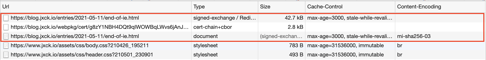
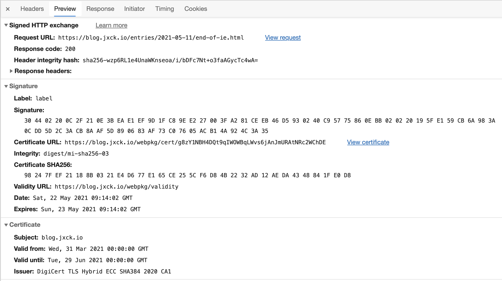

# [signed-http-exchange] SXG 対応


## Intro

本サイトを (Non AMP) SXG に対応した。その作業ログを記す。


## (Non AMP) SXG

SXG については過去に解説した。

- [WebPackaging の Signed HTTP Exchanges](https://blog.jxck.io/entries/2018-12-01/signed-http-exchanges.html)

本サイトでは AMP SXG に対応しており、 Google Search からの AMP ページへの遷移には SXG が取得され、本サイトのドメインが表示される。

- [AMP SXG 対応](https://blog.jxck.io/entries/2020-12-25/amp-signed-http-exchange.html)

今年の 4 月に AMP だけでなく、通常のコンテンツであっても SXG を配信すれば Google Bot がそれを取得し、 Google Search の検索結果で配信されるようになった。


## SXG の配信

SXG の配信は、コンテンツを SXG に変換するだけではなく、 Content Negotiation の対応や Validity URL の提供など、いくつか対応が必要となる。

また、 SXG はファイル自体に期限があるため、 [gen-signedexchange](https://github.com/WICG/webpackage/tree/main/go/signedexchange/cmd/gen-signedexchange) といったツールで静的に作る場合は更新が必要となる。

今回はこうした処理を全て肩代わりしてくれる Web Packager Server を用いることにした。

- [Web Packager Server - google/webpackager](https://github.com/google/webpackager/tree/master/cmd/webpkgserver)


## Web Packager Server

Web Packager Server は Web Packager に含まれる webpkgserver コマンドを用いる。

このコマンドはサーバを起動し、リクエストに応じて SXG を生成して返すため、フロントサーバから Proxy するように構成する。


### webpkgserver

webpkgserver は `go get` ではうまく動かなかったため、 README にある通りソースからビルドした。


```sh
git clone --depth 1 https://github.com/google/webpackager
cd webpackager/cmd/webpkgserver
go build .
```

これで `webpkgserver` コマンドが生成される。

実行には設定ファイルの toml を引数に渡す。


```sh
$ webpkgserver --config webpkgserver.toml
```


### webpkgserver.toml

設定ファイルは、同梱されている webpkgserver.example.toml を修正する。

ほとんどデフォルトで良く、 Port と SXG 用の証明書、 Domain あたりを気をつければ良いだろう。


```yaml
[Listen]
  Port = 11000

[Server]
  DocPath = '/priv/doc'

[SXG.Cert]
  PEMFile = '/keys/sxg/blog_jxck_io_full.crt'
  KeyFile = '/keys/sxg/blog_jxck_io.key'
  CacheDir = '/tmp/webpkg'

[SXG.ACME]
  Enable = false

[[Sign]]
  Domain = 'blog.jxck.io'
```

これを引数にするだけでサーバは起動する。

ローカルで起動した時点で、動作の確認はいかのように行うことができる。


```sh
export URL="https://blog.jxck.io/"
curl -s --output - -H 'accept: application/signed-exchange;v=b3,*/*;q=0.1' http://127.0.0.1:11000/priv/doc/$URL > dump.sxg
dump-signedexchange -i dump.sxg
```


## Routing

このサービスに対して行うべきルーティングは 3 つだ。

- webpkgserver に直接アクセスできないようポートを閉じる
- `/webpkg` を webpkserver に転送
- Content Negotiation で SXG を返す場合は `/priv/doc` をつけて proxy
- それ以外は proxy しない


## Content Negotiation

基本的にはリクエストヘッダに `Accpet: application/signed-exchange;v=b3` が付与されている場合、 Web Package Server に転送すれば良い。

しかし、 Google の Bot だけでなく、 Chrome も現状このヘッダをデフォルトで付与しているため、単にこのヘッダの有無だけを見てルーティングすると、ブラウザでの表示にも SXG を返すことになる。

これについては Q value を参照するように [ドキュメント](https://github.com/google/webpackager/blob/master/cmd/webpkgserver/README.md#content-negotiation) に書かれている。

具体的には Chrome と Google Bot の付与する Accept は以下のように異なる。(どちらも前後に別の値もくるが省いている)


```http
# Google Bot
text/html,application/xhtml+xml,application/signed-exchange;v=b3,application/xml;q=0.9,*/*;q=0.8

# Chrome 90
text/html,application/xhtml+xml,application/xml;q=0.9,image/webp,image/apng,*/*;q=0.8,application/signed-exchange;v=b3;q=0.9
```

SXG に注目すると Chrome は Q value を HTML などよりも下げているが、 Google Bot は Q value を下げずに HTML と同等にしていることがわかる。

ドキュメントでは、 Google Bot は Q value を付与しないことで優先度を下げないため、 Q value の有無が判断材料になると書かれており、それを Nginx で実現する正規表現の例が書かれている。

本サイトでは h2o の mruby handler で対応するため、以下のように否定先読みで実現した。


```ruby
if /application\/signed-exchange;v=b3(?!;q=)/.match(env["HTTP_ACCEPT"])
  # reproxy to backend wepkgserver
  next [307, {"x-reproxy-url" => "http://127.0.0.1:11000/priv/doc/https://blog.jxck.io#{path}"}, []]
else
  # fallthrough
  next [399, {}, []]
end
```

ここまでが成功しているかは、以下のようにテストをすることができる。


```sh
export URL="https://blog.jxck.io/"
curl -s --output - -H 'accept: application/signed-exchange;v=b3,*/*;q=0.1' $URL > dump.sxg
dump-signedexchange -i dump.sxg -signature
```


### `/webpkg`

webpkgserver は SXG に必要な Certificate URL を自動で提供してくれる。

そのパスは `/webpkg/cert/#{base64}` となっているため、ここへのリクエストはそのまま転送すれば良い。


```h2o
"/webpkg":
  proxy.reverse.url: "http://127.0.0.1:11000/webpkg"
```

dump した sxg の中に cert url があるためそこから URL を取得すると以下のようにテストできる。


```sh
# dump certurl
curl -s --output - https://blog.jxck.io/webpkg/cert/g8zY1NBH4DQt9qIWOWBqLWvs6jAnJmURAtNRc2WChDE > cert.cbor
dump-certurl -i cert.cbor
```


## Debug

curl でテストしても良いが、デプロイした後ならば Chrome でアクセスして Devtool で確認すると詳細がデバッグできる。

しかし、今回の設定では Chrome のデフォルトの Q value がついた `Accept` ヘッダでは SXG が取得できないため、 [ModHeader](https://chrome.google.com/webstore/detail/modheader/idgpnmonknjnojddfkpgkljpfnnfcklj) などを用いて Q value を無くすよう上書きする必要がある。

その状態でアクセスると、成功すれば以下のように SXG が確認できる。

まず、 Network の Timeline 上は SXG のレスポンスと CBOR リクエストが続き、 SXG から取り出された HTML が取得されている。



SXG の Preview タブを見ると、 Signature や Certificate も正しく解釈されていることが確認できる。




## Google Bot

この状態で放置しておくと GoogleBot がクロールしに来た際に、 SXG の Content Negotiation に成功して SXG をクロールしていく。

SXG が Google の Cache に乗ったかは以下の URL から検証できるようだ。

- (before): https://blog.jxck.io/entries/2016-07-12/cache-control-immutable.html
- (after ): http://blog-jxck-io.webpkgcache.com/doc/-/s/blog.jxck.io/entries/2016-07-12/cache-control-immutable.html

Preserve log した状態でアクセスすると、 Devtools で前述の通り確認できる。


## Search Result

Search Result から SXG で取得できているところまで確認できると良かったのだが、 Mobile Search の結果は AMP SXG が優先されてしまっているようで、確認することができなかった。


## AMP のトーンダウンと CWV と SXG

特にモバイル向けサイトでのパフォーマンスが全体的に悪かった時代、 [High Performance Browser Networking](https://www.oreilly.co.jp/books/9784873116761/) の Iliya などが改善のための啓蒙を世界中で行っていた。

しかし、世の中のサイトは一向に速くならず、その理由は「改善方法がわからない」という問題以外に、「改善の優先度が低い」という問題が共通してあった。特に改善したいと思っている開発者がいても、経営判断で後回しにされてしまう問題があった。

そこで、サイトに対して Best Practice を適用するモチベーションとして Google は Search Result での優遇を掲げ、開発者が意思決定者を説得する材料を提供する方法を選んだ。 Best Practice が適用されているかを機械的に判断するためのエビデンスとして作られたのが AMP だったと言えるだろう。

こうして Google によってぶら下げられた人参には世界中が飛びつき、対応は経営上の Hi Priority になった。実際は「パフォーマンスの改善」ではなく「AMP の対応」だったわけだが、 AMP は表向きは「速くするためのベストプラクティス」(実際は「サイトが遅くなるような実装ができないという制限」)をまとめたフレームワークだったため、 「AMP 対応」は大抵のサイトにとってそのまま「パフォーマンス改善」に繋がった。

筆者は AMP が好きではないし、こんなに成功するとは夢にも思ってなかったが、それで世界の大半を変えてしまったのだから、 Google らしい(Google にしかできない)やり方として、一定の評価をせざるを得ないと思っている。

しかし、 AMP にも問題がいくつかあった。

まずは AMP Cache の URL が Goolge のものであることへの反発と、どんなにパフォーマンスを気にかけて十分に最適化されているメディアでも、 AMP に対応しないと不利になるとう技術者の不満だ。

こうした不満が [AMP Letter](http://ampletter.org/) として表明されて以降、 Google は前者の改善のために SXG を取り入れた。 SXG 自体にも議論はあったが、少なくとも AMP であり、 AMP Cache で配信されながら URL は Origin のままにできるという点で、解決したといえば解決したのだ。これが AMP SXG として現在提供されている。

それでも、「速くする」という非機能要件を、「AMP である」という機能要件に置き換えて、それを Requirement としている事実は変わらないため、例えば本サイトのように「AMP よりも Origin が速い」サイトにとっての納得感はなかった。

そこで、「速い」という状態を客観的かつ機械的に測定するために、サイトの体感速度を数値化するための指標が Performance Timing API として多く提案された。従来はサーバ側の Response Time くらいしか測られていなかった Web も、フロントでのロジックが増えたことや、 Devtools の存在によって開発者には速めに受け入れられ、試行は続き、知見も貯められていった。

様々な指標が提案された中で、 AMP が当初目指していた「Mobile での体験を良くする」にフォーカスした場合は、「パッと表示されたサクッと動く」という初期表示とインタラクションに注目した結果、 Google が選定した指標としきい値が [Core Web Vitals](https://web.dev/vitals/) につながる。

Google は Search Rank への優遇を、 AMP という機能要件から CWV という非機能要件指標におきかえることで、速ければ AMP でる必要は無いという方向にゆるやかにシフトしていくのだろう。

実際、世界は 6 月ごろリリースされるとされている CWV のランクへの反映にむけ、やっきになって CWV の改善に取り組んでいる。(実際に反映されるのは CWV だけではないが)

実際に CWV をハックしてその数値の最適化をしている場合は、それはサイトのパフォーマンス・チューニングとはいえない。しかし AMP 対応サイトが遅いことはあまりないように、 CWV が良いサイトが遅いことはあまりないため、世界の動かし方としてはまた Goole らしいのかもしれない。

そして今回のように AMP でない SXG も Search で対応されたことは、これまで AMP でしかできなかったことがなくなりつつあることを意味する。

もちろん、下手なサイトをイチから作るよりは AMP にしておいた方が速い(遅くなりにくい)サイトを作ることはできるだろう。その意味でも AMP をフレームワークとして取り入れる選択肢は十分に残ると思い、 AMP 自体も [Web Component Framework](https://amp.dev/documentation/guides-and-tutorials/start/bento_guide/?format=websites) としての進化していく兆しを見せている。


Search から prefetch されるためメリットがある。

自分たちのサイトの特性やユーザのことを考え、 Google が提唱している CWV (FCP, CLS, FID) ではなく Speed Index など別の指標を自分で考えて最適化を進めているサイトにとっては、あまり腑に落ちない点は残るだろう。


## Outro

deadbeef


## DEMO

動作するデモを以下に用意した。

- <https://labs.jxck.io/>


## Resources

- Spec
- Explainer
- Requirements Doc
- Mozilla Standard Position
- Webkit Position
- TAG Design Review
- Intents
- Chrome Platform Status
- WPT (Web Platform Test)
- DEMO
- Blog
- Presentation
- Issues
- Other
  - Privacy-preserving instant loading for all web content – The AMP Blog
    - https://blog.amp.dev/2019/05/22/privacy-preserving-instant-loading-for-all-web-content/
  - Get started with signed exchanges on Google Search - 検索セントラル
    - https://developers.google.com/search/docs/advanced/experience/signed-exchange?hl=ja#debug-the-google-sxg-cache
  - ページ エクスペリエンスの更新に対応するための期間、ツール、詳細情報 - Google 検索セントラル ブログ
    - https://developers.google.com/search/blog/2021/04/more-details-page-experience?hl=ja
