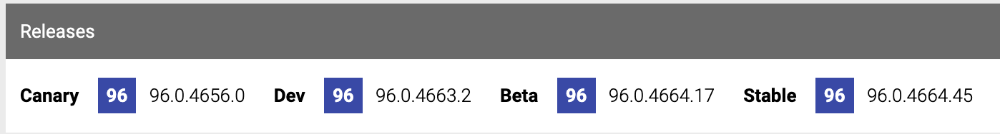

# Chromium にコントリビュートするための周辺知識

## Intro

Chromium にコントリビュートするためには、ソースコードを理解する意外に、もろもろ必要な周辺知識がある。

ドキュメントはかなり整備されている方ではあるが、そのドキュメントにたどり着くのが難しい場合がある。

レビュアーなどが親切に教えてくれはするが、ちょっと間が空くと忘れてしまうため、ローカルにメモしているがそれも散らばってきた。

そこで、細かい知識をメモ代わりに追記していくことにする。どんなに長くなっても分割などせず、全部まとまってる状態を目指す。

具体的なテーマとして fetch を縦軸にする。


## 関連サイト

始めて取り組もうとすると、まずどこを見ればわからないところから始まる。

似たようないくつかのサイトがあり、使い分けがされているからだ。

- Chromium Code Search
  - https://source.chromium.org/chromium/chromium/src
  - コードをインタラクティブに検索するためのサイト
  - こんなふうにコードを引用することもある [global_fetch.cc - Chromium Code Search](https://source.chromium.org/chromium/chromium/src/+/main:third_party/blink/renderer/core/fetch/global_fetch.cc;l=207)
- Issue Tracker
  - https://issues.chromium.org/issues?q=fetch
  - 元々は https://bugs.chromium.org だったが最近移行された
  - crbug とも呼ばれ以下で圧縮できる
  - https://crbug.com/10000
  - 何かバグを見つけた場合もここから登録する
  - 作業をする場合もここから探す
  - [Hotlist-GoodFirstBug](https://issues.chromium.org/issues?q=Hotlist-GoodFirstBug) とか P2, P3 あたりから始めるのが良い
- Gerrit Code Review
  - https://chromium-review.googlesource.com/dashboard/self
  - レビューをするためのサイト
  - crrev とも呼ばれ、以下で短縮できる
  - https://crrev.com/c/10000
- Chromium Dash
  - https://chromiumdash.appspot.com/home
  - もともとは [omahaproxy](https://omahaproxy.appspot.com/) というサービスだったもの
  - ビルドやリリースに関する情報がまとまっている
- Git at Google
  - https://chromium.googlesource.com/
  - Git のリポジトリがそのまま上がっている場所
  - あまり開発で使うことはないらしい


### Chromium Code Search

- 検索クエリとして使える構文
  - https://developers.google.com/code-search/reference?hl=ja


### Chromium Dash

例えば、以下がいつリリースされたかを知りたい場合。

- Rename InterestGroup API flag for common use and add flag for PARAKEET impl (3158266) · Gerrit Code Review
  - https://chromium-review.googlesource.com/c/chromium/src/+/3158266

このサイトの Patchset 13 の横にあるコミットハッシュをコピーする。


それを Chromium Dash の Commits に入れれば情報が出る。

- Chromium Dash
  - https://chromiumdash.appspot.com/commit/4359c5ebd238c93c22e69d369cbe813ae3081b6c



今回の場合は 96 でリリースされたことがわかる。

逆にここから Review や Bug にも飛べる。


## 公式の参考リソース

- docs - Chromium Code Search
  - https://source.chromium.org/chromium/chromium/src/+/main:docs/
  - このディレクトリに色々ある
  - まずは [README.md](https://source.chromium.org/chromium/chromium/src/+/main:docs/README.md)
- C++ in Chromium 101 - Codelab
  - https://chromium.googlesource.com/chromium/src/+/HEAD/codelabs/cpp101/README.md
  - C++ のコードラボ


## 外部リソース

- Chromium Browser のカレンダー | Advent Calendar 2017 - Qiita
  - 開発者によるアドカレ
  - https://qiita.com/advent-calendar/2017/chromium
- Chromium のソースコードを読んでみる - cidermitaina
  - https://cidermitaina.hatenablog.com/entry/2020/12/10/102814


## 環境構築

Chromium は、一部を開発するにも、基本は全てをチェックアウトしてビルドする必要がある。

ビルドは、基本的に Linux が一番早い(ファイルシステムやプロセス生成の影響がでかい)らしいので、 OS 依存でない限りは Mac より Linux を用意する方が良さそう。

それでも、一般的なサーバではビルドに一晩かかるので、そこは覚悟が必要。


## デバッグ

開発者のほとんどがプリントデバッグだけで開発しているらしい。

基本はこれ。

```cpp
LOG(ERROR) << "Foo";
```

他にも色々用意されている。よく使う型なら良い感じに変換されるようになってる。

- logging.h - chromium/src/base - Git at Google
  - https://chromium.googlesource.com/chromium/src/base/+/refs/heads/master/logging.h

stack trace の取り方はこう。

```cpp
#include "base/debug/stack_trace.h"

base::debug::StackTrace().Print();
// or
LOG(ERROR) << base::debug::StackTrace();
```

詳細は以下。

- getting started with blink debugging
  - https://source.chromium.org/chromium/chromium/src/+/main:docs/website/site/blink/getting-started-with-blink-debugging/index.md

GDB を使うことも可能だが、はまりどころは多いらしい。

- debugging.md - Chromium Code Search
  - https://source.chromium.org/chromium/chromium/src/+/main:docs/linux/debugging.md
  - `--no-sandbox` で sandbox を無効にして実効しないとうまくデバッグできないケースに注意。

VSCode でのステップ実行方法もある。

- Chromium Docs - Visual Studio Code Dev
  - https://chromium.googlesource.com/chromium/src/+/master/docs/vscode.md

これが動くなら理想。しかし、いつからかステップ実行するとプロセスが落ちるようになり、原因もわからなかったので、筆者もおとなしくプリントデバッグしている。

docs 以下を debug で検索すると色々テクニックが出てくる。

- debug - Search
  - https://source.chromium.org/search?q=debug&sq=&ss=chromium%2Fchromium%2Fsrc:docs%2F


## テスト関連

- テストの走らせ方
  - https://www.chromium.org/developers/testing/running-tests/
- Unittest のリスト
  - https://source.chromium.org/chromium/chromium/src/+/main:docs/testing/test_descriptions.md


## Git

Chromium 用の Git の拡張が用意されていて、それを用いてコントリビュートする。

- Chromium www.chromium.org Website - site/developers/gerrit-guide/index.md
  - https://chromium.googlesource.com/website/+/HEAD/site/developers/gerrit-guide/index.md

```shell
# Issue 番号で紐づける
$ git cl issue 123456

# 書いたコードを gerrit にアップする
$ git cl upload
```