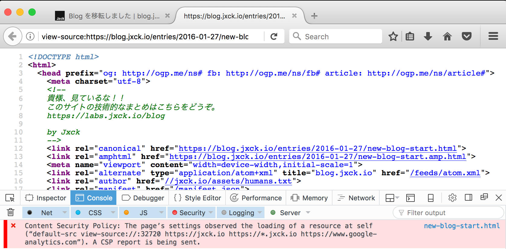

[csp][security] ブログで CSP Report を集めてみた結果

## Intro

このブログで CSP レポートの収集を開始してしばらく経つ。
現状、対象ドメイン内で `<input>` は一切提供しておらず、大半が静的に生成されたページである。
この条件でも、かなり多くのレポートが集まるという点を中心に、その内容を紹介する。


## 収集目的

CSP の基本は、意図しないリソースの読み込みや、意図しないインラインスクリプトの実行を防ぐことにある。

例えば XSS によって悪意のある Inline Script が埋め込まれたり、外部スクリプトを読み込まれたりした場合、ポリシーと照らし合わせた結果違反と判断したブラウザは、その実行をブロックする。

これによって、対策漏れにより発生してしまった XSS の発動を水際で防ぐことが目的となる。

ところが、 Web を閲覧するユーザの中には、以下に挙げるような方法で、 DOM を変更し自分にあった環境を実現している場合がある。

- ブックマークレット
- ブラウザ拡張
- ローカルプロキシ
- スクリーンリーダ
- etc

やり方によってはこれは CSP のポリシーに違反する場合があるだろう。

CSP で可能なのは「ポリシーの定義」と「その違反のブロック」であり、ポリシーの違反が必ずしも攻撃であるかはわからない。

したがって、場合によってはユーザに不便を強いる可能性があるのではないかという疑念があった。

そこで、比較的に技術リテラシーが高いユーザが閲覧していると予想される本サイトに対して去年の 3 月から CSP を適用し、レポートの収集を実施した。

*なにより重要なのは、このサイトはほとんど全てが静的に生成されており、かつ `<input>` フォームが無い点である。*

この条件で XSS に準ずる攻撃を成立されるのはほとんど難しいだろうと考えられる。

つまり、このサイトから上がってくる CSP 違反のレポートは、ほとんどが設定ミスかユーザの閲覧環境に起因するものであるだろうと推測できる。

*あえて `<input>` の無いコンテンツで実態を収集することで、リアルワールドにおいて本質的に攻撃では無いポリシー違反がどの程度あるのかを知ることができると考える。*

今回はその結果と、運用に当たって気づいたノウハウについて紹介する。


## 基本構成

まず、設定および構成について述べておく。

本サイトは `*.jxck.io` ドメインを使い、複数のサブドメインを運用している。

`labs.jxck.io` だけは(CSP に違反するデモを含む)、脆弱性デモを含む様々なデモを置いているため、対象外として扱う。

CSP は全て Report-Only で HTTP ヘッダから適応しており、 CSP レポートを収集している。

ポリシーは `default-src 'self'` の設定を基本として、レポートを集めながら try & error で更新している。

レポート送信のエンドポイントは `report-uri.io` を使っていたが、後述するように今は自前で立てたサーバに移行している。


## 全体像

以下が CSP をデプロイしてから、今月までのレポート発生のグラフである。

TODO: グラフ


まず最初の期間は、設定の漏れが多くレポートを修正する期間だったためレポートが多い。

その後も、コンテンツを更新(AMP の対応、 Youtube 埋め込みの対応 etc) を行うたびに、設定の更新が必要になるため、ところどころ山がある。

しかし、全体として、定常的にレポートが上がっており、コンテンツが安定ている今でも、レポートがなくなることは基本的に無いことがわかる。


次に個々のレポートを細かくみた結果、よく発生していたものについて紹介する。


### DOM Change from Bookmarklet

以下のレポートは、 CSP の指定範囲外オリジンから jQuery を埋め込んだことによるレポートと思われる。
Bookmarklet などから DOM を変更することで、ページそのものをカスタマイズしたりするユーザもいる。
もしくは、このサイト上で色々試したりするユーザもいるだろう。

```
{
  "csp-report": {
    "document-uri":        "https://blog.jxck.io/entries/...",
    "referrer":            "https://blog.jxck.io/",
    "violated-directive":  "script-src",
    "effective-directive": "script-src",
    "original-policy":     "default-src 'self' https://jxck.io...",
    "disposition":         "report",
    "blocked-uri":         "https://code.jquery.com/jquery-3.0.0.min.js",
    "line-number":         1,
    "column-number":       108,
    "status-code":         0
  }
}
```

同様に devtools からの変更でもレポートを起こすことができる。
Local Proxy による変更でも同じことが起こるだろう。

### Extension

以下のレポートは、ブラウザエクステンションがブロックされたであろうと想像される。
画像について何か改変をしているようだが、詳細はわからない。

```js
{
  "csp-report": {
    "document-uri":        "https://blog.jxck.io/entries/...",
    "violated-directive":  "default-src 'self' https://jxck.io ...",
    "effective-directive": "img-src",
    "original-policy":     "default-src 'self' https://jxck.io ...",
    "blocked-uri":         "ms-browser-extension",
    "status-code":         0
  }
}
```

こうした拡張を通じた DOM の改変が起こる可能性として、以下のような場面があるだろう。

- Reader View Mode
- Screen Reader
- Outline Viewer

Safari の Reder View と、 Screen Reader である TODO については、特に問題がなさそうなことを確認してる。
しかし、これらも実装次第ではあると思うので、もっと幅広い検証が必要かもしれない。


### browser inline style

本サイトでは記事の原稿を .md でも閲覧できる。また RSS feed は XML で提供し、 humand.txt や robot.txt は Text で提供している。

こうした `.md`, `.txt`, `.xml`, `.json` などのページをブラウザで表示すると、ブラウザによってはそれを内部的に HTML に整形して表示する。

この時、 HTML の中にある inline の style がポリシー違反と判定されるため、レポートが上がる。


```js
{
  "csp-report": {
  "document-uri":        "https://jxck.io/humans.txt",
  "referrer":            "",
  "violated-directive":  "style-src",
  "effective-directive": "style-src",
  "original-policy":     "default-src 'self' https://*.jxck.io...",
  "disposition":         "report",
  "blocked-uri":         "inline",
  "line-number":         1,
  "status-code":         0
  }
}
```

これはもちろん悪意のあるポリシー違反でないため、本サイトではこの種のコンテントタイプのページへは CSP を適用しないこととした。


### FireFox view:source

本サイトは技術者向けの内容が多いため、このサイト内の HTML ソースをブラウザで表示する閲覧者も多い。

Firefox ではソースを表示すると、オリジンが view-source://~ となるため、このページが CSP 違反となりレポートが上がる。

Chrome でも同じくオリジンが変わるが、ここではレポートはあがらないようだ。




これは対応せず無視することとした。


### about:blank_


### CSP ヘッダ


```
"jxck.io:443":
  header.add: "Content-Security-Policy-Report-Only: default-src 'self' https://*.jxck.io https://www.google-analytics.com; report-uri https://jxck.report-uri.io/r/default/csp/reportOnly"
  header.add: "Public-Key-Pins-Report-Only: pin-sha256=\"7JT7NhX2St/VBBkRi4BO427M7ytLy7p3CRYPtHpSm7c=\"; pin-sha256=\"+WpRHNpAId2FIOvVgwmS3HsG+eJtERKC4/qM1tQaeRk=\"; report-uri=\"https://jxck.report-uri.io/r/default/hpkp/reportOnly\""
"/humans.txt":
  header.unset: "Content-Security-Policy-Report-Only"
  file.file: ./www.jxck.io/humans.txt
```


https://twitter.com/Jxck_/status/715748823713185792


## CSP のサポート

このへんがまとまってる

[Content Security Policy Reference](https://content-security-policy.com/)

## CSP Report

レポートを取るのが重要
レポートだけでも良さそう
それだけでも前進している


## Reporting Server

CSP のレポート収集サービスとして、 [report-uri.io](https://report-uri.io) がよく紹介され、本サイトでもこれを用いてレポートを収集していた。
無料で使うことができる点で導入の敷居が低いのは良かったが、現在は以下のような理由でもう使っていない。

- レポートをエクスポートできない
- 半年以前のレポートが検索できない(内部的に消されている?)
- HTTP のヘッダを見ることができないので細かな解析ができない
- エンドポイントのレスポンスが悪く、一つのページが複数のレポートをあげると詰まって 5xx が返りレポートを取りこぼす
- レポート検索/閲覧の UI が非常に見辛い


Reporting Server は、小さい JSON ファイルが POST で受け取れる単純な API であればよいため、自分で自作することとした。
それなりのサービスであれば、ログなどを解析/可視化する基盤(graphite, kibana, ES, BigQ, mackerel etc) があると思うので、エンドポイントを自分で立ててそこに流し込むのが良いだろう。

また、もし自分でエンドポイントを実装する際には、以下の点に注意して実装するのが良いと思われる。

- report-uri は非推奨なので、 [report-to](http://wicg.github.io/reporting/) を前提として設計
- レポートには UA やタイムスタンプはないので、必ず HTTP ヘッダ(全体)を一緒に保存する
- 意図しないリクエストを `content-type: csp-report` で間引きたくなるが、[準拠してないクライアント](https://www.tollmanz.com/content-security-policy-report-samples/) もあるようなので注意が必要

report-uri から report-to への変更で、 CSP 以外も含めたレポート送信が Reporting API に統合される。
ここではヘッダ指定のしかたから、 Cookie の扱いなど色々変わりそうなので、本サイトで実装を終えたら追って解説しようと思う。
