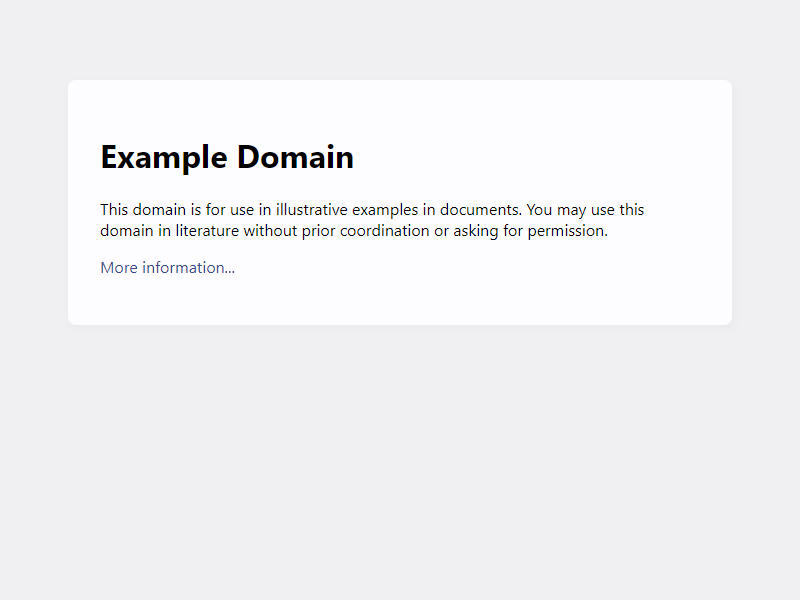

# example.com が更新された話

## Intro

http://example.com が更新されてしまった。


## Example Domain

ドキュメントや書籍、スライドやコメントなどに、サンプルとして適当な URL を書くことがあるだろう。

例えば、ネットワークでよく出てくる Alice になぞらえて `alice [dot] com` などと書くと、そのサイトは実在するため、開けばリクエストが飛ぶ。

`bob [dot] com` のように今は存在しなくても、将来取得される可能性があるのだ。

そこで、「このドメインはドキュメントの例示用に使って良い」というドメインが RFC に定義されている。

- RFC 6761 Special-Use Domain Names
  - https://www.rfc-editor.org/info/rfc6761/
- RFC 2606 Reserved Top Level DNS Names
  - https://www.rfc-editor.org/info/rfc2606/

例えば、以下は例示用途で安心して使えるのだ。

- example.com
- example.net
- example.org

筆者も、このサイトや書籍、雑誌への寄稿、スライド、研修資料、あらゆるところで `example.com` を使ってきた。


## example.com

すると、このドメインは空のままで、何もデプロイされてないと思うかもしれない。

しかし、実際には DNS がレコードを提供し、 Web サイトがデプロイされている。

- http://example.com



なんということのないサイトだが、このサイトは実は非常に便利だったのだ。


## `http://` のデプロイ

世界は HTTPS へとシフトしている。

http -> https のリダイレクトは当たり前で、一度リダイレクトすれば HSTS で固定する。

Preload HSTS や HTTPS RR の提供、 HTTPS First Mode などによって、 `http://` へのトラフィックは極力消していくことになっていた。

ところが、それは `http://` の接続を検証するためのデプロイも無くなっていくことを意味する。

例えば、ブラウザが「平文通信は赤く警告を出す」という変更を入れても、実際にオンラインでどうなるか試すには、平文のままなサイトを探すか、自分で立てる必要があった。

そのような用途のために、「このサイトは HTTPS にしない」といったコンセプトのサイトを、思いついたように立てる人は多々いた。しかし、いつしかサイトが落ちてたり、ドメインが失効していたり、デプロイ先の都合で HTTPS になってしまっていたり、そんなサイトばかりだった。

そんな中 http://example.com は、ずっと平文を提供していた。

余計なリダイレクトはなく、余計な広告も出ず、余計なスクリプトも動かない。

ただただ `http://` を提供しており、覚えやすい。

`telnet example.com 80` ですら接続できるため、 HTTP の研修などでも非常にお世話になった。

平文通信をするということは、 WiFi の Captive Portal を開くにも便利だ。

とりあえず http://example.com に繋げば、ほぼ間違いなく Captive Portal は開く。

## シンプルな HTML

HTML は以下のようなシンプルなものだ。

```html
<div>
  <h1>Example Domain</h1>
  <p>This domain is for use in documentation examples without needing permission. Avoid use in operations.</p>
  <p><a href="https://iana.org/domains/example">Learn more</a></p>
</div>
```

DevTools で `h1` をイジるワンライナーを何回書いただろう。

何回 `div` に CSS を当てただろう。

なんのエラーも出て無いまっさらな Console で、何回正規表現を試しただろう。


## 刷新

いつしか、 example.com を開くのは手癖になっていた。

URL バーに e を入れれば、補完は example.com だ。

そんなある日、いつものように http://example.com を開いたら https://example.com にリダイレクトされた。

