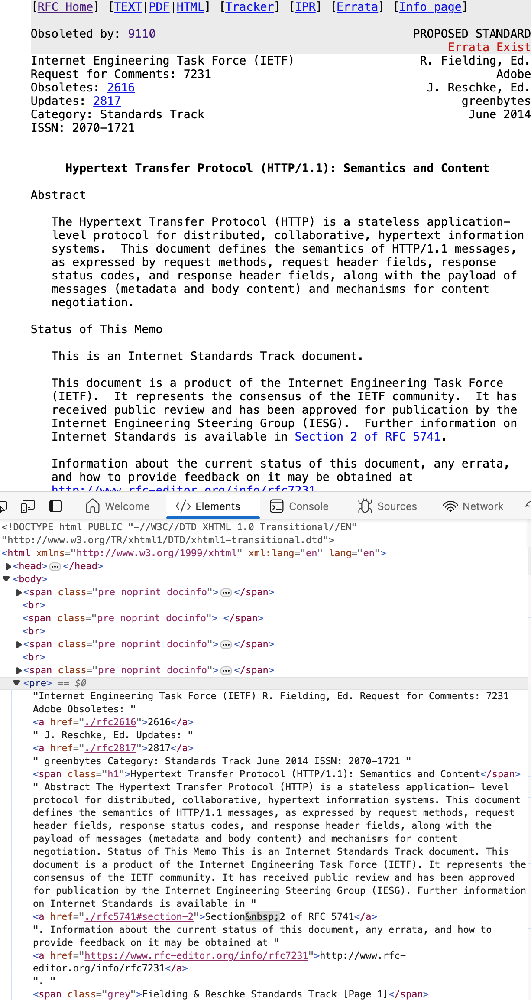
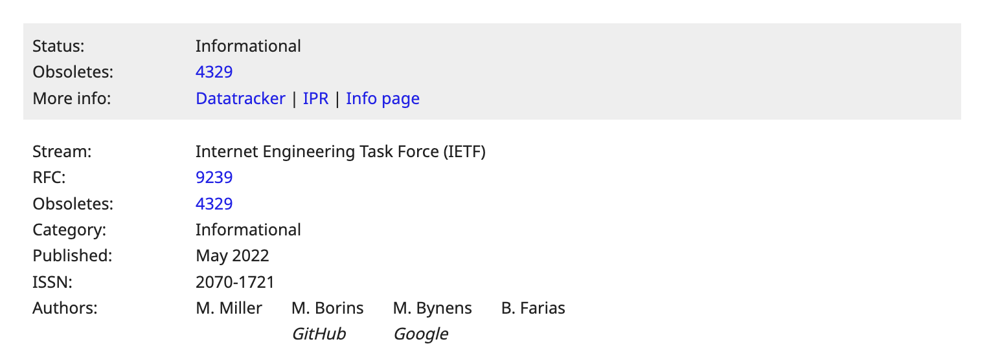

# [rfc][ietf] RFC のリンクはどのドメインでするのが良いか

## Intro

IETF の RFC はいくつかの場所に同じものが上がっている。

どれがいいのか、という話。

## RFC Hosting Site

例えば RFC 9110 - HTTP Semantics で言うと、以下の 4 つがある。

- https://tools.ietf.org/html/rfc9110
- https://datatracker.ietf.org/doc/html/rfc9110
- https://www.rfc-editor.org/rfc/rfc9110.html
- https://httpwg.org/specs/rfc9110.html

まずは違いを簡単に解説する

### tools.ietf.org

IETF がホストする RFC は、 tools.ietf.org だった。

しかし、 2021 年 tools と xml2rfc/bibxml をメンテしていた Henrik 氏が引退し、それを機に刷新が行われることになった。

- Clarifying the state of and the transition plan for tools.ietf.org
  - https://mailarchive.ietf.org/arch/msg/ietf/0n-6EXEmkTp3Uv_vj-5Vnm3o0bo/

既存のページはマイグレーションされて、 URL は datatracker.ietf.org にリダイレクトしている。

- Reminder: tools.ietf.org is shutting down before IETF 113
  - https://mailarchive.ietf.org/arch/msg/ietf-announce/xKzJZIyanPCclTd7DU9PxBAbwhA/

### datatracker.ietf.org

tools の持っていた機能は RFC 本文の表示だけではなく、そのメタ情報の表示でもあった。

特に、 RFC 以前にどのような変遷を辿ったのか、 Author は誰で、 Errata はどこなのか。 Internet Standard なのか Informational なのか etc

昔はディスプレイも小さかったので、サイドバーはなくヘッダと別ページに書かれていたが、 datatracker はこれをサイドバーに踏襲している。

と言う意味で、もっとも情報量が多いのは datatracker と言える。

### rfc-editor.org

気がついたらあったが、いつどのようにできたのかは追いきれなかった。

### httpwg.org

名前の通り、これは HTTPWG が独自に管理しているものであり、リポジトリの GitHub Pages だ。

- httpwg/httpwg.github.io: HTTP Home Page
  - https://github.com/httpwg/httpwg.github.io

HTTPWG は、策定活動に GitHub をかなり多用する WG であり、仕様も全て GitHub のリポジトリで管理されている。

そのリソースを、策定段階から独自の読みやすいスタイル(CSS)で出してくれている。

つまり、 IETF 公式といえるかというと微妙ではある。

## RFC の読みにくさ

tools から datatrakcer に移行するのと同時期くらいに、 RFC 自体のフォーマットをなんとかしようという動きがあった。

以前の RFC は、本文が ASCII 固定文字数で折り返し、 HTML では全体が `<pre>` というフォーマットだった。

文の途中でも固定長で折り返しているため、例えば読み上げも途切れるし、自動翻訳も意味がつながらずうまく動かない。センタリングもされてない。

ディスプレイが小さかったころに、安定したテキストフォーマットとしては良かったかもしれないが、全くアクセシブルでないこのフォーマットには筆者も不信感があった。

HTTPWG が独自に HTML を生成してホストしていたのも、このあたりの理由から読みやすいものを独自に公開していたように思う。

その後 RFC 8650 あたりから、 RFC を生成するツールも刷新され、それを用いて現在のモダンな HTML が吐かれるようになった。

ちなみに、以下の二つを見比べてみると datatracker の方が見やすいフォーマットになっていそうに見える。

- https://datatracker.ietf.org/doc/html/rfc7932
- https://www.rfc-editor.org/rfc/rfc7932.html

しかし、ソースをみるとどちらも `<pre>` であることは変わらず、センタリングがされているか程度の違いしか実際はない。過渡期であるがゆえの微妙な差ではある。

## どれを使うべきかの議論

以下に、 Stack Exchange で不具合があった際に IETF 担当者とやりとりしたログが残っている。

- Links to HTML versions of RFC's need to move from "tools" to "datatracker" - Meta Stack Exchange
  - https://meta.stackexchange.com/questions/367881/links-to-html-versions-of-rfcs-need-to-move-from-tools-to-datatracker

> rfc-editor.org is the canonical location for RFC documents, and will remain the correct destination for now. The RFC document locations at the various IETF URLs aren't canonical repositories, even though they do ultimately point to the same documents. I gather (but could be wrong) that these are more so 'working repositories' than the reference documents themselves.
>
> rfc-editor.org は RFC の正規の場所であり、今のところ正しい保存先と言える。複数の IETF URL にある RFC 文書の場所は、最終的に同じ文書を指しているとはいえ、正規のリポジトリではない。私は(間違っているかもしれないが)、これらは参照文書そのものというよりも、「作業用リポジトリ」だと考えている。

つまり、文書としての RFC の Canonical URL は rfc-editor であり、そのリポジトリが datatracker ということになる。

類似する議論として WHATWG HTML の仕様の URL はどうするかという議論もあった。

- Editorial: move `ietf` links to `datatracker` · Issue #7671 · whatwg/html
  - https://github.com/whatwg/html/issues/7671

この中で MDN のとっているルールを採用することになり、そのルールは以下だ。

- If an httpwg version exists, use that
- Otherwise, if an rfc-editor version exists, use that
- Otherwise, use the datatracker version

これは、あくまで読みやすいことを優先している。また HTTPWG のスペックしか HTTPWG にはない。

## どれを使うべきか

あらゆるエリアの RFC について、公式の、統一された、安定的な URL を求めるのであれば、 *rfc-editor* を用いるのが良さそうだ。

移行時期の問題で、一部は datatracker の方がセンタリングされて見やすいように思うものもあるかもしれないが、内容は基本的に変わらない。

最近の RFC であれば、改善されたスタイルで読むことができるし、仕様を読む目的の人にとっては最も適したものだろう。

もし、メタデータに用がある場合は、画面上部に datatracker へのリンクがある。

## Outro

本ブログや、筆者が書く文書では、 RFC へのリンクは rfc-editor を採用することとする。