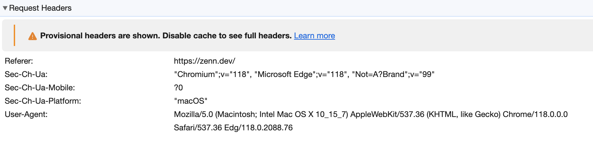

# ブラウザでリロードしながら「キャッシュがヒットしない」と勘違いしてる全ての人へ

## Intro

こういうタイトルを付けるのはあまり好きでは無いが、あえてこのようにした。


## 「ブラウザでキャッシュがヒットしない」

以下は、 Web における Caching の FAQ だ。

- サーバで `Cache-Control` を付与したのにキャッシュがヒットしない
- サーバで `ETag` を付与したのに `If-None-Match` が送られない
- サーバで `Last-Modified-Since` を付与したのに `If-Modified-Since` が送られない

先日も、筆者が書いた MDN の Cache セクションで「記述が間違っているのでは?」と同様の質問を受けた。

- Issue about the Age response header and the term "Reload" · Issue #29294 · mdn/content
  - https://github.com/mdn/content/issues/29294#issuecomment-1746290336

日本語でいうと、例えば以下もこれにあたる。

- Cache-Control ヘッダは仕様通り実装されていない? - Qiita
  - https://qiita.com/shibukawa/items/bdf56e0adbc292666cfb#comment-f8af1c05a7b8abed7a82

自分が RFC などを確認していることがバイアスとして働き、「このブラウザは仕様に準拠してないのでは」とか「ブラウザにバグがあるのでは」などと勘違いしがちだ。

確かに、これについてきちんと解説しているリソースは、決して多く無いかもしれない。そのため昨年 MDN の Cache セクションを書き直した際には、このことも解説しているし、自分が書いた本にもこの説明を 1 節使って行っている。

- Browser API | Cache 解体新書
  - https://zenn.dev/jxck/books/cache-anatomia/viewer/browser

今後、この記事を渡すだけで説明が終わるように、改めてまとめておく。


## 原因は検証方法

ブラウザごとの差なども含めて丁寧に話をすると記事が長くなるうえに、こうした検証で問い合わせてくる人が試しているのは大抵 Chrome なので、今回は Chrome に絞って話をする。

結論から言うと、これらの勘違いは全て「*ブラウザをリロードしながら DevTools の Network パネルを見てる*」ことが原因だ。

まず、ブラウザから発生するリクエストには、大きく 3 つある。(細かく分ければもっとあるが割愛)

1. Navigation
2. Reload
3. Force Reload (Super Reload)


### Navigation

Navigation とは、要するにリンクをクリックした場合に発生する画面遷移のリクエストだ。

このリクエストに対し、 Fresh なレスポンスが Store されていれば Reuse される(意訳: ブラウザにキャッシュがあればヒットする)。

もし、 `ETag` や `Last-Modified` が付与されていた場合は、 Validation が発生する(意訳: `If-None-Match` や `If-Modified-Since` が付与されたリクエスト送られ、 304 が返ってくれば再利用される)。

これが RFC に書かれており、勘違いしている人が再現してほしい挙動だ。


### Reload

Reload は、その名の通りリロード、再読み込みだ。ブラウザの URL バーの隣にあるリロードボタンや、 CMD-r / F5 などで実行される。

Reload はそもそも、何らかの理由で壊れた画面の修復や、最新情報への更新のために実装されている。したがって、「キャッシュが再利用されてほしくない」というのがユーザの要求であるため、当然のように、ブラウザが Fresh なレスポンスを Store していようがいまいが、バイパスして Origin にリクエストする。(意訳: サーバに最新の HTML を取りに行く)

つまり、 Reload しながら DevTools を眺めても、キャッシュがヒットする様や Validation が発生する様を見ることができるはずはないのだ。

*普段、結果の表示を Reload でデバッグしている癖でやってしまいがちではあるが、「Reload の挙動は Navigation とは違う」という点は、 Cache 周りをいじっているなら念頭におきたい*。


## Force Reload

Force Reload は Super Reload などとも呼ばれ、 Shift + Reload や DevTools の "Disable Cache" 相当の機能を有効すると発生するものだ。

したがって、一般ユーザによる実行ではなく、開発者が実行するという意図で実装されている。

Reload との違いは Request で送られるフィールドだ。

```http
# Reload Request
Cache-Control: max-age=0

# Force Reload Request
Cache-Control: no-cache
```

「すべてのキャッシュをバイパスして Origin から最新のリソースを得たい」なら仕様上 `no-cache` が適切といえる。しかし、 `no-cache` が仕様化されたのは、ブラウザが登場してからかなり経ってからだ。それ以前は `max-age=0` が使われていたため、ブラウザのリロードの実装はそのころから `max-age=0` を使っていた。後に `no-cache` が登場したからといって Reload の実装を変えると、クライアントが `no-cache` を送ってくることを想定してないサービスにおいては、互換性が壊れる可能性がある。そこで、開発者向けとして別途 Force Reload として実装されたのだ。

そこの差をさておいても、「ブラウザのキャッシュは無視され、 Validation も発生しない」のは同じだ。自明だが「*Cache を検証しているなら DevTools の "Disable Cache" は無効にする必要がある*」。


## 正しい検証方法

では、キャッシュの挙動はどのように検証すれば良いのだろうか?

答えは、最初に言ったように Navigation を用いることだ。

よくあるユースケースとして、例えば `/home.html` のレスポンスが以下だったとする。

```http
HTTP/1.1 200 OK
...
Cache-Control: max-age=100
ETag: deadbeef
If-Modified-Since: Sat, 11 Nov 2023 11:11:11 GMT

<!doctype html>
...
```

このキャッシュがヒットするところが見たい場合は、 DevTools のネットワークパネルを開いたまま、以下のようなリンクをクリックし、そこに遷移すれば良い。もちろん、 "Disable Cache" は無効にする。

```css
<a href="/home.html">Home</a>
```

もし、 100s 以内ならキャッシュがヒットするだろうし、 100s すぎたら以下のようなリクエストが飛ぶだろう。

```http
GET /home.html HTTP/1.1
...
If-None-Match: deadbeef
If-Modified-Since: Sat, 11 Nov 2023 11:11:11 GMT
```

これで、仕様に記載されたリクエストを見ることができるだろう。

もしここで、 `/home.html` を表示した状態で Realod をすると、以下のようなリクエストが飛ぶ。

```http
GET /home.html HTTP/1.1
...
Cache-Control: max-age=0
```

ここで `If-None-Match` / `If-Modified-Since` が飛ばないのは、仕様違反でもバグでもなく、意図したものであることがわかるだろう。


### サブリソースの Revalidate

ただし、もう 1 つ注意点がある。

近年の Web では、サービスの実装バグなどによって表示が壊れるといった事象は、滅多にみられなくなってきた。つまり、ユーザがリロードをする理由の大半は、表示情報を最新にしたいケースと言える。

一方、現在の Web は 1 つのページが非常に多くのサブリソースに依存している。メインリソースである HTML の情報を最新にするために、多くのサブリソースを同時に更新するのは、非常に無駄な処理が多い。特に最近のサブリソースは、ビルド結果のハッシュを URL に付与し、キャッシュバスティングするケースが多い。そうしたサブリソースは内容が一切変更されず、内容を変更する場合は URL が変更されることになる。

つまり、リロードで大量のサブリソースまで同時に更新するのは、大抵の場合無駄でしか無いのだ。

そこで、「このリソースは更新されないからリロード時に取得し直す必要がない」と明示的に示す `immutable` が定義された。

- RFC 8246 - HTTP Immutable Responses
  - https://www.rfc-editor.org/rfc/rfc8246

Firefox と Safari はこれを実装している。しかし Chrome は実装をしてない。

Chrome は独自の調査の結果、 `immutable` がなかろうと Reload 時にサブリソースを Validation する必要はないという結論から、 Reload 時はメインリソースしか再取得しない、つまり、サブリソースは `immutable` がデフォルトという実装に変更している。

この変更については、以下に詳細がある。

- Chromium Blog: Reload, reloaded: faster and leaner page reloads
  - https://blog.chromium.org/2017/01/reload-reloaded-faster-and-leaner-page_26.html

つまり、先ほどの「リロードしながらキャッシュの挙動を観察する」においては、 Chrome でサブリソースのリクエストは発生すらしてない。また、この場合に出る以下のエラーメッセージが以下のようにかなり不親切なため、余計に混乱するかもしれない。

```
Provisional headers are shown, Disable cache to see full headers.
```

