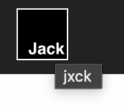

# [dialog][popover] Dialog と Popover #10

## Intro

今回は、この連載の最終回となる予定だ。

今回考えたいのは、　GitHub の Issue や User アイコンをマウスでホバーすると、 Issue の詳細や User Profile が表示されるアレだ。


挙動としては想像通り、対象要素に Anchoring した `<div popover>` を表示して、中に好きなようにコンテンツを入れれば良い。しかし、この UI のセマンティクスに関しては、複数の議論が行われている。

今回は、それらを整理つつ、考えうる選択肢をいくつか提示する。その中で要件に合わせて何を選ぶかは実装者に委ねたい。


## Native Tooltip

まず、この UI の名前だが、例えば UI コンポーネントライブラリを見ても、このようなコンポーネントは様々な名前で提供されている。

そもそも Popover という名前で提供している場合もあれば、 Tooltip や Toggletip といった名前がつくこともあるようだ。

しかし、 HTML において Tooltip というと、 `title` 属性を付与した際に、マウスオーバーでブラウザが出す、この UI もそう呼ばれる。



紛らわしいので、ここではこれを "native tooltip" と呼ぶことにする。

native tooltip は、古くからブラウザが実装しているが、実装にいくつかの問題が度々指摘されている。(e.g. ブラウザによってはキーボードのフォーカスだけでは出せない)

スタイルについては、 CSS を当てられるようにする提案自体はある。

- Consider providing a way for authors to style the title attribute's tooltip · Issue #730 · openui/open-ui
  - https://github.com/openui/open-ui/issues/730
- [css-ui] Standardize tooltip styling and expose as `::tooltip` · Issue #8930 · w3c/csswg-drafts
  - https://github.com/w3c/csswg-drafts/issues/8930

しかし、まだ議論がまとまっておらず、どうなるかわからない。そして、いじれてもスタイルだけなので、 `title` 属性に頼らず、別途 Tooltip コンポーネントを自作する場面は今後も多いだろう。

## Tooltip/Toggletip

"native tooltip" は `title` 属性を出しているだけなので、内容はテキスト(presentation contents)のみだ。ここにコントローラー(interactive content)つまりリンクなどが入ってくると話は少し変わる。

そこで、「テキストのみ」を表示するコンポーネントは Tooltip、対して「コントローラ」を含むものを Toggletip と呼び分ける場合がある。便利なので、本文でもそれを採用することにする。

どちらも、 対象要素に Anchoring した `<div popover>` で実装することが可能だろう。問題は、どのようなセマンティクスを提供するかだ。

```html
<div popover>
</div>
```


### Tooltip

Tooltip の場合、`role=tooltip` があるため、そのまま使えば良いだろう。あくまで内容はテキストのみだ。

```html
<div role=tooltip popover>
  <output>Hello Tooltip</output>
</div>
```

`role=tooltip` については以下に仕様がある。

- Accessible Rich Internet Applications (WAI-ARIA) 1.3
  - https://w3c.github.io/aria/#tooltip

`role=state` などと違い、 `aria-live` や `aria-atomic` について規定がないため、特に UA にとって何か特別な挙動がないことも知られているが、その点は Popover を用いている時点で解決できる部分もなくはない。

そして、 APG にも Tooltip についてのパターンがある。

- Tooltip Pattern | APG | WAI | W3C
  - https://www.w3.org/WAI/ARIA/apg/patterns/tooltip/

最初に書かれている通り、このパターンはまだ議論が終わっておらず、完成しているとは言えない。 Issue は 2016 年に立ったもので、今でもまだ結論が出ていない。

- Develop example of tooltip design pattern · Issue #127 · w3c/aria-practices
  - https://github.com/w3c/aria-practices/issues/127
- Draft tooltip design pattern · Issue #128 · w3c/aria-practices
  - https://github.com/w3c/aria-practices/issues/128

時を経て去年、この議論は ARIA 側にも持ち込まれた。

- Definitive tooltip design pattern · Issue #2002 · w3c/aria
  - https://github.com/w3c/aria/issues/2002

この中で、「そもそも `role=tooltip` 自体が微妙なのでは？」ということで、そちらの議論にも派生した。

- Clarify the use of role=tooltip · Issue #979 · w3c/aria
  - https://github.com/w3c/aria/issues/979

これを議論するために TPAC では 2 枠のディスカッションが用意されたが、明確な結論には至ってない。

- ARIA WG F2F (TPAC) – 11 September 2023
  - https://www.w3.org/2023/09/11-aria-minutes
- (MEETING TITLE) – 15 September 2023
  - https://www.w3.org/2023/09/15-aria-minutes.html

## Text or Interactive Content

まず、ここに入れる内容が native tooltip のようにテキストだけであれば、なんら問題はない。

```html
<div role=tooltip popover>
  <output>Hello Tooltip</output>
</div>
```


その UI の中に「テキストのみ」が表示されるのかコントローラなどの「インタラクティブコンテンツ」も含めて表示されるのかで、話は結構変わってくる。

そこで、前者を Tooltip、 後者を Toggletip と呼び分ける場合がある。本文ではこの呼び分けを採用することにする。

## APG


基本的に、画面上同時に 1 つしか存在せず、マウスを外せばすぐ消える。全ての要素に対して、あらかじめ `[poposver]` を作っておいて、表示/非表示を切り替えるのは現実的ではないため、 1 つの Popover 使い回し、内容と位置を変えながら表示していく実装方法が考えられる。

表示位置は、どの場所にあるリンクをホバーしても、そのリンクに紐づいて表示されるように、 Anchor Positioning を活用することになる。

今回は、 `<a>` をホバーした際に、リンク先のタイトルを取得して表示するような UI を考えてみる。


## role=tooltip の議論
 
- Clarify the use of role=tooltip · Issue #979 · w3c/aria
  - https://github.com/w3c/aria/issues/979
- Tooltip should not use role and aria-describedby · Issue #3242 · ariakit/ariakit
  - https://github.com/ariakit/ariakit/issues/3242


- Semantics and the popover attribute: which role to use when? | hidde.blog
  - https://hidde.blog/popover-semantics/


### HTML

基本は `<div popover>` となる。同時に 1 つしか表示されないため、 `popover=auto` を指定するが、デフォルトなので明示的に書く必要はない。

```html
<div popover>
</div>
```

この要素のロールの選択には、いくつかの設計方針がある。

`role=tooltip` というそのままの名前のものもあるが、このロールは特にデフォルトで規定(`aria-live` や `aria-atomic` の値など)されているものが無い。そのため、たとえば `title` 属性を付与した時にブラウザが出す、デフォルトの Tooltip のように、補助的なプレーンテキストが表示されるといったものであれば使われるが、インタラクティブコンテンツなどを含む場合は、別のロールが使われることが多い。

たとえば、 GitHub で Icon や Issue を hover した時に出る Tooltip は `role=region` を用いており、 Slack の場合は `role=presentation` を用いている。

```html
<div role=tooltip popover>
</div>
```

しかし、 `role=tooltip` は前回 Toast に使用した `role=status` や `role=alert` と異なり、`aria-live` や `aria-atomic` はデフォルトでは指定されない点には注意が必要だ。

今回は、あくまで補助的な情報を表示している点から `aria-live=polite`、かつ同じ DOM を使い回している点から `aria-atomic=true` で全変更を通知する実装が考えられるだろう。

```html
<div role=tooltip aria-live=polite aria-atomic=true popover>
</div>
```


マウスオーバー時に表示し、マウスが外れれば消えるため、明示的な非表示 UI は不要だろう。必要なのはメッセージの表示領域だ。

```html
<div popover>
  <h2>ホバーしたリンク先のタイトル</h2>
</div>
```
これが基本の構造となり、これを


### CSS

表示に関して、特にアニメーションは不要だろう。大事なのは表示する位置だ。

基本的には、ホバーしたリンクに対して右下に表示するため、リンクをアンカーとして指定する。

```css
[popover] {
  top: anchor(end);
  left: anchor(start);
}
```

これではピッタリとくっつきすぎるため、 `translate` で少し余白を設定するする。

```css
[popover] {
  top: anchor(end);
  left: anchor(start);
  translate: 2% 4%;
}
```

このとき、表示のための領域が足らなければ上、左とフォールバックするように指定する。

```css


```

TODO: aria

### JS

以上の `<div popover>` を、リンクごとに動的に内容を取得して表示することになる。

Anchor の対応関係の表現は、現状 CSS でしか行えない。

```css
a {
  anchor-name: --anchor;
}

[popover] {
  position-anchor: --anchor;
}
```

これを 1 つの `[popover]` と複数の `<a>` の間で行う必要があるため、基本的には `<a>` 側に一意の値を割り振り、それを各々の `anchor-name` として採用する。そして表示したい `<a>` に合わせて `[popover]` の `position-anchor` を変えるという方針を採用する。

今回の場合は、 `<a>` には ID が付与されている前提とする。

```html
<ul>
  <li><a id=one>one</a>
  <li><a id=two>two</a>
  <li><a id=three>three</a>
</ul>
```

最初に id に `--` をつけたものを、全ての `<a>` の `anchor-name` にしてしまう。

```js
document.querySelectorAll('a').forEach(($a) => {
  $a.style.anchorName = `--${$a.id}` // --one など
})
```

次に、 `<a>` が `mouseover` されたら、 `[popover]` の `position-anchor` を、 `<a>` の ID を元に紐づけてから、 `showPopover()` すれば、 `<a>` を Anchor として表示することができる。

```js
document.querySelectorAll('a').forEach(($a) => {
  $a.style.anchorName = `--${$a.id}` // --one など
  $a.on('mouseover', async (e) => {
    $popover.style.positionAnchor = `--${e.target.id}`
    // fetch & dom update
    $popover.showPopover()
  })
})
```

ここで、 `showPopover()` の前に、必要な情報を取得して DOM に反映すれば良い。

そして `[popover]` の mouseleave で消す。このイベントリスナーは `mouseover` ごとに追加されてメモリーリークするので `{ once: true }` が必須だ。

```js
$$('a').forEach(($a) => {
  $a.style.anchorName = `--${$a.id}`
  $a.on('mouseover', async (e) => {
    $popover.style.positionAnchor = `--${e.target.id}`
    $popover.showPopover()
    $popover.on('mouseleave', (e) => {
      $popover.hidePopover()
    }, { once: true })
  })
})
```

この場合、 Popover 内に一回もマウスが入らなければ消えないが、 Light Dismiss なので、他の場所のクリックや、他の Popover のオープンなどで簡単に消えるため、残り続けることは少ないだろう。ちゃんとやるのであれば、同時に `<a>` からの `mouseleave` も合わせて見るなどの実装が必要だ。