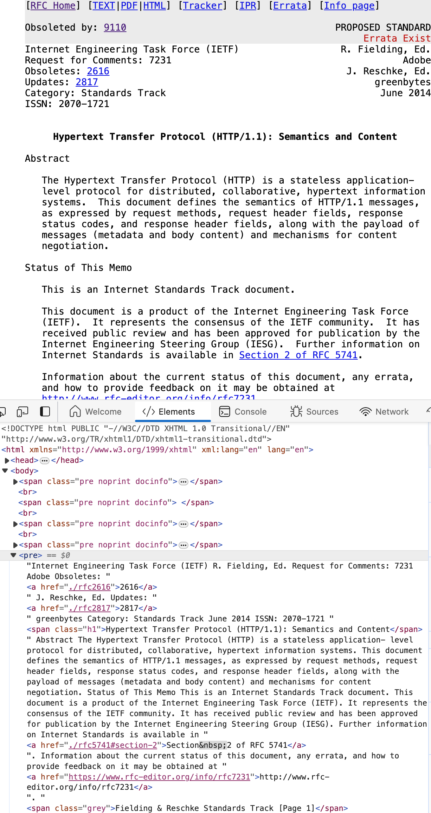
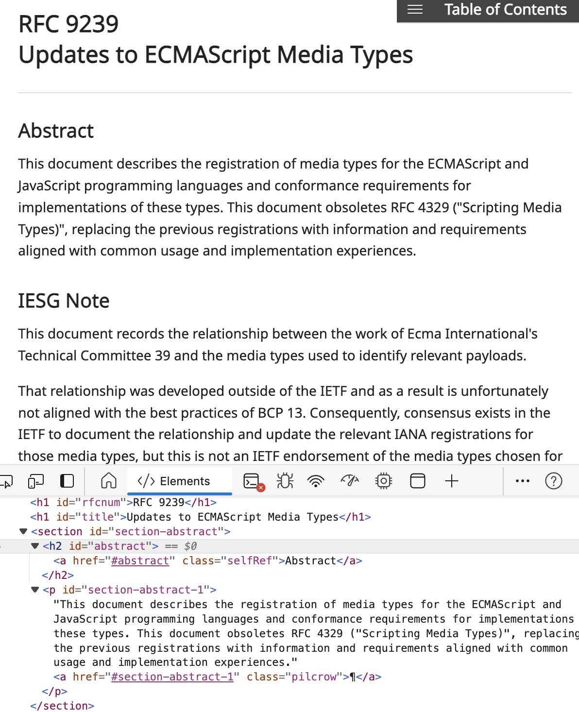

# [rfc][ietf] RFC のリンクはどのドメインで貼るのが良いか

## Intro

IETF の RFC はいくつかの場所に同じものが上がっている。

どれがいいのか、という話。


## RFC Hosting Site

例えば RFC 9110 - HTTP Semantics で言うと、以下の 4 つがある。

- https://tools.ietf.org/html/rfc9110
- https://datatracker.ietf.org/doc/html/rfc9110
- https://www.rfc-editor.org/rfc/rfc9110.html
- https://httpwg.org/specs/rfc9110.html

まずは違いを簡単に解説する。


### tools.ietf.org

IETF がホストする RFC は、 tools.ietf.org だった。

- RFC 2616: Hypertext Transfer Protocol -- HTTP/1.1
  - https://web.archive.org/web/20070301142401/https://tools.ietf.org/html/rfc2616


しかし、 2021 年 tools と xml2rfc/bibxml をメンテしていた Henrik 氏が引退し、それを機に刷新が行われることになった。

- Clarifying the state of and the transition plan for tools.ietf.org
  - https://mailarchive.ietf.org/arch/msg/ietf/0n-6EXEmkTp3Uv_vj-5Vnm3o0bo/

既存のページはマイグレーションされて、 URL は datatracker.ietf.org にリダイレクトされている。

- Reminder: tools.ietf.org is shutting down before IETF 113
  - https://mailarchive.ietf.org/arch/msg/ietf-announce/xKzJZIyanPCclTd7DU9PxBAbwhA/


### datatracker.ietf.org

tools.ietf からのリダイレクト先は datatracker だ。

- RFC 2616 - Hypertext Transfer Protocol -- HTTP/1.1
  - https://datatracker.ietf.org/doc/html/rfc2616

tools の持っていた機能は RFC 本文の表示だけではなく、そのメタ情報の表示でもあった。

特に、 RFC 以前にどのような変遷を辿ったのか、 Author は誰で、 Errata はどこなのか。 Internet Standard なのか Informational なのか etc

昔はディスプレイも小さかったので、サイドバーはなくヘッダと別ページに書かれていたが、 datatracker はこれをサイドバーに踏襲している。


と言う意味で、もっとも情報量が多いのは datatracker と言える。


### rfc-editor.org

最近よく見るのが rfc-editor.org だ。

- RFC 9110: HTTP Semantics
  - https://www.rfc-editor.org/rfc/rfc9110

気がついたらあったが、いつどのようにできたのかは追いきれなかった。


ヘッダ部分にメタデータはあるが、デザインはシンプルで、サイドバーには ToC がある。

見た目が良くなったサイトだ、と言いたいところがが、これはサイトが新しいからではなく、 RFC の生成ツールが刷新されているからだ。

従って、古い RFC はそのまま古いスタイルで表示される。

- RFC 2616: Hypertext Transfer Protocol -- HTTP/1.1
  - https://www.rfc-editor.org/rfc/rfc2616

また、ヘッダ部分から datatracker に飛べる。


### httpwg.org

もう一つ最近見るようになったのがこのドメインだ。

- RFC 9110 - HTTP Semantics
  - https://httpwg.org/specs/rfc9110.html


名前の通り、これは HTTPWG が独自に管理しているものであり、リポジトリの GitHub Pages で配信されている。

- httpwg/httpwg.github.io: HTTP Home Page
  - https://github.com/httpwg/httpwg.github.io

HTTPWG は、策定活動に GitHub をかなり多用する WG であり、仕様も全て GitHub のリポジトリで管理されている。

そのリソースを、策定段階から独自の読みやすいスタイル(CSS)で出してくれているものだ。

つまり、 IETF 公式といえるかというと微妙ではある。


## RFC の読みにくさ

tools から datatrakcer に移行するのと同時期くらいに、 RFC 自体のフォーマットをなんとかしようという動きがあった。

以前の RFC は、本文が ASCII 固定文字数で折り返し、 HTML では全体が `<pre>` というフォーマットだった。



これはそもそも RFC は固定長折り返しのテキスト形式がもとで、そこから HTML や PDF へとバリエーションが増えていき、そこで Text と同じスタイルがが保たれたからと思われる。

文の途中でも固定長で折り返しているため、例えば読み上げも途切れるし、自動翻訳も意味がつながらずうまく動かない。左寄せでセンタリングもされてない。

ディスプレイが小さかったころに、安定したテキストフォーマットとしては良かったかもしれないが、全くアクセシブルでないこのフォーマットには筆者も不信感があった。

HTTPWG が独自に HTML を生成してホストしていたのも、このあたりの理由から読みやすいものを独自に公開していたように思う。

その後 RFC 8650 あたりから、 RFC を生成するツールも刷新され、それを用いて現在のモダンな HTML が吐かれるようになった。



先ほど言った、新しい/古いフォーマットどちらかは、ドメインによるものではない。例えば以下の二つは見た目が違うように見えるが、 HTML のソース自体は同じだ。

- https://datatracker.ietf.org/doc/html/rfc7932
- https://www.rfc-editor.org/rfc/rfc7932.html

しかし、ソースをみるとどちらも `<pre>` であることは変わらず、センタリングがされているか程度の違いしか実際はない。過渡期であるがゆえの微妙な差と言える。


## どれを使うべきかの議論

以下に、 Stack Exchange で不具合があった際に IETF 担当者とやりとりしたログが残っている。

- Links to HTML versions of RFC's need to move from "tools" to "datatracker" - Meta Stack Exchange
  - https://meta.stackexchange.com/questions/367881/links-to-html-versions-of-rfcs-need-to-move-from-tools-to-datatracker

> rfc-editor.org is the canonical location for RFC documents, and will remain the correct destination for now. The RFC document locations at the various IETF URLs aren't canonical repositories, even though they do ultimately point to the same documents. I gather (but could be wrong) that these are more so 'working repositories' than the reference documents themselves.
>
> rfc-editor.org は RFC の正規の場所であり、今のところ正しい保存先と言える。複数の IETF URL にある RFC 文書の場所は、最終的に同じ文書を指しているとはいえ、正規のリポジトリではない。私は(間違っているかもしれないが)、これらは参照文書そのものというよりも、「作業用リポジトリ」だと考えている。

つまり、文書としての RFC の Canonical URL は rfc-editor であり、そのリポジトリが datatracker ということになる。

類似する議論として WHATWG HTML の仕様の URL はどうするかという議論もあった。

- Editorial: move `ietf` links to `datatracker` · Issue #7671 · whatwg/html
  - https://github.com/whatwg/html/issues/7671

この中で MDN のとっているルールを採用することになり、そのルールは以下だ。

- If an httpwg version exists, use that
- Otherwise, if an rfc-editor version exists, use that
- Otherwise, use the datatracker version

これは、あくまで読みやすいことを優先している。また HTTPWG のスペックしか HTTPWG にはない。


## 聞いてみた。

公式見解を探そうにも、そもそも `datatracker` や `rfc-editor` での検索が RFC 自体に引っかかりまくるので、検索が困難だった。

そこで、 IETF の discussion で聞いてみた。

- What is the difference between datatracker.ietf.org & www.rfc-editor.org and which is Official URL for RFC ? · ietf-tools/datatracker · Discussion #7259
  - https://github.com/ietf-tools/datatracker/discussions/7259

答えは以下のドキュメントに書かれていた。

> For RFCs the official site is rfc-editor.org. The information page for each RFC has a link to the BibXML file.
> --- https://authors.ietf.org/en/references-in-rfcxml

このことからも、 ドメインは rfc-editor.org が正しいようだ。

ではパスはどうかというと。以下に言及がある。

> The Digital Object Identifier (DOI) is now listed in each reference to an RFC. The first example in Section 4.8.6.2 of RFC 7322 is updated as follows.
> For one author or editor: 
> [RFCXXXX] Last name, First initial., Ed. (if applicable), “RFC Title”, Sub-series number (if applicable), RFC number, DOI, Date of publication, <https://www.rfc-editor.org/info/rfc#>.
> --- https://www.rfc-editor.org/styleguide/part2/#ref_rfcs

Digital Object Identifier (DOI) は、その対象物に振られる一意な識別子で、例えば RFC 9110 であれば以下のように参照できる。

```
10.17487/RFC9110
```

これを DOI を解するサービスを経由すれば、リダイレクトされる。

```
https://doi.org/10.17487/RFC9110
```

これにより、 IETF がドメインを変えたり構成が変わっても、リダイレクト先を登録しなおせば参照が切れないという仕組みだ。

そして、その DOI に登録されている(つまりリダイレクトされる先)は以下だ。

```
https://www.rfc-editor.org/info/rfc9110
```


本文ではなく、メタデータ部分のページであり、複数のリンクから好きなフォーマットで見ることができる。

そして、 RFC の引用ルールではこのページを貼るように指定されているのだ。

ここにコンテンツを含まないでいいのかは、 IETF の中でも議論があるらしい。

ただし、これはあくまで「RFC を書く場合」のルールであり、 RFC へのリンクを外部から貼る人にも求められる要件とはよめなさそうだ。

## まとめ

あらゆるエリアの RFC について、公式の、統一された、安定的な URL を求めるのであれば、ドメインは *rfc-editor* を用いるのが良いだろう。

そして RFC を書く場合や、論文や出版で DOI を意識したのであれば、 `/info` を貼る必要がある。

しかし、一般的な文書や書籍では、 `/info` である必要はないだろうし、必要なら DOI そのものを併記すれば良い場合がほとんどと思われる。

従って、以下のどれかをフォーマットに応じて引用するのが良いと言えそうだ。

- https://www.rfc-editor.org/rfc/rfc9110.html
- https://www.rfc-editor.org/rfc/rfc9110.pdf
- https://www.rfc-editor.org/rfc/rfc9110.txt


## Outro

本ブログや、筆者が書く文書では、 RFC へのリンクは rfc-editor の html のリンクを採用することとする。