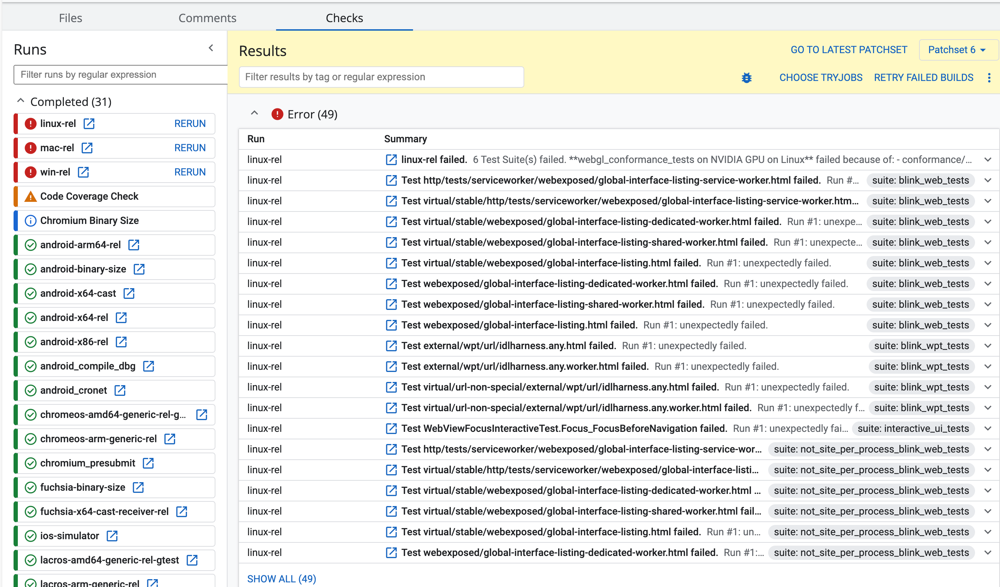

# [url][chromium] URL.parse を Chromium で Ship するまで

## Intro

Chrome 126 で筆者が実装した URL.parse が Ship された。

Chromium にコントリビュートしたことは何回かあったが、単体機能を Ship したのは初めてだった。


## invalid URL の処理

`new URL()` によって、文字列の URL をパースすることができるようになって久しいが、この API は invalid な場合に例外を投げる。

例外処理をするよりも、先に URL としてパース可能かどうかを知るための `URL.canParse()` が提案され、先に実装が進んだ。

```js
URL.canParse(str) // boolean
```

しかし、これでは二回パースが必要になるため無駄が多い。

```js
if (URL.canParse(str)) { // 1 回目のパース
  return new URL(str) // 2 回目のパース
}
```

そこで、失敗したら null にし、成功したら URL を返せば良いという発想が、 `URL.parse()` だ。

そもそも、リアルワールドでは以下のように例外を握りつぶすコードがよく使われていることも知られていたため、賛同が多かった。

```js
function URLparse(str) {
  try {
    return new URL(str)
  } catch (err) {
    return null
  }
}
```


## URL.parse

URL.parse の提案は以下で議論された。

- Consider adding non-throwing URL.parse(input, base) · Issue #372 · whatwg/url
  - https://github.com/whatwg/url/issues/372

その後 URL の仕様にマージされている。

- Add URL.parse() by annevk · Pull Request #825 · whatwg/url
  - https://github.com/whatwg/url/pull/825
- URL Standard
  - https://url.spec.whatwg.org/#dom-url-parse

使い方もそのままだ。

```js
URL.parse(str) // null or URL
```

機能としては小さく、 Firefox や Safari は比較的早く実装を進めていた。

- Firefox
  - 1887611 - Implement URL.parse()
    - https://bugzilla.mozilla.org/show_bug.cgi?id=1887611
  - Intent to prototype & ship: URL.parse()
    - https://groups.google.com/a/mozilla.org/g/dev-platform/c/3QgJqDYpEwA/m/4n1pJEtqAAAJ
- Webkit
  - Implement URL.parse() by annevk · Pull Request #26403 · WebKit/WebKit
    - https://github.com/WebKit/WebKit/pull/26403

Firefox と Safari が実装したので、そろそろこの機能を使おうと思ったところ、 Chrome が未実装だったことに気づいた。


## Implementor Assing

Issue を調べると、その時点では Chrome だけまだアサインが浮いていた。

- Implement URL.parse() [331041242] - Chromium
  - https://issues.chromium.org/u/0/issues/331041242

仕様が小さいことも、ほぼ `URL.canParse()` と同じように実装できることがわかっていたので、自分で手を挙げたところアサインしてもらうことになり、実装に着手した。

小さいパッチは投げたことはあっても、単体の機能を実装するのは初めてだった。また、 crrev などはちょっと使わないとすぐにわからなくなるので、中の人にはかなり手取り足取り教えてもらいながら進めることになった。

一度教えてもらったことを何度も聞かないで済むよう、この作業中に教わったことは全て以下にまとめている。

- Chromium にコントリビュートするための周辺知識 | blog.jxck.io
  - https://blog.jxck.io/entries/2024-03-26/chromium-contribution.html


## Patchset

実装したパッチのレビューなどは以下で行った。

- Implement URL.parse() (5414853) · Gerrit Code Review
  - https://chromium-review.googlesource.com/c/chromium/src/+/5414853

書くコード自体は特に難しいところはなく、ただ書くだけだ。

基本的には URL の WebIDL が変わるので、そこを追加する。


- url.idl | Gerrit Code Review
  - https://chromium-review.googlesource.com/c/chromium/src/+/5414853/7/third_party/blink/renderer/core/url/url.idl

これをもとに Python のスクリプトで binding が生成されるので、その実態となる C++ のコードを書く。


- dom_url.cc | Gerrit Code Review
  - https://chromium-review.googlesource.com/c/chromium/src/+/5414853/7/third_party/blink/renderer/core/url/dom_url.cc

Chromium の中には、ありとあらゆるリアルワールド URL をパースしてきた歴戦(Battle Tested)の URL パーサーである KURL という実装がある。

これに、後から標準化された JS の URL API のために、ガワを被せて外に出す作りになっているため、実際は KRUL を呼んだら終わりだ。

DOMURL のコンストラクタがそもそも例外を投げる実装になっているため、一旦 KURL でパースして IsValid() が ture ならその KURL を元に DOMURL を生成できるコンストラクタを追加しただけだ。

つまり、全く難しくない。 C++ 書いたことがなくても、見ればわかるくらいの変更だ。


## WPT

この API は先に Firefox で実装されたので、そのときに WPT のテストが追加されていた。WPT はブラウザが共有しているテストスイートなので基本的にこれを通せばよい。

Chromium が WPT を内部で流していながら、 WPT にある URL.parse のテストでこれまで落ちなかったのは、 Chromium が持つ expected ファイルによるものだ。

- url-statics-parse.any-expected.txt · Gerrit Code Review
  - https://chromium-review.googlesource.com/c/chromium/src/+/5414853/7/third_party/blink/web_tests/external/wpt/url/url-statics-parse.any-expected.txt

これは、 WPT の実行結果をそのまま保存したファイルになっており、「その結果が変わらないことをテストする」という仕組みになっている。つまり、実装前は「落ちることを期待する」というテストだった。

今回、実装して WPT が通るようになったことで、この expected ファイルは削除し今後は WPT の結果を直接見るようになる。

このような expected テストはいたることろにあるため、自分で一個一個探して書き直すのではなく、テストを流す時に `--reset-result` をつけて上書きし、その diff をチェックするのが基本らしい。それを知らずに、手作業でやっていたため、ここでかなり時間がかかった。

また、 `--reset-result` する対象は、 CI (CQ DRY RUN) で全部のテストを流して、落ちるテストを UI で確認し、手元でそれだけを流して上書きするのが最も効率良い方法だ。



しかし、 CI (CQ DRY RUN) の実行は中の人しかできない上に、終わるまで 1,2 時間かかる。結果を見ながら `--reset-result` したパッチをあげて、また CI を実行して結果を待つ。実際もっとも時間がかかったのは、この辺だったと思う。


## API Review

こんな小さい機能でありながらも、新しい標準機能を Web Platform に出すためには、様々な角度からのレビューが行われる。(コードレビューではなく Ship のためのレビュー)

具体的には、以下の各レビュアーの Approve を得て、初めて Ship できるのだ。

- Privacy
- Security
- Enterprise
- Debuggability
- Testing
- API Ownwers

このレビューは Chrome Plaform Status からリクエストをする。いつも見ていた Platform Status にその機能があることはここで初めて知った。


- URL.parse() - Chrome Platform Status
  - https://chromestatus.com/feature/6301071388704768?gate=4813144208965632

実装に着手したのが 4 月頭で、マージが 4 月末、そこから Ship のプロセスを進めたので、まるまる 1 ヶ月かかったことになる。ほとんどは、コードを書く以外の時間と待ち時間だった。


## Intent to Ship

今回もっとも良い経験になったのは、 Intents を初めて出したことだろう。

- Intent to Ship: URL.parse()
  - https://groups.google.com/u/0/a/chromium.org/g/blink-dev/c/G070zUd0e4c

これまで 10 年近く、ほぼ全ての Intents に目を通してきたが、自分がそれを出す側になることで、裏にあるプロセスやツールなど初めて知るこも多く、解像度もかなり上がった。

通常、新しい機能を実装するには、膨大なステップがある。

1. 仕様の提案
2. Explainer, Draft の作成
3. WG や Issue での議論
4. Tag Review
5. WPT などの整備
6. Intent to Prototype
7. Intent to Experience
8. 様々な修正
9. Intent to Ship

本来、これを外部のコントリビューターが全て行うのは難しい。通常は中の人が行うのを手伝ったり、議論に参加したり、細かいバグを後から直したり、仕様の差分だけを実装したりと言ったコントリビュートが多いだろう。作業自体も年単位になるのが普通だ。

しかし、今回は仕様策定がすでに終わり、他のブラウザも Implement/Ship 済みだったため、全部すっ飛ばして実装と Ship だけを行えるという、社会科見学としては最高のタスクに運良く携わることができた。

Stable が 124 の時にマージし、今週リリースされた Chrome M126 が Stable に落ちてきて、無事 `URL.parse()` の挙動を確認することができたので、やっとタスクとして終了した実感がある。


## Outro

Chromium のコードはちょくちょくいじってはいるが、機能を Ship するのは基本的に敷居が高いため、良い経験になった。

ここまで面倒を見てくれた [@horo](https://x.com/horo) さん、 [@hayatoito](https://x.com/hayatoito) さん、 [@toyoshim](https://x.com/toyoshim) さんには非常に感謝しています。ありがとうございました。今後もコントリビュートは続けたいので、引き続きよろしくお願いします。


## Blink API Owners Gift

コードがマージされたあと、中の人(API Owner)からメールをもらった。機能の Ship までを行った人には、お祝いとしてギフトを贈るというものだった。

後日忘れた頃に国際郵便で届いたのは、 Chromium の LGTM ステッカーだった。


嬉しい。

すでに次のタスクももらってるので、そっちもガンバる。