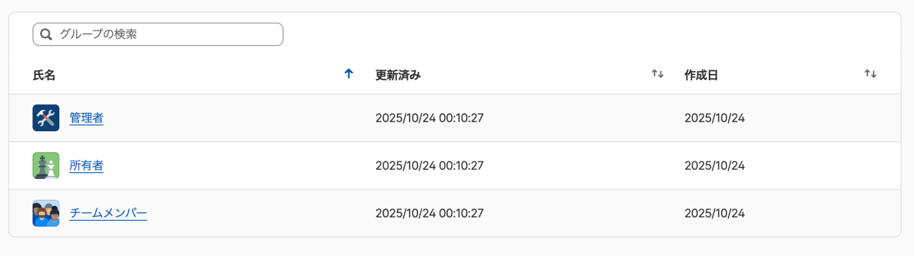
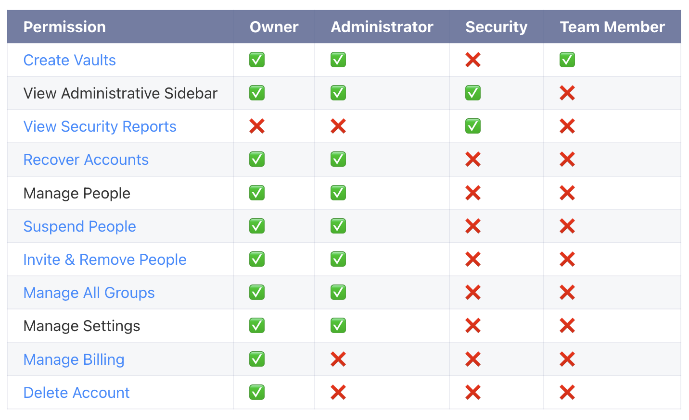

# [1password][security] 1Password AC #7: Group と Vault の運用

## Intro

このエントリは、1Password Advent Calendar の 7 日目である。

- 1Password - Qiita Advent Calendar 2025 - Qiita
  - https://qiita.com/advent-calendar/2025/1password

このシリーズでは、組織において 1Password Business を運用する上での考慮点を解説していく。

- 1Password Business 運用ガイド素案 - Google ドキュメント
  - https://docs.google.com/document/d/1CZ5xdOz2IRHXRKVzcUZG-d4wQmlexBet8_Iee_EJlmw

今回は、Business アカウントを運用する上で重要な、Group/Vault の概念について解説する。

## Group

権限管理の方式は色々あるが、1Password ではユーザを Vault に追加し、その Vault に権限を付与することで管理するのが基本だ。

いわゆる管理者となるアカウントも、実態は「管理」Vault に入ったユーザという形だ。

デフォルトで作られている Vault は以下の 3 つがある。

- 所有者 (Owner)
- 管理者 (Admin)
- チームメンバー (Team Member)

この Vault に振られたデフォルトの権限は以下だ。

つまり最も権限が強いのは「所有者 (Owner)」だが、「管理者 (Admin)」との差分は支払い周りなので、いわゆる組織の運用上はあまり気にする必要はない。

つまり、基本は「管理者」と「メンバー」がいると思えば良い。

Business アカウントを作ったら、まず最初にこの「管理者」Vault に複数のアカウントを登録し、SPoF を防ぐのが重要だ。

### 管理用アカウントは必要か

企業においてこうしたソリューションを運用する際に、「管理者用のアカウントを作るか」という点は議論になる。

要するにこの場合は、`admin@example.com` のようなメールアドレスを用意し、それを用いて "Admin" のようなアカウントを作り、そのアカウントを管理担当者で共有するといった運用だ。

検証した結論から言うと、1Password の場合、そのアカウントは不要と考えて良さそうだ。

もしここで "Admin" アカウントを作れば、それは別途共有する必要があり、その Master Password / Secret Key をどう共有するかの問題が出る。全員が 1Password を使っているなら、それをアイテムにして共有するといったことになるだろう。

そもそも Owner は Vault なので、管理担当者は個々に自分のメールアドレスを用いてアカウントを作り、それを Owner Vault に追加するのが 1Password の運用方法になる。

このメリットは、「誰が Owner であるか」の管理が 1Password の Vault を見ればわかる点だ。Admin アカウントをアイテムに入れて共有すると、ダッシュボードだけでなく、そのアイテムの共有範囲を別途管理する必要があり、二度手間なだけになる。

また、1Password のダッシュボードでは、アカウントごとのアクティビティも細かくログが残るため、重要な変更などを行った場合、そのアカウントの特定などが容易にできる。

もし、ここで "Admin" アカウントでログが残ると、ではその 「"Admin" アカウントを使っていたのは誰なのか?」がわからなくなってしまう。

個々がきちんと管理している、それぞれの Business アカウントを「管理者」Vault に追加し、素直に運用するのが 1Password Business の機能を最も有効に使えるだろう。

### Security Group

もう 1 つ、デフォルトでは作られていない Security という Vault がある。

これは、「ドメイン侵害レポート」という機能を有効にすることで作られ、そのレポートを見ることができる権限が付与される Vault だ。

- ドメイン侵害レポート | 1Password
  - https://1password.com/jp/business/domain-breach-report/

これは、Have I Been Pwned などで公開された漏洩アカウントのリストに、チームメンバーのアドレスが存在しないかをチェックする機能のようだ(検証中ではレポートを見ることができなかった)。

この機能のみ Vault が別で、「管理者」Vault に権限を振ることもできないようだ。なぜそうなっているのかはよくわからなかったが、おそらくレポート内容の機微性を踏まえてそうなっているのだろう。

### チームメンバー

デフォルトでは、追加したユーザは全て「チームメンバー」Vault に追加される。

組織が小さいうちはそれでも良いだろうが、大きくなってくるといくつかの問題が出るだろう。

- 「管理者」だと権限が強すぎるため、ある程度の権限を保つ「マネージャ」ロールが欲しい
- 組織にあるチームの実態に合わせて、Vault を管理したい

特に後者は、権限が同じだとしても、共有するアイテムが異なるため、Vault の単位を分けたくなる。このとき、Group も一緒に分けてしまうと、管理しやすくなる。

## Vault

Group がユーザを束ねる単位なのに対して、Vault はアイテムを束ねる単位だ。

デフォルトでは以下の 2 つの Vault が作成されている。

- 従業員 (Employee)
- 共有 (Shared)

前者は、メンバーごとに異なる「自分だけのアイテム」を入れるための Vault だ。

後者は、名前の通りメンバー間で共有するアイテムを入れるためのものだ。デフォルトでは、ここに入れれば組織内の全員に共有されることになる。

Vault でアイテムを共有できるのは、組織で 1Password を導入する大きなメリットの 1 つだ。

例えば、特定サービスの管理者パスワードを入れて共有できる。従来は、どこかにパスワードを書いて共有していたようなものが、Passkey に移行しても、アイテムさえ共有しておけば誰でもログインできるのだ。

また、共通して使う Access Token 系の値を入れて共有するのも便利だ。別途解説する CLI を使えば、環境変数の適用まで自動化できる。Token のローテーションがある場合も、担当者が 1Password 上で更新すれば、メンバー全員が常に最新の値を使用できる。

### Vault へのアクセス権

Vault へのアクセス権の管理は、ダッシュボード上で行う。

UI を見てもわかるように、個別のユーザを指定して追加することもできるが、基本は Group を追加して、そこに権限(表示、編集 etc)を割り当てる仕様になっている。

このように、基本的には Vault へのアクセスは Group の単位で行うようにし、Vault には対応する Group がある状態が運用しやすいだろう。

いちいち Vault と対応する Group を作るのは面倒そうに思うかもしれないが、Group を作る際に「対応する Vault を作る」というオプションがあるため、この組み合わせを作るのは難しくない。

「管理者」 Group は自動で追加されるため、管理から外れてしまうこともない。

## 実運用を想定した検証

では、実際の運用はどうなるか、1 つの典型的な組織モデルを想定し、Group/Vault の設計を試してみる。

今回想定するのは以下のような組織だ。

- Jxck (管理者)
- Frontend Team
  - Alice (マネージャ)
  - Charlie
- Backend Team
  - Bob (マネージャ)
  - Dave
- Eve (業務委託)

2 つのチームは、それぞれ扱うアイテムが異なるため、Vault は別で作りたい。

またチームの中で「マネージャ」だけは、メンバーを管理できる権限を付与したい。

そして、Backend チームには業務委託のメンバーが参加している。

この状態を運用する設計を考えてみよう。

## Team Group/Vault

まずは素直に Frontend/Backend の Group を作り、そこにメンバーをアサインする。ここで同時に Vault も作成する。

作成した Group のメンバーを整理する。デフォルトでは管理者も追加されるが、ダッシュボードから操作できるため、追加しておく必要は特になさそうだ。ここでは Alice と Charlie を追加する。

次に Vault を整理する。Frontend Group は最初から割り当てられている。所有者 Group も追加されているが、これは削除できない。Vault 内は企業の資産とも言えるため、所有者 Group はデフォルトなのだろう。ただし、管理はあくまで管理者 Group で行っているため、こちらには管理者 Group も追加した。

同じことを Backend でも行えば、チームに必要な Group と Vault の作成は完了だ。

## Manager Group

Alice と Bob は、チームを管理するマネージャであるが、Business アカウント全体の管理者である必要はないため、ここで権限の分離を行いたい。

そこで Vault を持たない Manager Group を作り、Alice と Bob を追加する。

ここに、チームメンバーよりも強い権限として、例えば「アカウントの復旧」を付与する。

次に Vault だが、方針は大きく 2 つ考えられる。

まず、作成した Manager Group を Frontend/Backend 両方のグループに追加する方法だ。

ただ、これでは Alice だけでなく Bob も Frontend Vault を管理する形になる。

多くの場合はこれで足りるだろうが、もし Alice だけが Frontend Vault の管理者にしたいのであれば、個別に Alice だけを追加することもできる。

今回はチームにマネージャが一人なので、Vault に一人ずつ追加すればそれでも足りる。

しかし、Frontend/Backend Vault 両方に Manager Group を追加することで、二人をマネージャとして機能させることもできる。この場合、例えば Bob が Frontend Vault も見えてしまう。

この場合は、Team x Manager ごとの Group をまた作るなどが考えられる。しかし、そこまでいくとかなり煩雑になるため、Manager Group 単位の運用で足りるうちはそこに留めた方が良さそうだ。

## Outro

Manager と Vault の運用は、組織の構成によってかなりバリエーションがあるだろう。しかし、あまり細かく指定しすぎると、組織変更に対して管理負荷がかなり上がりそうだ。

ある程度余白のある運用に落とし所を見つけるのが、適切な負荷で運用するコツになると思われる。